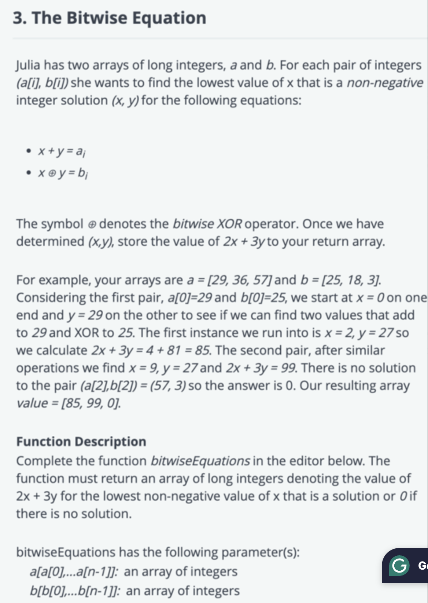

https://leetcode.com/discuss/interview-question/3683641/Confluent-OA-or-The-Bitwise-Equation
# 问题

# Code
```java
package org.example;

import java.util.*;

class BitwiseEquationSolver {

    public static long[] bitwiseEquations(long[] a, long[] b) {
        int n = a.length;
        long[] results = new long[n];

        for (int i = 0; i < n; i++) {
            long ai = a[i];
            long bi = b[i];

            if (ai < bi || (ai - bi) % 2 != 0) {
                results[i] = 0;
                continue;
            }

            long and = (ai - bi) / 2;
            long x = and;
            long y = ai - x;

            if ((x + y == ai) && ((x ^ y) == bi) && x >= 0 && y >= 0) {
                results[i] = 2 * x + 3 * y;
            } else {
                results[i] = 0;
            }
        }

        return results;
    }

    public static void main(String[] args) {
        long[] a = {29, 36, 57};
        long[] b = {25, 18, 3};
        long[] results = bitwiseEquations(a, b);

        System.out.println(Arrays.toString(results));  // Output: [85, 99, 0]
    }
}
```