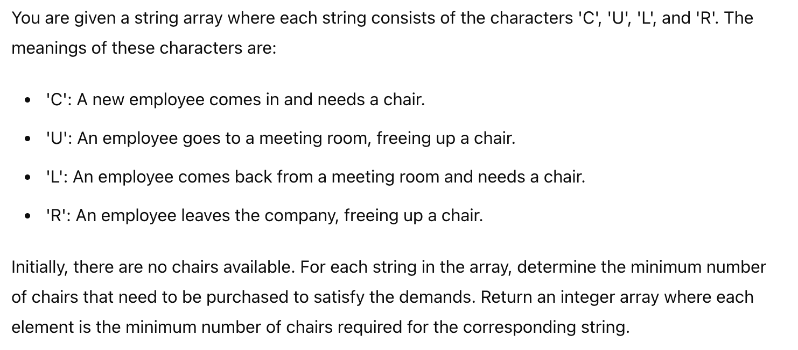

# 问题

```md
第一题，买椅子，给一个string array，每一个string由'C', 'U', 'L', 'R'组成：'C'表示有新员工进来，需要一把椅子；'U'表示有一个员工进会议室，空出来一把椅子; 'L'表示有员工从会议室出来，需要一把椅子; 'R'表示员工离职，空出来一把椅子（可能记得字母和对应内容记混了，但就这四个情况），每一个情况下，如果当前空余的椅子不够现在需求的，就要买一把（eg. 如果第一个字母是'C'，表示有一个新员工来，但此时没有可以用的，默认一开始椅子为0，那样就需要买一把）。求每一个string最少的买椅子数，输出一个int array。这题没啥说的，遍历一遍就好。
```

# Code
```java
package org.example;

import java.util.Arrays;

class BuyChairSolution{
    public static int[] buyChairs(String [] arr){
        int [] minChairs = new int [arr.length];
        int times = 0;
        for(String str : arr){
            int totalChair = 0;
            int currentVacancy = 0;
            for(char c : str.toCharArray()){
                switch (c){
                    case 'C':
                        if(currentVacancy > 0){
                            currentVacancy --;
                        }else {
                            totalChair ++;
                        }
                        break;
                    case 'U':
                        currentVacancy ++;
                        break;
                    case 'L':
                        if(currentVacancy > 0){
                            currentVacancy --;
                        }else {
                            totalChair ++;
                        }
                        break;
                    case 'R':
                        currentVacancy ++;
                        break;
                }
            }
            minChairs[times] = totalChair;
            times ++;
        }
        return minChairs;
    }
    public static void main(String [] args){
        String [] str = {"CURLL","RULLC","URCLL","CCU", "LCR", "CCLLUUR", "RLCU"};
        System.out.println(Arrays.toString(buyChairs(str)));
    }
}
```