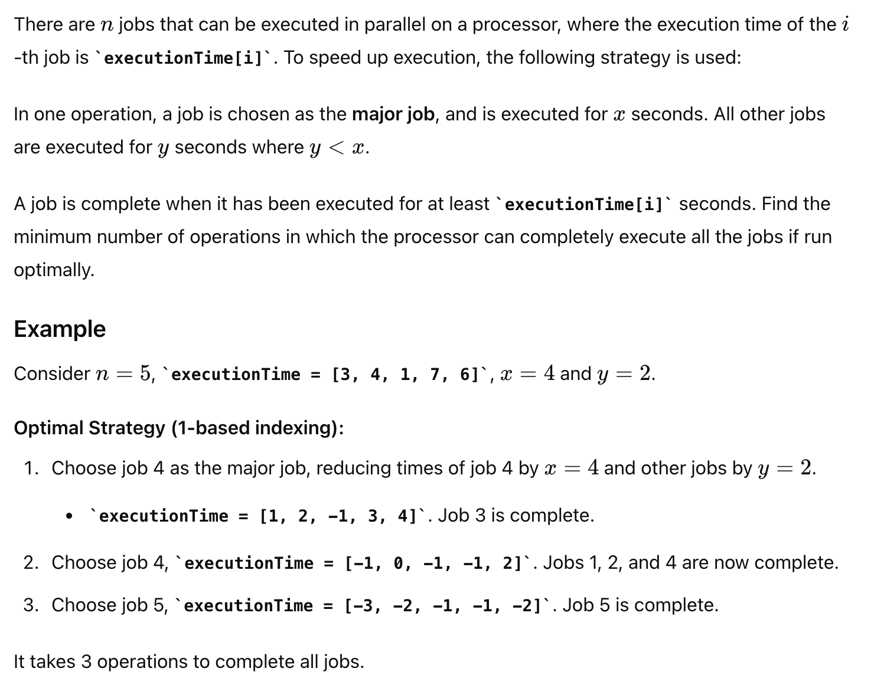
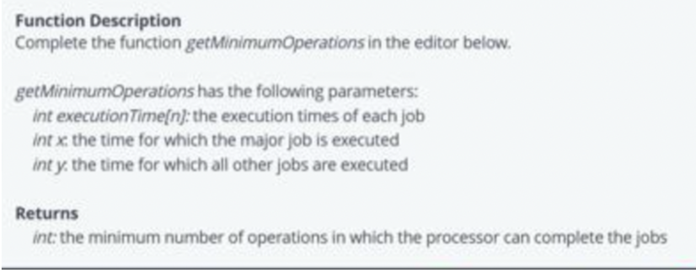

# 问题


# Code
```java
package org.example;

import java.util.PriorityQueue;

public class JobExecution {
    public int getMinimumOperations(int[] executionTime, int x, int y) {
        int n = executionTime.length;
        int operations = 0;

        PriorityQueue<Integer> pq = new PriorityQueue<>((a, b) -> executionTime[b] - executionTime[a]);

        for (int i = 0; i < n; i++) {
            pq.offer(i);
        }

        while (!pq.isEmpty()) {
            operations++;
            int majorJob = pq.poll();
            executionTime[majorJob] -= x;

            PriorityQueue<Integer> tempPQ = new PriorityQueue<>();
            while (!pq.isEmpty()) {
                int job = pq.poll();
                executionTime[job] -= y;
                if (executionTime[job] > 0) {
                    tempPQ.offer(job);
                }
            }
            pq = tempPQ;
            if (executionTime[majorJob] > 0) {
                pq.offer(majorJob);
            }
        }

        return operations;
    }

    public static void main(String[] args) {
        JobExecution solver = new JobExecution();
        int[] executionTime1 = {3, 4, 1, 7, 6};
        System.out.println(solver.getMinimumOperations(executionTime1, 4, 2)); // 输出: 3

        int[] executionTime2 = {4, 3, 2, 5, 1};
        System.out.println(solver.getMinimumOperations(executionTime2, 3, 1)); // 输出: 3
    }
}

```