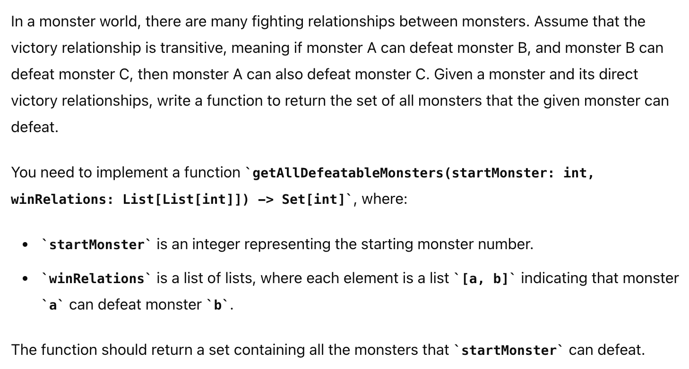
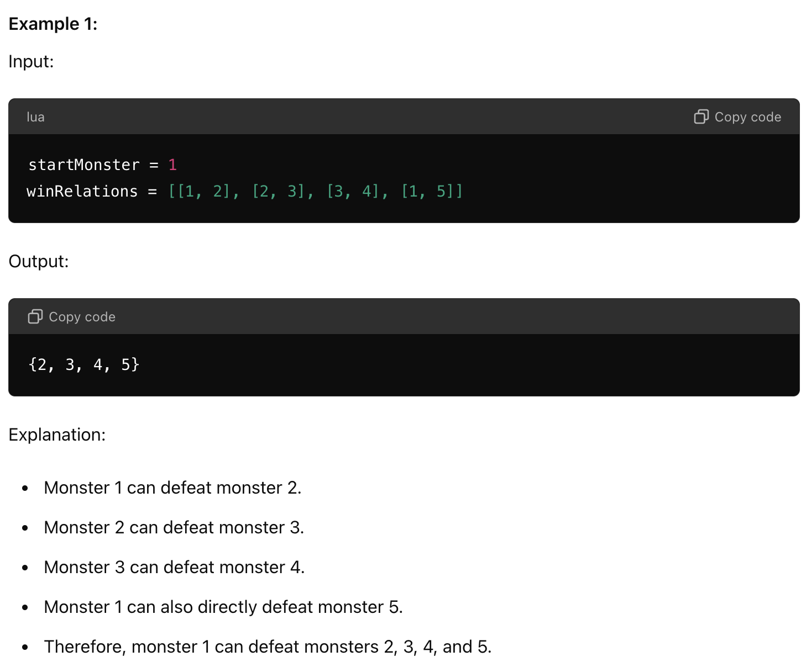
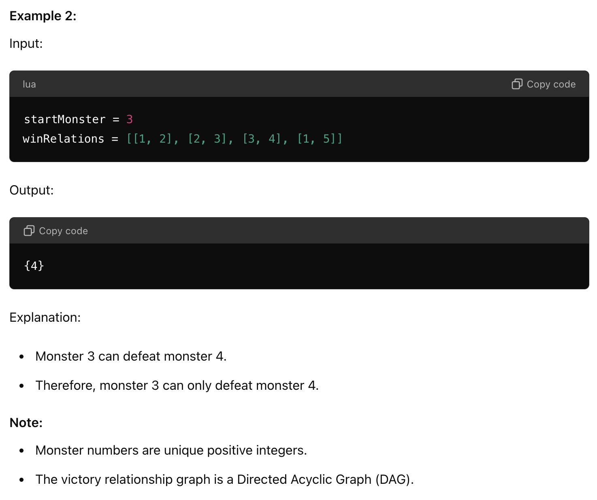

# 问题
怪兽打架题，其实就是个graph题，假设有很多类似a能赢b，b能赢c…的打架胜负关系，且胜负关系transitive，开局给你个怪兽，返回你能打赢的怪兽集合，用bfs即可




# Code
* BFS
* 注意: if(defeated.contains(neighbor))不能省略，因为避免进入死循环
* 
```java
package org.example;

import java.util.*;

public class MonsterFight {

    public static Set<Integer> getAllDefeatableMonsters(int startMonster, List<int[]> winRelations) {
        // 创建图的邻接表表示
        Map<Integer, List<Integer>> graph = new HashMap<>();
        for (int[] relation : winRelations) {
            graph.computeIfAbsent(relation[0], k -> new LinkedList<>()).add(relation[1]);
        }

        // 使用BFS找到所有可达的节点
        Set<Integer> defeated = new HashSet<>();
        Queue<Integer> que = new LinkedList<>();
        que.offer(startMonster);
        while(!que.isEmpty()){
            int current = que.poll();
            if(graph.containsKey(current)){
                for(int neighbor : graph.get(current)){
                    //避免重复进入相同节点，死循环
                    if(!defeated.contains(neighbor)) {
                        defeated.add(neighbor);
                        que.offer(neighbor);
                    }
                }
            }
        }
        return defeated;
    }

    public static void main(String[] args) {
        List<int[]> winRelations = new ArrayList<>();
        winRelations.add(new int[]{1, 2});
        winRelations.add(new int[]{2, 3});
        winRelations.add(new int[]{3, 4});
        winRelations.add(new int[]{1, 5});
        winRelations.add(new int[]{5, 4});

        System.out.println(getAllDefeatableMonsters(1, winRelations)); // 输出: [2, 3, 4, 5]
        System.out.println(getAllDefeatableMonsters(2, winRelations)); // 输出: [4]
    }
}

```