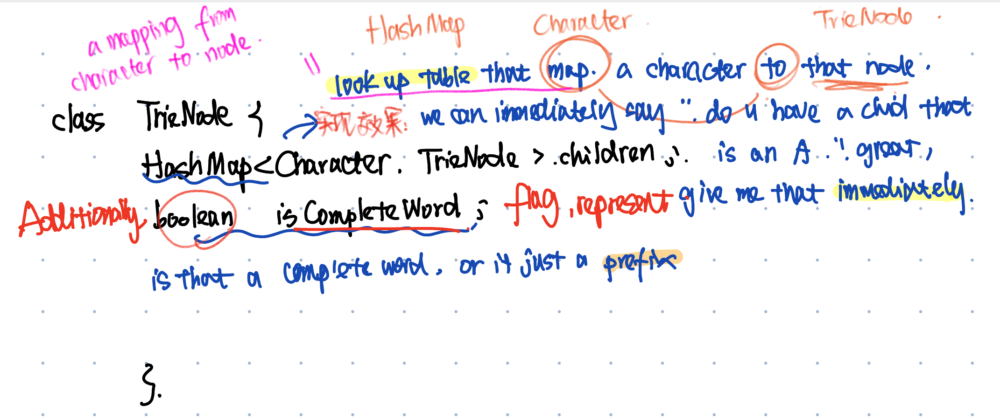
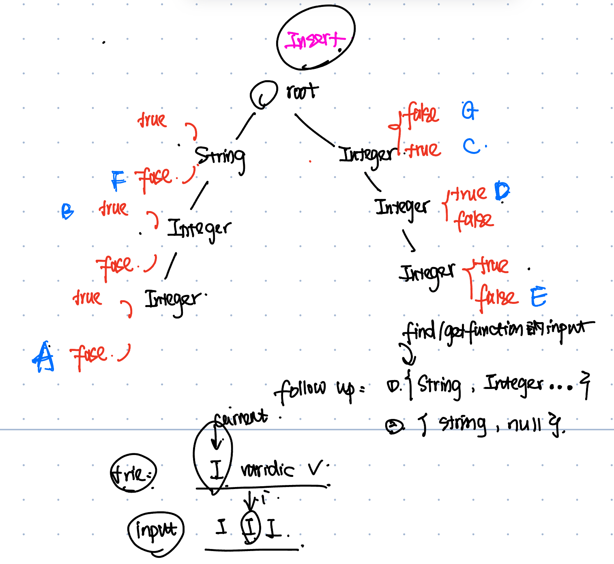

# 题目


题目细节补充:
* 设计一个interface，能够register不同的函数以及他们的参数类型，之后能按照参数类型进行查询
* https://www.1point3acres.com/bbs/thread-550026-1-1.html
## 可能问题
### 1. What is an optimal solution for this?
### 2. If getFunction(string, integer...) how to handle?
### 3. If getFunction(string, null) where null can stands for all the possibilities
### 4. Implement two follow ups above

## 第一问




### 时间复杂度分析

1. **注册（Insert）函数到 Trie 中**：
   - 每个函数的注册操作包括遍历参数列表，然后将其插入到 Trie 中。
   - 对于每个函数，时间复杂度是 O(k)，其中 k 是参数列表的长度。
   - 总时间复杂度是 O(n * k)，其中 n 是函数的数量。

2. **查找（Find）匹配函数**：
   - 查找匹配操作包括遍历输入的参数列表，并在 Trie 中查找匹配的节点。
   - 对于每个查找操作，时间复杂度是 O(m * k)，其中 m 是输入参数列表的长度，k 是参数列表的长度。
   - 最坏情况下（假设每个节点都有所有类型的子节点），时间复杂度会变成 O(m * k)。

### 比较

#### Trie 方法的优化

1. **前缀共享**：
   - 在 Trie 中，公共前缀只存储一次，这样可以显著减少存储空间。例如，多个函数签名的公共前缀只存储一次。

2. **快速查找**：
   - Trie 可以在 O(m * k) 时间复杂度内进行查找，而暴力搜索的时间复杂度是 O(n * k)。
   - 对于大规模数据，Trie 方法可以显著减少查找时间，特别是当函数数量（n）非常大时。

#### Map 暴力解法的时间复杂度

1. **注册函数到 Map 中**：
   - 每个函数的注册操作包括将其键值对插入到 Map 中。
   - 对于每个函数，时间复杂度是 O(1)。
   - 总时间复杂度是 O(n)。

2. **查找匹配函数**：
   - 查找匹配操作包括遍历所有函数并检查其参数列表是否匹配。
   - 对于每个查找操作，时间复杂度是 O(n * k)，其中 n 是函数的数量，k 是参数列表的长度。
   - 如果输入参数列表的长度为 m，则总时间复杂度为 O(m * n * k)。

### 总结

- **Trie 方法**：
  - 注册：O(n * k)
  - 查找：O(m * k)
  - 优化：利用前缀共享减少存储空间，快速查找。

- **Map 暴力解法**：
  - 注册：O(n)
  - 查找：O(m * n * k)
  - 缺点：每次查找都需要遍历所有函数，查找时间复杂度高。

**优化**：
- Trie 方法通过前缀共享和层次化查找显著优化了查找时间，特别是在函数数量很大的情况下。暴力解法由于需要遍历所有函数，因此查找时间复杂度较高，不适用于大规模数据。

```java
package org.example;

import java.util.*;

class TrieNode {
    HashMap<String, TrieNode> children;
    List<String> isVarTrue;
    List<String> isVarFalse;
    TrieNode(){
        this.children = new HashMap<>();
        this.isVarFalse = new ArrayList<>();
        this.isVarTrue = new ArrayList<>();
    }
}
class Function {
    String name;
    List<String> argumentTypes;
    boolean isVariadic;
    Function(String name, List<String> argumentTypes, boolean isVariadic){
        this.name = name;
        this.argumentTypes = argumentTypes;
        this.isVariadic = isVariadic;
    }
}
class FunctionLibrary{
    private TrieNode root;
    FunctionLibrary(){
        this.root = new TrieNode();
    }
    public void register(Set<Function> functionSet){
        for(Function f: functionSet){
            insert(f.name,f.argumentTypes,f.isVariadic);
        }
    }
    public List<String> findMatches(List<String> argumentTypes){
        TrieNode current = root;
        List<String> result = new ArrayList<>();
        for(int i = 0 ; i < argumentTypes.size(); i ++){
            String arg = argumentTypes.get(i);
            if(!current.children.containsKey(arg)){
                return result;
            }else {
                current = current.children.get(arg);
                if(i != argumentTypes.size() - 1 && !current.isVarTrue.isEmpty()){
                    if(allSame(argumentTypes.subList(i,argumentTypes.size()),arg)){
                        result.addAll(current.isVarTrue);
                    }
                }
                if(i == argumentTypes.size() - 1){
                    result.addAll(current.isVarTrue);
                    result.addAll(current.isVarFalse);
                }
            }
        }
        return result;
    }
    private void insert(String functionName, List<String> arguments, boolean isVariable){
        TrieNode current = root;
        for(String arg:arguments){
            current = current.children.computeIfAbsent(arg, k -> new TrieNode());
        }
        if(isVariable){
            current.isVarTrue.add(functionName);
        }else {
            current.isVarFalse.add(functionName);
        }
    }
    private boolean allSame(List<String> listInput, String arg){
        for(String str:listInput){
            if(!str.equals(arg)){
                return false;
            }
        }
        return true;
    }

    public static void main(String[] args) {
        FunctionLibrary functionLibrary = new FunctionLibrary();
        Set<Function> inputSet = new HashSet<>();
        inputSet.add(new Function("FuncA", Arrays.asList("String", "Integer", "Integer"), false));
        inputSet.add(new Function("FuncB", Arrays.asList("String", "Integer"), true));
        inputSet.add(new Function("FuncC", Arrays.asList("Integer"), true));
        inputSet.add(new Function("FuncD", Arrays.asList("Integer", "Integer"), true));
        inputSet.add(new Function("FuncE", Arrays.asList("Integer", "Integer", "Integer"), false));
        inputSet.add(new Function("FuncF", Arrays.asList("String"), false));
        inputSet.add(new Function("FuncG", Arrays.asList("Integer"), false));
        functionLibrary.register(inputSet);

        System.out.println("Print match:");
        System.out.println(functionLibrary.findMatches(Arrays.asList("String"))); // [FuncF]
        System.out.println(functionLibrary.findMatches(Arrays.asList("Integer"))); // [FuncC, FuncG]
        System.out.println(functionLibrary.findMatches(Arrays.asList("Integer", "Integer", "Integer", "Integer"))); // [FuncC, FuncD]
        System.out.println(functionLibrary.findMatches(Arrays.asList("String", "Integer", "Integer", "Integer"))); // [FuncB]
        System.out.println(functionLibrary.findMatches(Arrays.asList("String", "Integer", "Integer"))); // [FuncA, FuncB]
    }
}
```