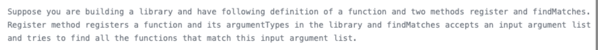
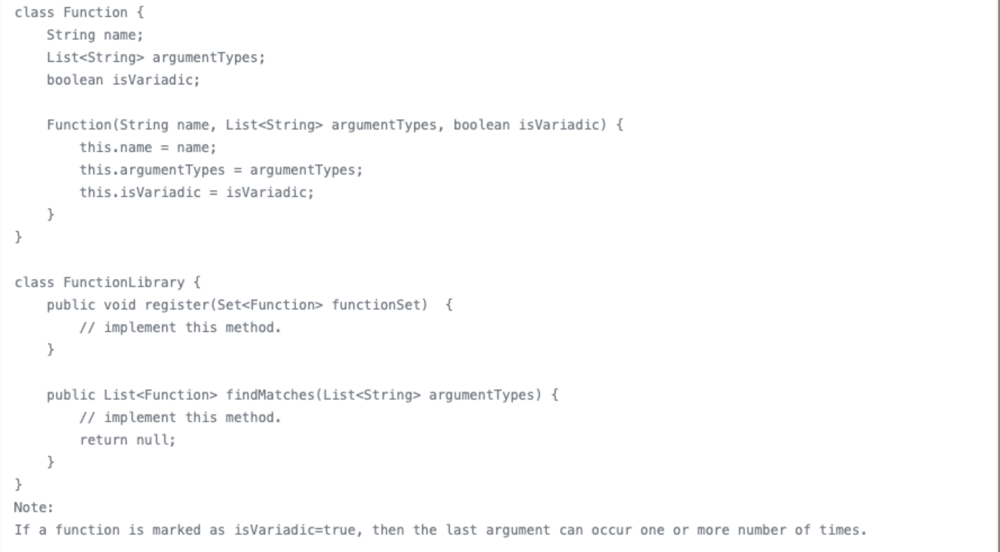
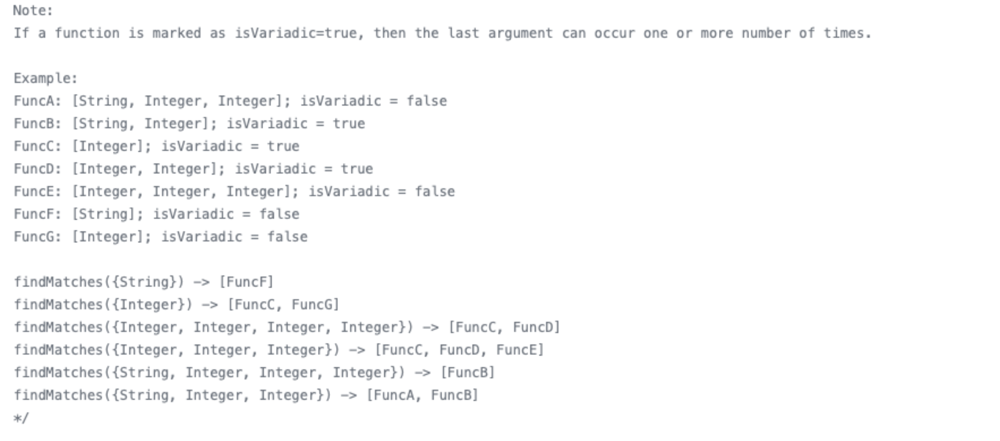

# 题目

题目细节补充:
* 设计一个interface，能够register不同的函数以及他们的参数类型，之后能按照参数类型进行查询
* 
## 可能问题
### 1. What is an optimal solution for this?
### 2. If getFunction(string, integer...) how to handle?
### 3. If getFunction(string, null) where null can stands for all the possibilities
### 4. Implement two follow ups above
