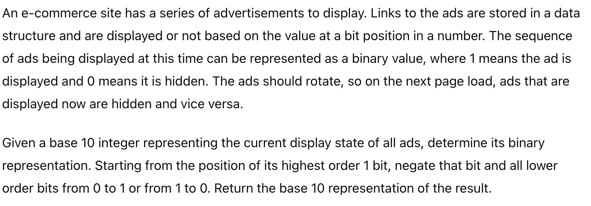
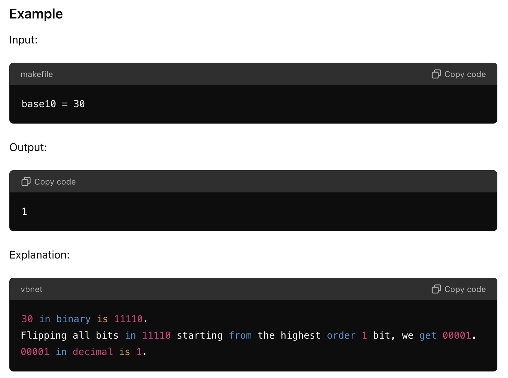
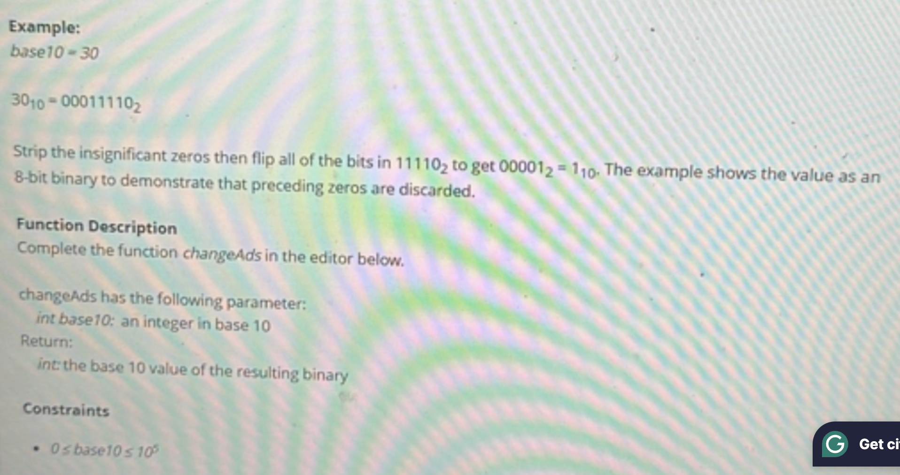

# 问题



# Code
```java
class AdRotation {

    public int changeAds(int base10) {
        if (base10 == 0) return 1;

        // 找到base10的最高位1
        int highestBit = Integer.highestOneBit(base10);

        // 创建一个掩码，所有位从最高位到最低位都设置为1
        int mask = (highestBit << 1) - 1;

        // 翻转base10在掩码范围内的所有位
        return ~base10 & mask;
    }

    public static void main(String[] args) {
        AdRotation solver = new AdRotation();
        System.out.println(solver.changeAds(30)); // 输出: 1
        System.out.println(solver.changeAds(1));  // 输出: 0
        System.out.println(solver.changeAds(0));  // 输出: 1
    }
}

```