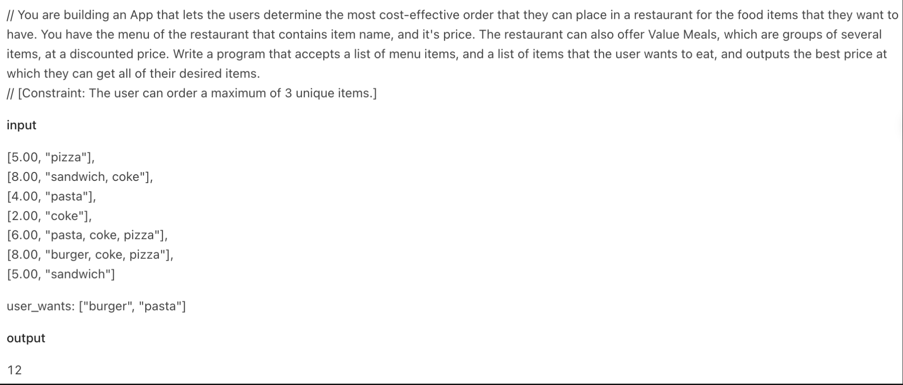

https://leetcode.com/discuss/interview-question/4999712/Confluent-coding-round
# 问题


# Code
```java
package org.example;

import java.util.*;

class FoodOrderOptimizer {
    // Class to represent menu item
    static class MenuItem {
        double price;
        Set<String> items;

        MenuItem(double price, String[] items) {
            this.price = price;
            this.items = new HashSet<>(Arrays.asList(items));
        }
    }

    public static double getMinimumCost(List<MenuItem> menu, List<String> userWants) {
        int n = menu.size();
        double minCost = Double.MAX_VALUE;

        // Generate all combinations of menu items
        for (int i = 0; i < (1 << n); i++) {
            Set<String> itemsSet = new HashSet<>();
            double cost = 0.0;
            for (int j = 0; j < n; j++) {
                if ((i & (1 << j)) != 0) {
                    itemsSet.addAll(menu.get(j).items);
                    cost += menu.get(j).price;
                }
            }

            // Check if the combination includes all items in userWants
            if (itemsSet.containsAll(userWants)) {
                minCost = Math.min(minCost, cost);
            }
        }

        return minCost;
    }

    public static void main(String[] args) {
        // Input menu items and user wants
        List<MenuItem> menu = Arrays.asList(
                new MenuItem(5.00, new String[]{"pizza"}),
                new MenuItem(8.00, new String[]{"sandwich", "coke"}),
                new MenuItem(4.00, new String[]{"pasta"}),
                new MenuItem(2.00, new String[]{"coke"}),
                new MenuItem(6.00, new String[]{"pasta", "coke", "pizza"}),
                new MenuItem(8.00, new String[]{"burger", "coke", "pizza"}),
                new MenuItem(5.00, new String[]{"sandwich"})
        );

        List<String> userWants = Arrays.asList("burger", "pasta");

        // Calculate and print the minimum cost
        double minCost = getMinimumCost(menu, userWants);
        System.out.println(minCost);
    }
}

```