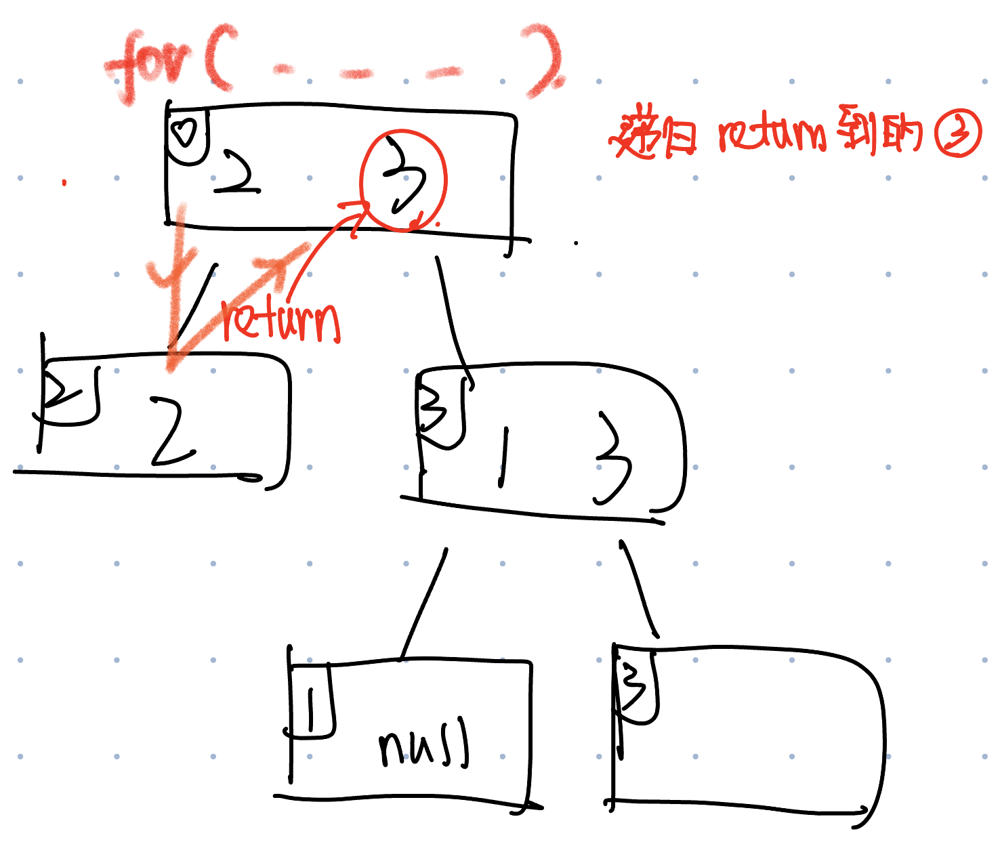

# 827. Making A Large Island
* **一刷:43：04(✅)**
* [827. Making A Large Island](https://leetcode.com/problems/making-a-large-island/)

## My Code
```java
class Solution {
    Map<Integer, Integer> map = new HashMap<>();
    int zone = 2;
    int[][] move = { { 0, 1 }, { 0, -1 }, { 1, 0 }, { -1, 0 } };
    int max = Integer.MIN_VALUE;

    public int largestIsland(int[][] grid) {
        int n = grid.length;
        // color different zones
        for (int i = 0; i < n; i++) {
            for (int j = 0; j < n; j++) {
                if (grid[i][j] == 1) {
                    int num = dfs(grid, i, j, zone, 1);
                    map.put(zone, num);
                    zone++;
                }
            }
        }
        for (int i = 0; i < n; i++) {
            for (int j = 0; j < n; j++) {
                if (grid[i][j] == 0) {
                    int tmp = 0;
                    Set<Integer> set = new  HashSet<>();
                    for (int m = 0; m < 4; m++) {
                        int nextY = move[m][0] + i;
                        int nextX = move[m][1] + j;
                        if (nextY < 0 || nextX < 0 || nextY >= grid.length || nextX >= grid.length)
                            continue;
                        if (map.containsKey(grid[nextY][nextX]) && !set.contains(grid[nextY][nextX])) {
                            tmp = tmp + map.get(grid[nextY][nextX]);
                            set.add(grid[nextY][nextX]);
                        }
                    }
                    max = Math.max(tmp + 1, max);
                }
            }
        }
        return max == Integer.MIN_VALUE ? n * n : max;
    }

    private int dfs(int[][] grid, int y, int x, int zone, int num) {
        grid[y][x] = zone;
        for (int i = 0; i < 4; i++) {
            int nextY = move[i][0] + y;
            int nextX = move[i][1] + x;
            if (nextY < 0 || nextX < 0 || nextY >= grid.length || nextX >= grid.length)
                continue;
            if (grid[nextY][nextX] == 1) {
                num = 1 + dfs(grid, nextY, nextX, zone, num);
            }
        }
        return num;
    }
}
```
***
# 463. Island Perimeter
* **一刷:33：04(✅)**
* [463. Island Perimeter](https://leetcode.com/problems/island-perimeter/)

## My Code
```java
class Solution {
    public int islandPerimeter(int[][] grid) {
        int row = grid.length;
        int col = grid[0].length;
        int[][] move = { { 0, 1 }, { 0, -1 }, { 1, 0 }, { -1, 0 } };
        int peri = 0;
        for (int y = 0; y < row; y++) {
            for (int x = 0; x < col; x++) {
                if (grid[y][x] == 1) {
                    for (int i = 0; i < 4; i++) {
                        int nextY = move[i][0] + y;
                        int nextX = move[i][1] + x;
                        if (nextY < 0 || nextX < 0 || nextY >= grid.length || nextX >= grid[0].length) {
                            peri++;
                            continue;
                        }
                        if (grid[nextY][nextX] == 0) {
                            peri++;
                            continue;
                        }
                    }
                }
            }
        }
        return peri;
    }
}
```
***
# 841. Keys and Rooms
* **一刷:43：04(❌)**
* [841. Keys and Rooms](https://leetcode.com/problems/keys-and-rooms/)

## 错误分析
* 因为是找遍历的所有路径，所以"回溯"之后不用撤销 ==> 他是开枝散叶，每一个都要往下走(for 循环)
* return返回的是本层

```java
class Solution {
    boolean visited[];
    public boolean canVisitAllRooms(List<List<Integer>> rooms) {
        visited = new boolean[rooms.size()];
        dfs(rooms, 0);
        for (int i = 0; i < visited.length; i++) {
            if (!visited[i]) {
                return false;
            }
        }
        return true;
    }

    private void dfs(List<List<Integer>> rooms, int roomNumber) {
        if (visited[roomNumber]) {
            return;
        }
        visited[roomNumber] = true;
        for (int key : rooms.get(roomNumber)) {
            dfs(rooms,key);
        }
    }
}
```
***
# 127. Word Ladder
* **一刷:20：04(❌)**
* [127. Word Ladder](https://leetcode.com/problems/word-ladder/)
## 技巧&反思(很好的一道题)
### 涉及最短路径，可以考虑BFS

### List --> HashSet
* **情况**: 当遇见list中的值是**unique!**，并且需要**快速访问**时，可以直接:`HashSet<String> hashSet = new HashSet<>(wordList);`,加快访问速度

### Set和Map的老生常谈方法
* map添加数据:`map.put(key,vale)`
* map获取数据:`map.get(key) //return对应value`
* map是否包含:`map.containsKey(key)`
* set是否包含:`set.contains(xxx)`

### String老生常谈方法
* 涉及String中单个字符的操作: 转换成char数组`char []` : `char [] charArray = word.toCharArray();`
* char数组转换成String: `String newWord = String.valueOf(charArray);`
* 字符串比较:`stringA.equals(stringB);`

## Code
```java
class Solution {
    public int ladderLength(String beginWord, String endWord, List<String> wordList) {
        HashSet<String> hashSet = new HashSet<>(wordList);
        if(wordList.size() == 0 || !hashSet.contains(endWord)){
            return 0;
        }
        Map <String,Integer> map = new HashMap<>();
        map.put(beginWord,1);
        Deque<String> dq = new LinkedList<>();
        dq.offer(beginWord);
        while(!dq.isEmpty()){
            String word = dq.poll();
            int path = map.get(word);
            for(int i = 0 ; i < word.length(); i ++){
                char [] charArray = word.toCharArray();
                for(char k = 'a'; k <= 'z'; k ++){
                    charArray[i] = k;
                    String newWord = String.valueOf(charArray);
                    if(newWord.equals(endWord) && hashSet.contains(newWord)){
                        return path + 1;
                    }
                    if(!map.containsKey(newWord) && hashSet.contains(newWord)){
                        map.put(newWord,path+1);
                        dq.offer(newWord);
                    }
                }
            }
        }
        return 0;
    }
}
```