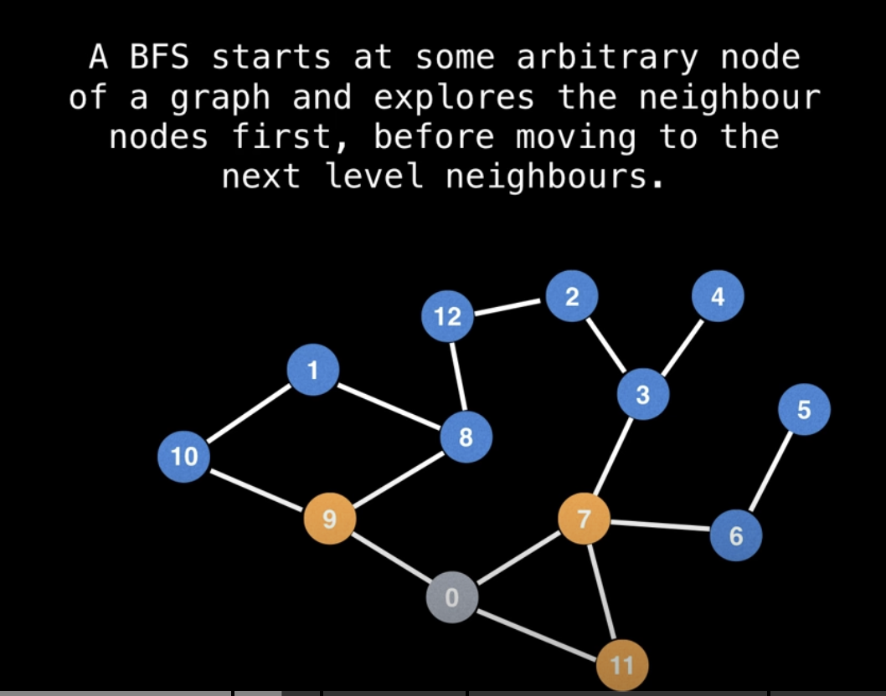
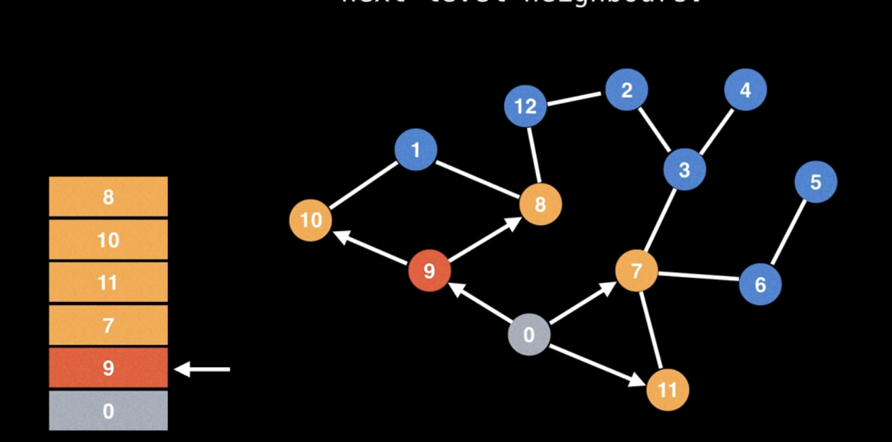
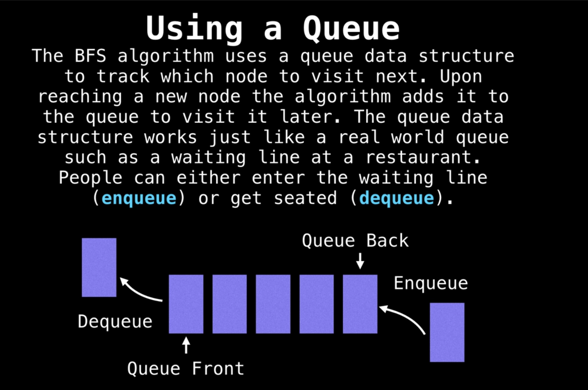

# Breadth First Search
## 使用场景
* Finding the **shortest path on unweighted graphs**
* 广搜的搜索方式就适合于解决两个点之间的最短路径问题。 因为广搜是从起点出发，以起始点为中心一圈一圈进行搜索，一旦遇到终点，记录之前走过的节点就是一条最短路。
## BFS过程


## 代码实现过程
* 通过Queue先进先出，一圈圈遍历neighbors



## 代码模版
```java
class Solution {
    //visited 数组记录走过路径
    int [][] move = {{0,1},{-1,0},{1,0},{0,-1}};
    boolean [][] visited;
    public int numIslands(char[][] grid) {
        int res = 0;
        visited = new boolean [grid.length][grid[0].length];
        for (int i = 0 ; i < grid.length; i ++){
            for (int j = 0; j < grid[0].length; j ++){
                if(grid[i][j] == '1' && visited[i][j] == false){
                    dfs(grid,i,j);
                    res ++;
                }
            }
        }
        return res;
    }
    private void dfs(char[][] grid, int y, int x ){
        //通过deque来记录当前相连的所有内容
        Deque<int []> dq = new LinkedList<>();
        dq.offer(new int []{y,x});
        visited[y][x] = true;
        while(!dq.isEmpty()){
            //弹出当前岛屿('1')
            int [] location = dq.poll();
            int moveX = location[1];
            int moveY = location[0];
            //上下左右遍历，找到岛屿的话继续加入
            for(int i = 0 ;i < 4; i ++){
                int nextY = move[i][0] + moveY;
                int nextX = move[i][1] + moveX;
                if(nextX < 0 || nextY < 0 || nextX >= grid[0].length || nextY >= grid.length) continue;
                if(!visited[nextY][nextX] && grid[nextY][nextX] == '1'){
                    visited[nextY][nextX] = true;
                    dq.offer(new int []{nextY,nextX});
                }
            }
        }
        return ;
    }
}
```

