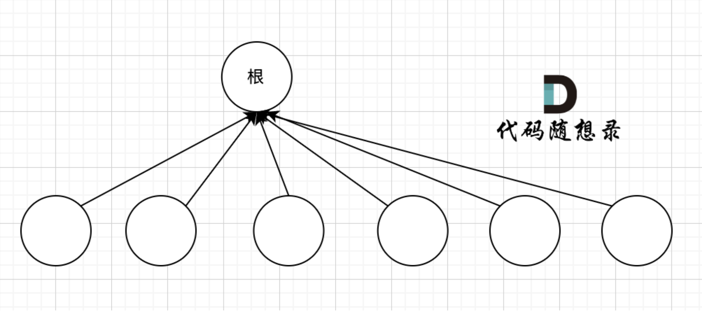

# Disjoint-Set Data Structure
## 原理
* [原理讲解_知乎](https://zhuanlan.zhihu.com/p/93647900)
* [代码随想录_并查集](https://github.com/youngyangyang04/leetcode-master/blob/master/problems/%E5%9B%BE%E8%AE%BA%E5%B9%B6%E6%9F%A5%E9%9B%86%E7%90%86%E8%AE%BA%E5%9F%BA%E7%A1%80.md)

## 适用情况
* **连通性问题**
  * 1. 用来判断**两个元素是否在同一集合**
  * 2. 用来将两个元素**join在同一集合**
* 类似：帮派划分
  
## 代码模版
* 优化：路径压缩(通过递归接住🫴)

```java
class Solution {
    int[] father;
    public boolean validPath(int n, int[][] edges, int source, int destination) {
        father = new int[n];
        init();
        for (int i = 0; i < edges.length; i++) {
            join(edges[i][0], edges[i][1]);
        }

        return isSame(source, destination);
    }

    // 并查集初始化
    public void init() {
        for (int i = 0; i < father.length; i++) {
            father[i] = i;
        }
    }

    // 并查集里寻根的过程
    public int find(int u) {
        if (u == father[u]) {
            return u;
        } else {
            father[u] = find(father[u]);
            return father[u];
        }
    }

    // 判断 u 和 v是否找到同一个根
    public boolean isSame(int u, int v) {
        u = find(u);
        v = find(v);
        return u == v;
    }

    // 将v->u 这条边加入并查集
    public void join(int u, int v) {
        u = find(u); // 寻找u的根
        v = find(v); // 寻找v的根
        if (u == v) return; // 如果发现根相同，则说明在一个集合，不用两个节点相连直接返回

        father[v] = u;
    }
}
```
