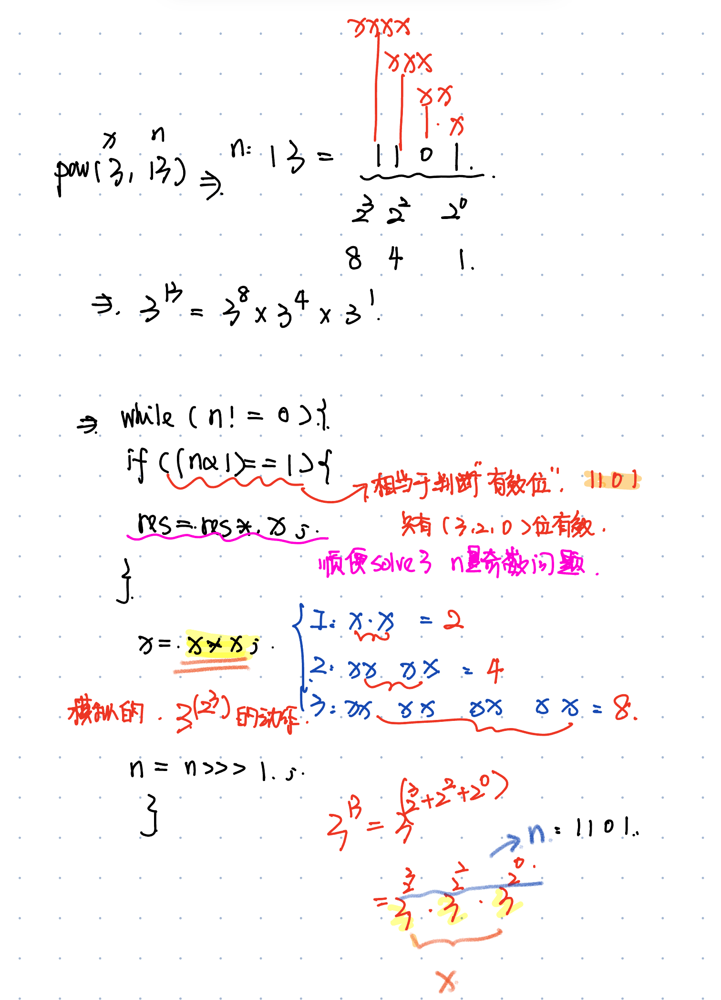

# 9. Palindrome Number
* **一刷:10:02(✅)**
* [9. Palindrome Number](https://leetcode.com/problems/palindrome-number/?envType=study-plan-v2&envId=top-interview-150)

## My Code
```java
class Solution {
    public boolean isPalindrome(int x) {
        if(x < 0) return false;
        Deque <Integer> que = new LinkedList<>();
        int n = x % 10;
        int m = x / 10;
        que.offer(n);
        while(m != 0){
            n = m % 10;
            m = m / 10;
            que.offer(n);
        }
        while(!que.isEmpty()){
            if(que.size() == 1)return true;
            if(que.size() > 1 && que.getLast() == que.peek()){
                que.pollLast();
                que.poll();
            }else {
                return false;
            }
        }
        return true;
    }
}
```
***
# 66. Plus One
* **一刷:15:02(✅)**
* [66. Plus One](https://leetcode.com/problems/plus-one/?envType=study-plan-v2&envId=top-interview-150)

## My Code
```java
class Solution {
    public int[] plusOne(int[] digits) {
        if (digits[digits.length - 1] != 9) {
            digits[digits.length - 1]++;
            return digits;
        }
        Deque<Integer> dq = new LinkedList<>();
        boolean flag = true;
        for(int i = digits.length - 1; i >=0 ; i --){
            if(flag && digits[i] == 9){
                dq.offer(0);
                if(i == 0){
                    dq.offer(1);
                }
                continue;
            }
            if (flag && digits[i] != 9){
                dq.offer(digits[i] + 1);
                flag = false;
                continue;
            }
            if(!flag){
                dq.offer(digits[i]);
                continue;
            }
        }
        int [] res = new int [dq.size()];
        for(int i = 0 ; i < res.length; i ++){
            res[i] = dq.pollLast();
        }
        return res;
    }
}
```
***
# 172. Factorial Trailing Zeroes
* **一刷:17:02(❌)**
* [172. Factorial Trailing Zeroes](https://leetcode.com/problems/factorial-trailing-zeroes/?envType=study-plan-v2&envId=top-interview-150)

## Code
* 思路：
  * 本题的关键是找到产生0的原因 ==> `5 和 5 的倍数`
  * 5的倍数会产生一个，25的倍数会产生两个，125会产生3个
  * 通过`n/5 + trailingZeroes(n/5);`,其实是在通过**递归**一层层筛选5和25和125及他们的倍数
  
```java
class Solution {
  public int trailingZeroes(int n) {
    if (n == 0) {
      return 0;
    }
    return n/5 + trailingZeroes(n/5);
  }
}
```
***
# 69. Sqrt(x)
* **一刷:15:02(✅)**
* [69. Sqrt(x)](https://leetcode.com/problems/sqrtx/?envType=study-plan-v2&envId=top-interview-150)

## My Code 
* 思路：二分法，最后结果return end. 因为当end < start 时，已经相当于round down了
```java
class Solution {
    public int mySqrt(int x) {
        if(x == 0 || x == 1) return x;
        long start = 0; 
        long end = x/2;
        long mid = 0;
        while(start <= end){
            mid = start +  ((end - start ) / 2);
            long sqrt = mid * mid;
            if(sqrt == x) { return (int) mid;}
            if(sqrt < x) {start = mid + 1;}
            else {end = mid - 1;}
        }
        return (int)end;
    }
}
```
***
# 50. Pow(x,n)
* **一刷:30:02(❌)**
* [50. Pow(x,n)](https://leetcode.com/problems/powx-n/?envType=study-plan-v2&envId=top-interview-150)

## 🌟位运算的应用
### 1. 通过 `(n & 1)!= 0 ` 来判断奇偶数
* 位运算中 : `(n&1) == 0` 是偶数; `(n&1) != 0` 是奇数

### 2.  >> 和 >>> 的区别
* `>>` and `>>>` are both **bitwise shift operators**, but they differ in how they handle the sign bit (the leftmost bit) for signed integers.
* `>>` is the signed right shift operator. It will keep the orginal sign
* `>>>` is the unsigned right shift operator. No matter what, the result will always be positive.

#### 3. int range from -2^31 to 2^31 - 1
* Which means if we use `n = -n ` and the `n = -2^31`. The n won't be 2^31, as it out of int range!!!  ==> it will still be `n = -2^31`
* In this case, use `>>>` instead of `>>`

## 本题思路
### Binary exponentiation （二分幂） 算法

```java
class Solution {
    public double myPow(double x, int n) {
        if(n < 0){
            n = -n;
            x = 1 / x;
        }
        double pow = 1;
        while(n != 0){
            if((n & 1) != 0){
                pow *= x;
            }    
            x *= x;
            n >>>= 1;
        }
        return pow;
    }
}
```
***
# 149. Max Points on a line
* **一刷:48:02(✅)**
* [149. Max Points on a line ](https://leetcode.com/problems/max-points-on-a-line/?envType=study-plan-v2&envId=top-interview-150)

## My Code
* 通过map记录来找最大，问题是效率极低
```java
class Solution {
    public int maxPoints(int[][] points) {
        Arrays.sort(points, (arr1, arr2) -> {
            if (arr1[0] == arr2[0]) {
                return arr1[1] - arr2[1];
            }
            return arr1[0] - arr2[0];
        });
        int start = 0;
        int max = 1;
        while (start <= points.length - 2) {
            Map<Double, Integer> map = new HashMap<>();
            for (int i = start + 1; i <= points.length - 1; i++) {
                int num = 0;
                double k = (double) (points[i][1] - points[start][1]) / (points[i][0] - points[start][0]);
                num = map.getOrDefault(k, 1);
                map.put(k, num + 1);
                if (num + 1 > max) {
                    max = num + 1;
                }
            }
            if (max > points.length / 2) {
                return max;
            }
            start++;
        }
        return max;
    }
}
```