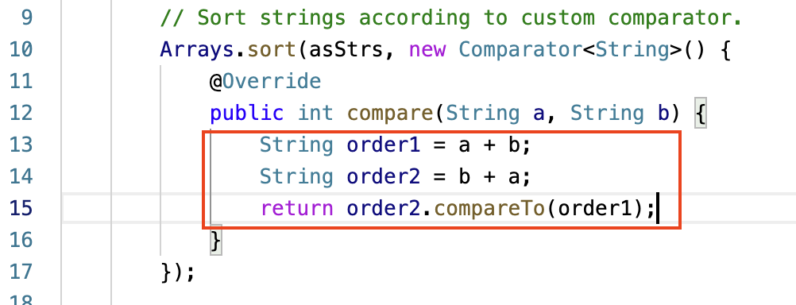

# 148. Sort List
* **一刷:5:50(❌)**
* [148. Sort List](https://leetcode.com/problems/sort-list/)

## 思路
* List 的 Merge Sort 操作
  * 通过`pre.next = null` 来cut
  * 通过`slow = slow.next; fast = fast.next.next` 来找到mid点 
  * 在Merge中，通过`ListNode dummy = new ListNode(0), p = dummy`来设置虚拟结点dummy，以及实际操作的节点p
  
## Code
```java
/**
 * Definition for singly-linked list.
 * public class ListNode {
 *     int val;
 *     ListNode next;
 *     ListNode() {}
 *     ListNode(int val) { this.val = val; }
 *     ListNode(int val, ListNode next) { this.val = val; this.next = next; }
 * }
 */
class Solution {
    public ListNode sortList(ListNode head) {
        //1. return : if head is single which is head.next = null || head == null return
        if(head == null || head.next == null){
            return head;
        }
        //2. divide List into half
        ListNode pre = null, slow = head, fast = head;
        while(fast != null && fast.next != null){
            pre = slow;
            slow = slow.next;
            fast = fast.next.next;
        }
        //cut in list
        pre.next = null;
        ListNode l1 = sortList(head);
        ListNode l2 = sortList(slow);
        return merge(l1,l2);

    }
    public ListNode merge(ListNode l1, ListNode l2){
        ListNode first = new ListNode(0), p = first;
        while(l1 != null && l2 != null){
            if(l1.val < l2.val){
                p.next = l1;
                l1 = l1.next;
            }else{
                p.next = l2;
                l2 = l2.next;
            }
            p = p.next;
        }
        if(l1 != null){
            p.next = l1;
        }
        if(l2 != null){
            p.next = l2;
        }
        return first.next;
    }
}
```
***

# 56. Merge Intervals
* **一刷:15:50(✅)**
* [56. Merge Intervals](https://leetcode.com/problems/merge-intervals/)
## My Code
```java
class Solution {
    public int[][] merge(int[][] intervals) {
        Arrays.sort(intervals, (arr1, arr2) -> {
            if (arr1[0] == arr2[0]) {
                return arr1[1] - arr2[1];
            } else {
                return arr1[0] - arr2[0];
            }
        });
        List<int[]> list = new LinkedList<>();
        int preEnd = intervals[0][1];
        int preStart = intervals[0][0];
        for (int i = 1; i < intervals.length; i++) {
            int start = intervals[i][0];
            int end = intervals[i][1];
            if (start > preEnd) {
                int[] tmp = { preStart, preEnd };
                list.add(tmp);
                preStart = start;
                preEnd = end;
            } else {
                preEnd = Math.max(preEnd, end);
            }
        }
        int[] tmp = { preStart, preEnd };
        list.add(tmp);
        return list.toArray(new int[list.size()][]);
    }
}
```
***
# 27. Remove Elements
* **一刷:10:20(✅)**
* [27. Remove Elements](https://leetcode.com/problems/remove-element/)
## My Code
```java
class Solution {
    public int removeElement(int[] nums, int val) {
        int res = 0;
        int slow = 0, fast = 0;
        while(fast < nums.length){
            if(nums[fast] != val){
                nums[slow] = nums[fast];
                slow ++;
                res ++;
            }
            fast ++;
        }
        return res;
    }
}
```
***
# 179. Largest Number
* **一刷:30:20(❌)**
* [179. Largest Number](https://leetcode.com/problems/largest-number/)

## 知识点
### 自定义比较方法： Override Comparator中的compare方法

* 在红框内自定义**比较的规则**

### Str1.compareTo(Str2);
* 字符串的比较大小，根据字典顺序排序

## Code
```java
class Solution {
    public String largestNumber(int[] nums) {
        String [] str = new String [nums.length];
        for(int i = 0 ; i < nums.length; i ++){
            str[i] = String.valueOf(nums[i]);
        }
        Arrays.sort(str, new Comparator<String>(){
            @Override
            public int compare(String a, String b){
                String order1 = a + b;
                String order2 = b + a;
                return order2.compareTo(order1);
            }
        });
        if(str[0].equals("0")) return "0";
        StringBuilder res = new StringBuilder();
        for(String s : str){
            res.append(s);
        }
        return res.toString();
    }
}
```

