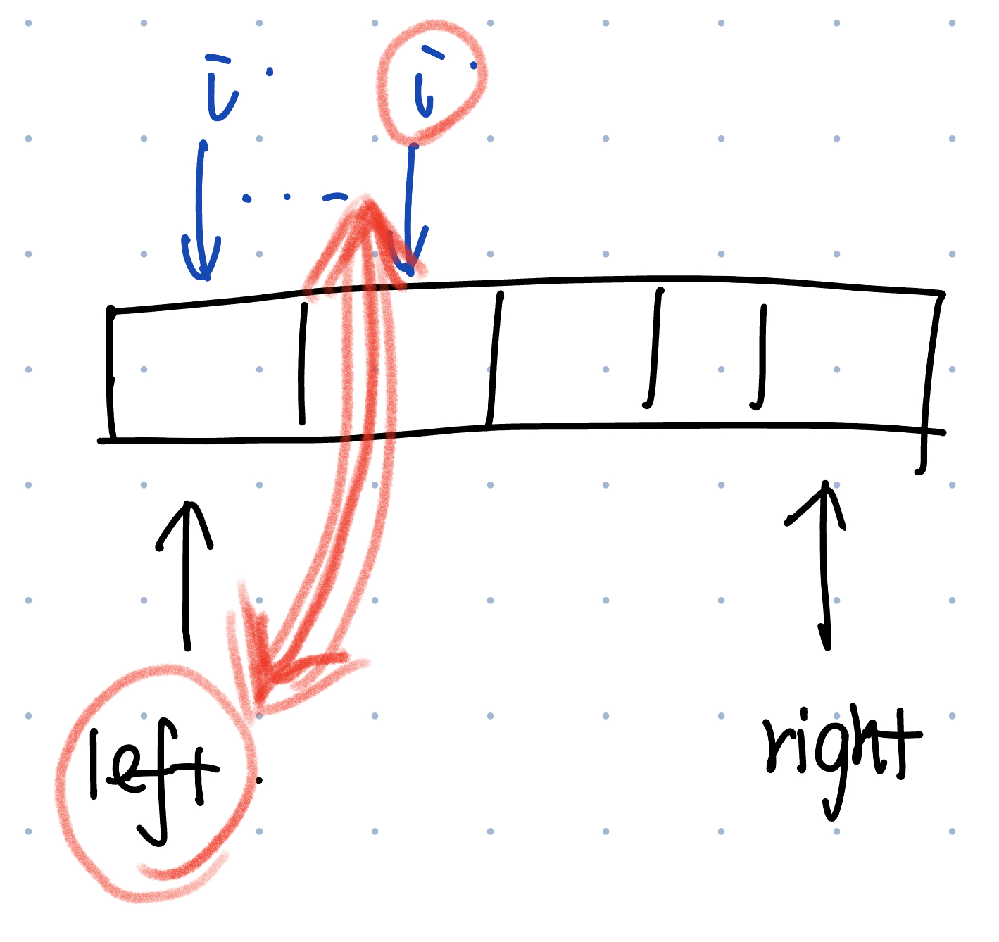

# 75. Sort Colors
* **一刷:36:50(✅)**
* [75. Sort Colors](https://leetcode.com/problems/sort-colors/)

## 思路
* 通过找到固定值，l: 存放最小的0; r: 存放最大的2
* 通过i来进行遍历，当i是0，更新left； 当i是2，更新2。最后的结果自然而然就是排序好的！
```java
class Solution {
  public void sortColors(int[] nums) {
    int l = 0;
    int r = nums.length - 1;

    for (int i = 0; i <= r;)
      if (nums[i] == 0)
        swap(nums, i++, l++);
      else if (nums[i] == 1)
        i++;
      else
        swap(nums, i, r--);
  }

  private void swap(int[] nums, int i, int j) {
    final int temp = nums[i];
    nums[i] = nums[j];
    nums[j] = temp;
  }
}
```

***
# 215. Kth Largest Element in an Array 
* **一刷:36:50(❌)**
* [215. Kth Largest Element in an Array ](https://leetcode.com/problems/kth-largest-element-in-an-array/)

## 感悟
### 排序的常见升级版

* 通常会有固定值(right / left)，然后通过for循环遍历i，通过i来与固定值比较大小，然后更新left/right
### QuickSort 通过 Random来减少极端情况
``` java
    Random rand = new Random();
    int pivot_index = left + rand.nextInt(right - left + 1); // [left,right];
```
* !注意在partition中，需要先交换pivot与right的位置，因为for循环还是需要遍历整个[left, right];

```java
public class Solution {
    public int findKthLargest(int[] nums, int k) {
        int left = 0, right = nums.length - 1;
        Random rand = new Random();
        while (true) {
            int pivot_index = left + rand.nextInt(right - left + 1);
            int new_pivot_index = partition(nums, left, right, pivot_index);
            if (new_pivot_index == nums.length - k) {
                return nums[new_pivot_index];
            } else if (new_pivot_index > nums.length - k) {
                right = new_pivot_index - 1;
            } else {
                left = new_pivot_index + 1;
            }
        }
    }

    private int partition(int[] nums, int left, int right, int pivot_index) {
        int pivot = nums[pivot_index];
        swap(nums, pivot_index, right);
        int stored_index = left;
        for (int i = left; i < right; i++) {
            if (nums[i] < pivot) {
                swap(nums, i, stored_index);
                stored_index++;
            }
        }
        swap(nums, right, stored_index);
        return stored_index;
    }

    private void swap(int[] nums, int i, int j) {
        int temp = nums[i];
        nums[i] = nums[j];
        nums[j] = temp;
    }
}
```
