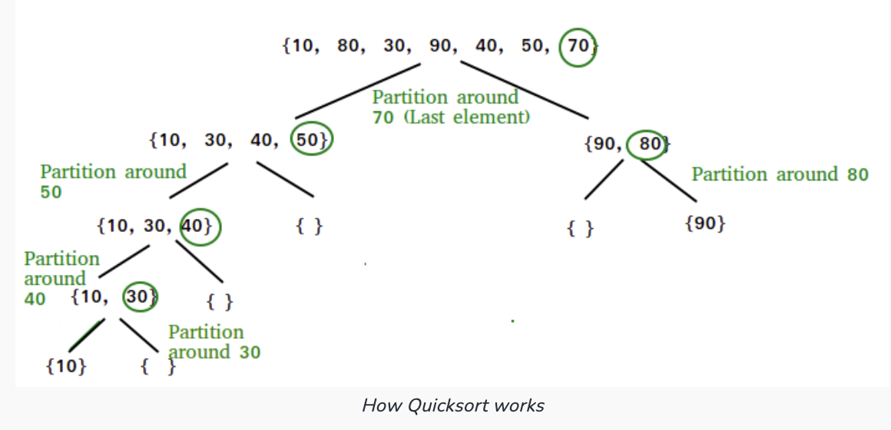
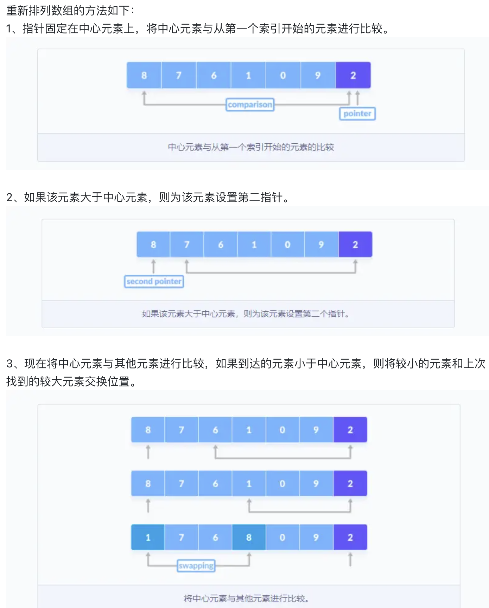
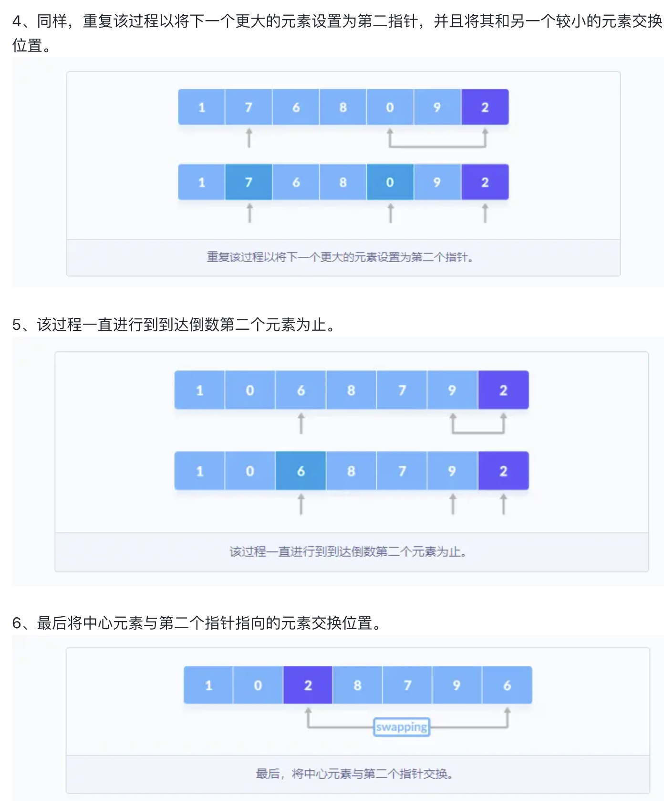
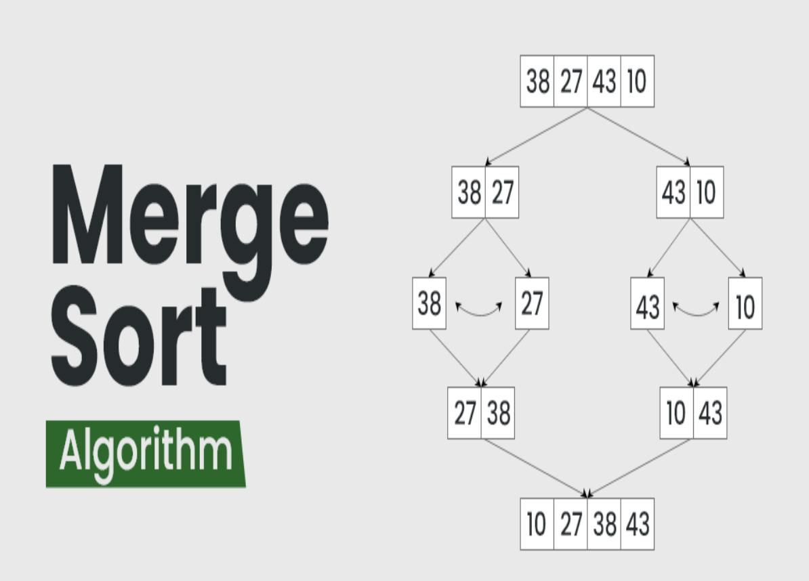
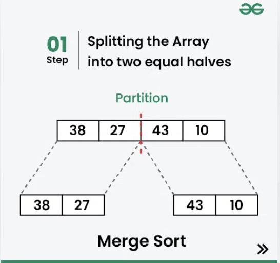
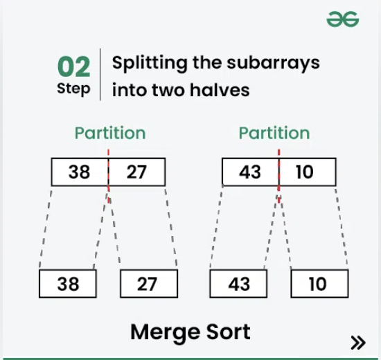
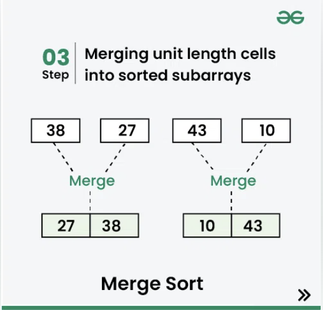
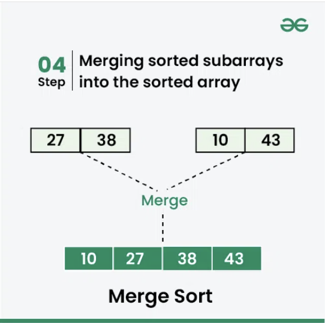

# Quick Sort + Merge Sort + Quick Select
* 十大排序: [十大排序JavaGuide](https://javaguide.cn/cs-basics/algorithms/10-classical-sorting-algorithms.html#%E4%BB%A3%E7%A0%81%E5%AE%9E%E7%8E%B0-5)
## Quick Sort
* [java实现quick Sort](https://segmentfault.com/a/1190000040022056)
* [英文解释，很详细](https://www.geeksforgeeks.org/quick-sort/)
### 思想
* 方法：使用的**Divide and Conquer**
* Key Process: **partition()**
  * The target of partitions is to place the **pivot** at its correct position in the sorted array and put all **smaller** elements to the left of the pivot, and all **greater** elements to the right. 
  * Partiton is done **recursively** on each side of the pivot after the pivot is placed in its correct position and this finally sorts the array.
* 
* **代码逻辑**
  * 1. Set the `pivot = arr[high];`
  * 2. Start from the **leftmost** which is `i = low`. And keep track of the index of **smaller elements** as `int pointer`
  * 3. if current value `arr[i]` smaller than pivot, than **swap** the `arr[pointer]` with `arr[i]`  
  * 4. After the traversing, swap the pointer and pivot, and go on


### Time Complexity and Auxiliary Space
#### Time Complexity
* Best Case: $\Omega (NlogN)$
  * When the pivot chosen at the each step divides the array into roughly **equal halves**
    * Which mean at **each step of recursion**, the time complexity is $O(n)$
    * The **depth** of recursion is roughly $O(logN)$
    *  ==> $\Omega (NlogN)$
* Worst Case: $O(N * N)$
  * When the pivot chosen at the each step results in **highly unbalanced paritions** (When the array is already sorted and the pivot is always chosen as the smallest or largest element.)
    * One arr is void, and the other one contains all the elements left
    * ==> $O(N * N)$
#### Auxiliary Space
* Depends on the depth of **recursion**
  * Best case: $\Omega (logN)$
  * Worst case: $O(N)$
### 代码实现
```java
public class QuickSort {

    public static int partition(int[] array, int low, int high) {
        // 取最后一个元素作为中心元素
        int pivot = array[high];
        // 定义指向比中心元素大的指针，首先指向第一个元素
        int pointer = low;
        // 遍历数组中的所有元素，将比中心元素大的放在右边，比中心元素小的放在左边
        for (int i = low; i < high; i++) {
            if (array[i] <= pivot) {
                // 将比中心元素小的元素和指针指向的元素交换位置
                // 如果第一个元素比中心元素小，这里就是自己和自己交换位置，指针和索引都向下一位移动
                // 如果元素比中心元素大，索引向下移动，指针指向这个较大的元素，直到找到比中心元素小的元素，并交换位置，指针向下移动
                int temp = array[i];
                array[i] = array[pointer];
                array[pointer] = temp;
                pointer++;
            }
            System.out.println(Arrays.toString(array));
        }
        // 将中心元素和指针指向的元素交换位置
        int temp = array[pointer ];
        array[pointer] = array[high];
        array[high] = temp;
        return pointer;
    }

    public static void quickSort(int[] array, int low, int high) {
        if (low < high) {
            // 获取划分子数组的位置
            int position = partition(array, low, high);
            // 左子数组递归调用
            quickSort(array, low, position -1);
            // 右子数组递归调用
            quickSort(array, position + 1, high);
        }
    }

    public static void main(String[] args) {
        int[] array = {6,72,113,11,23};
        quickSort(array, 0, array.length -1);
        System.out.println("排序后的结果");
        System.out.println(Arrays.toString(array));
    }
}
```
***
## Quick Select
* Target: Find the **k-th smallest element** in an unordered list. It is related to the **Quick Sort**.
* [英文解释，很详细](https://www.geeksforgeeks.org/quickselect-algorithm/)
```java
Input: arr[] = {7, 10, 4, 3, 20, 15}
           k = 3
Output: 7

Input: arr[] = {7, 10, 4, 3, 20, 15}
           k = 4
Output: 10
```
### 思想
* 方法：和Quick Sort类似，只是只用对单侧(left/right)进行recursion遍历
* It recurs only for **the part that contains the k-th smallest element**
  * If index of the partitioned element is more than k, then we recur for the left part
  * If index is the same as k, we have found the k-th smallest element and we return. 
  * If index is less than k, then we recur for the right part. 
### Time Complexity and Auxiliary Space
* Best Case: $\Omega (N)$ (since don't need the $\Omega (logN)$)
* Worst Case: $O(N * N)$ (still the same, the worst case logic is the same as Quick Sort above)
### 代码实现
```java
// Java program of Quick Select 
import java.util.Arrays; 
  
class GFG { 
  
    // partition function similar to quick sort 
    // Considers last element as pivot and adds 
    // elements with less value to the left and 
    // high value to the right and also changes 
    // the pivot position to its respective position 
    // in the final array. 
    public static int partition(int[] arr, int low, 
                                int high) 
    { 
        int pivot = arr[high], pivotloc = low; 
        for (int i = low; i <= high; i++) { 
            // inserting elements of less value 
            // to the left of the pivot location 
            if (arr[i] < pivot) { 
                int temp = arr[i]; 
                arr[i] = arr[pivotloc]; 
                arr[pivotloc] = temp; 
                pivotloc++; 
            } 
        } 
  
        // swapping pivot to the final pivot location 
        int temp = arr[high]; 
        arr[high] = arr[pivotloc]; 
        arr[pivotloc] = temp; 
  
        return pivotloc; 
    } 
  
    // finds the kth position (of the sorted array) 
    // in a given unsorted array i.e this function 
    // can be used to find both kth largest and 
    // kth smallest element in the array. 
    // ASSUMPTION: all elements in arr[] are distinct 
    public static int kthSmallest(int[] arr, int low, 
                                  int high, int k) 
    { 
        // find the partition 
        int partition = partition(arr, low, high); 
  
        // if partition value is equal to the kth position, 
        // return value at k. 
        if (partition == k - 1) 
            return arr[partition]; 
  
        // if partition value is less than kth position, 
        // search right side of the array. 
        else if (partition < k - 1) 
            return kthSmallest(arr, partition + 1, high, k); 
  
        // if partition value is more than kth position, 
        // search left side of the array. 
        else
            return kthSmallest(arr, low, partition - 1, k); 
    } 
  
    // Driver Code 
    public static void main(String[] args) 
    { 
        int[] array = new int[] { 10, 4, 5, 8, 6, 11, 26 }; 
        int[] arraycopy 
            = new int[] { 10, 4, 5, 8, 6, 11, 26 }; 
  
        int kPosition = 3; 
        int length = array.length; 
  
        if (kPosition > length) { 
            System.out.println("Index out of bound"); 
        } 
        else { 
            // find kth smallest value 
            System.out.println( 
                "K-th smallest element in array : "
                + kthSmallest(arraycopy, 0, length - 1, 
                              kPosition)); 
        } 
    } 
} 
// This code is contributed by Saiteja Pamulapati
```
***


## Merge Sort
* [英文解释，很详细](https://www.geeksforgeeks.org/merge-sort/)
### 思想
* 方法：使用的**Divide and Conquer**
* Key Process: Divide and Merge
  * Keep dividing by `mid` point, `int mid = arr.length / 2`
  * When it reachs down to the bottom ,`arr.length <= 1`, `return arr`
  * Using `int [] arrLeft = Arrays.copyOfRange(arr, left, right);` get a new splited array.
  * Using `merge(int [] arrLeft, int [] arrRight)` to sort and merge






### 代码实现
```java
    public static int [] mergeSort(int []  arr){
        //当分割到只有1个的时候返回；
        if(arr.length <= 1){
            return arr;
        }
        //每次以中点为切割点
        int mid = arr.length / 2;
        int [] arr1 = Arrays.copyOfRange(arr,0, mid);
        int [] arr2 = Arrays.copyOfRange(arr,mid, arr.length);
        // 不断切割，然后再merge
        return merge(mergeSort(arr1),mergeSort(arr2));
    }
    public static int [] merge(int [] arr1, int [] arr2){
        int [] res = new int [arr1.length + arr2.length];
        int index = 0;
        int index1 = 0;
        int index2 = 0;
        while(index1<arr1.length && index2 < arr2.length){
            if(arr1[index1] < arr2[index2]){
                res[index] = arr1[index1];
                index1 ++;
            }else{
                res[index] = arr2[index2];
                index2 ++;
            }
            index ++;
        }
        if(index1 != arr1.length){
            while(index1!=arr1.length){
                res[index] = arr1[index1];
                index1 ++;
                index ++;
            }
        }else{
            while(index2!=arr2.length){
                res[index] = arr2[index2];
                index2 ++;
                index ++;
            }
        }
        return res;
    }
```
