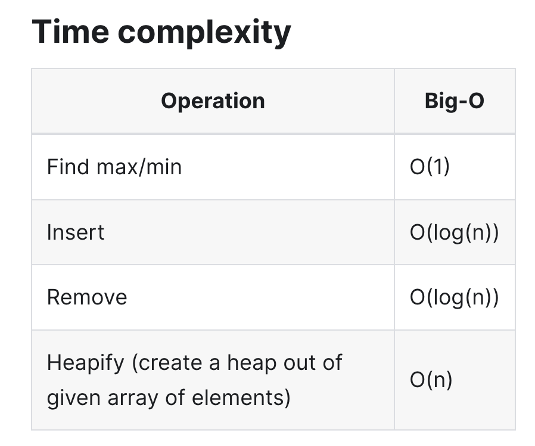
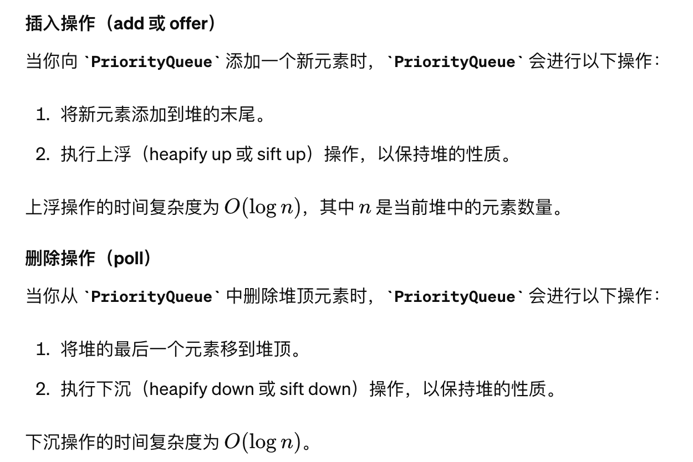

# Heap/Priority Queue
## 基础
* Default是一个min-heap, children > parent，最小的就是heap顶
### 1. 创建`PriorityQueue`
```java
// 默认小顶堆
PriorityQueue<Integer> minHeap = new PriorityQueue<>();

// 自定义比较器实现大顶堆
PriorityQueue<Integer> maxHeap = new PriorityQueue<>((a, b) -> b - a);

// 使用 lambda 表达式创建自定义比较器的小顶堆
PriorityQueue<int[]> pq = new PriorityQueue<>((a, b) -> {
    return a[0] - b[0];  // 根据数组第一个元素进行比较
});
```
### 2. 添加元素: add/offer
### 3. 移除元素: poll
### 4. 获取不移除: peek
### 5. 大小: size

## 算法实现



