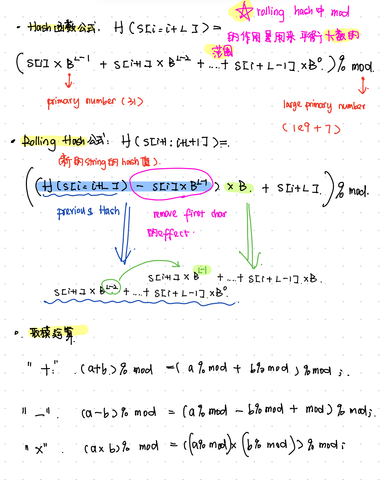
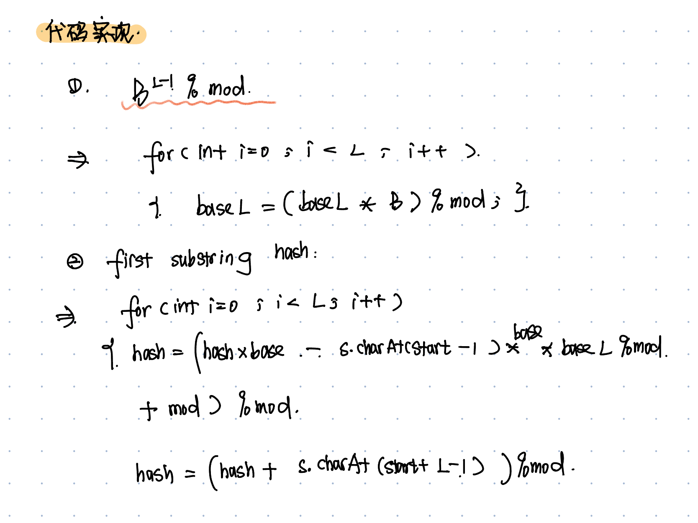

# 528. Random Pick with Weight
* **一刷:20：45(❌)**
* [528. Random Pick with Weight](https://leetcode.com/problems/random-pick-with-weight/)

## 知识点
### 前缀和prefixSums
* 用处：可以快速计算出i在 它以及他之前的权重。**加权随机选择问题**中，前缀和数组有助于快速找到随机数落在哪个权重区间内.
* 结合**二分法**，能够实现按权重选取随机数

## Code
```java
class Solution {
    int [] preArr;
    int totalSum = 0;
    Random rand;
    public Solution(int[] w) {
        preArr = new int [w.length];
        int index = 0 ;
        for(int i : w){
            totalSum += i;
            preArr[index] = totalSum;
            index ++;
        }
        rand = new Random();
    }
    
    public int pickIndex() {
        int r = rand.nextInt(totalSum);
        int start = 0;
        int end = preArr.length - 1;
        while(start < end){
            int mid = start + (end - start)/2;
            if (preArr[mid] <= r){
                start = mid + 1;
            }
            else{
                end = mid;
            }
        }
        return end;
    }
}

/**
 * Your Solution object will be instantiated and called as such:
 * Solution obj = new Solution(w);
 * int param_1 = obj.pickIndex();
 */
```
***
# 1060. Missing Element in Sorted Array
* **一刷:20：45(❌)**
* [1060. Missing Element in Sorted Array](https://leetcode.com/problems/missing-element-in-sorted-array/)

## 思路
* 可以通过index之间的差值来确定missing values!
## Code
```java
class Solution {
    public int missingElement(int[] nums, int k) {
        int totalMissing = (nums[nums.length - 1] - nums[0]) - (nums.length - 1);
        if(k > totalMissing) return nums[nums.length - 1] + k - totalMissing;
        int start = 0;
        int end = nums.length - 1;
        while(start < end){
            int mid = start + (end - start) / 2;
            int missingUntilMid = nums[mid] - nums[0] - mid;
            if(missingUntilMid >= k){
                end = mid;
            }else {
                start = mid + 1;
            }
        }
        return nums[0] + k + start - 1;
    }
}
```
***
# 1062. Longest Repeating Substring
* **一刷:30：45(❌)**
* [1062. Longest Repeating Substring](https://leetcode.com/problems/longest-repeating-substring/)

## 算法：Rolling Hash



## Code
```java
import java.util.HashSet;

class Solution {
    public int longestRepeatingSubstring(String s) {
        int n = s.length();
        int left = 1, right = n;

        while (left <= right) {
            int L = left + (right - left) / 2;
            if (search(s, L, n) != -1) {
                left = L + 1;
            } else {
                right = L - 1;
            }
        }

        return left - 1;
    }

    private int search(String s, int L, int n) {
        HashSet<Long> seen = new HashSet<>();
        long hash = 0;
        long base = 31;
        long mod = (long) 1e9 + 7;
        long baseL = 1;

        // 计算 base^L % mod
        for (int i = 0; i < L; i++) {
            baseL = (baseL * base) % mod;
        }

        // 计算第一个长度为 L 的子串的哈希值
        for (int i = 0; i < L; i++) {
            hash = (hash * base + s.charAt(i)) % mod;
        }
        seen.add(hash);

        // 滚动哈希值遍历字符串
        for (int start = 1; start <= n - L; start++) {
            hash = (hash * base - s.charAt(start - 1) * baseL % mod + mod) % mod;
            hash = (hash + s.charAt(start + L - 1)) % mod;

            if (seen.contains(hash)) {
                return start;
            }
            seen.add(hash);
        }

        return -1;
    }
}
```