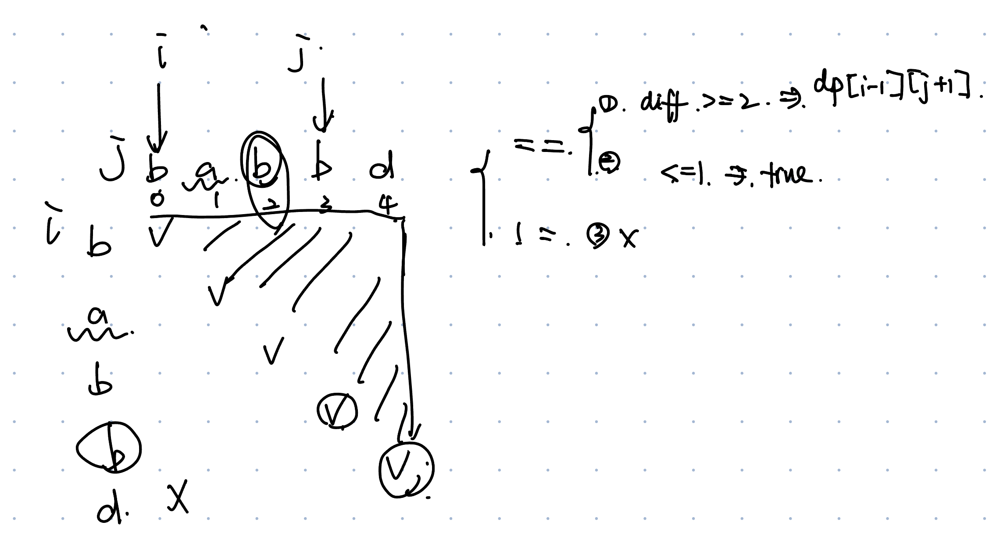

# 125. Valid Palindrome
* **一刷:11：45(✅)**
* [125. Valid Palindrome](https://leetcode.com/problems/valid-palindrome/)

## 字符常用方法
* `Character.isLetterOrDigit()`:判断是否是字母and数字
* `Character.toLowerCase()`:大写到小写

## Code
```java
class Solution {
    public boolean isPalindrome(String s) {
        int start = 0;
        int end = s.length() - 1;
        
        while (start < end) {
            // Move start to the next alphanumeric character
            while (start < end && !Character.isLetterOrDigit(s.charAt(start))) {
                start++;
            }
            // Move end to the previous alphanumeric character
            while (start < end && !Character.isLetterOrDigit(s.charAt(end))) {
                end--;
            }
            
            // Convert characters to lower case and compare
            if (Character.toLowerCase(s.charAt(start)) != Character.toLowerCase(s.charAt(end))) {
                return false;
            }
            
            start++;
            end--;
        }
        
        return true;
    }
}
```
## My Code
```java
class Solution {
    public boolean isPalindrome(String s) {
        char[] arr = s.toCharArray();
        int start = 0;
        int end = arr.length - 1;
        while (start < end) {
            // upper to lower
            if (arr[start] >= 'A' && arr[start] <= 'Z') {
                arr[start] = (char) (arr[start] + 32);
            }
            if (arr[end] >= 'A' && arr[end] <= 'Z') {
                arr[end] = (char) (arr[end] + 32);
            }
            // skip not belongs to alphanumeric
            while (!((arr[start] <= '9' && arr[start] >= '0') || (arr[start] >= 'a' && arr[start] <= 'z'))) {
                start++;
                if (start > end) {
                    return true;
                }
                if (arr[start] >= 'A' && arr[start] <= 'Z') {
                    arr[start] = (char) (arr[start] + 32);
                }
            }
            while (!((arr[end] <= '9' && arr[end] >= '0') || (arr[end] >= 'a' && arr[end] <= 'z'))) {
                end--;
                if (start > end) {
                    return true;
                }
                if (arr[end] >= 'A' && arr[end] <= 'Z') {
                    arr[end] = (char) (arr[end] + 32);
                }
            }
            if (arr[start] == arr[end]) {
                start++;
                end--;
            } else {
                return false;
            }
        }

        return true;
    }
}
```
***
# 5. Longest Palindromic Substring
* **二刷:20：45(❌)**
* [5. Longest Palindromic Substring](https://leetcode.com/problems/longest-palindromic-substring/)

## 法1: 二维DP
### 1. DP的使用场景
#### 1.1 最优子结构
* 问题能够通过解决**子问题**来解决
* e.g. Fibonacci sequence, knapsack problem, and shortest path problems
#### 1.2 重叠子结构
* 原问题的子问题会重复出现，可以通过**memoization or bottom-up**

#### 1.3 子问题无后效性
*子问题的解一旦确定，就不再受其他子问题的影响，即子问题的解不依赖于更大的问题的解。
* 例如，求解最长公共子序列时，某一子序列的解不会受到其它子序列的解的影响。

### 2. DP的五部曲
* 确定dp数组的含义
* 找到如何递归，递归公式
* 确定初始值
* 确定遍历顺序
* 验证模拟

### 2. 本题分析
* 这一个**上三角**问题
  * 通过二维dp的i，j来模拟两个指针在string上的移动。数组dp的含义是在[i,j]**范围内**，是否是palindromic!
  * 通过**bottom-up**来进行遍历
  * j的起始值是i（这才是上三角）
* 递归问题要将可能的情况列举出来进行分析


### 3. Code
```java
class Solution {
    public String longestPalindrome(String s) {
        boolean[][] dp = new boolean[s.length()][s.length()];
        for (int i = 0; i < s.length(); i++) {
            dp[i][i] = true;
        }
        int maxLen = 0;
        int start = 0;
        for (int i = s.length() - 1; i >= 0; i--) {
            for (int j = i; j <= s.length() - 1; j++) {
                if (s.charAt(i) == s.charAt(j)) {
                    if (Math.abs(j - i) >= 2) {
                        if (dp[i + 1][j - 1]) {
                            dp[i][j] = true;
                        }
                    } else {
                        dp[i][j] = true;
                    }
                } else {
                    dp[i][j] = false;
                }
                if (dp[i][j] && j - i + 1 > maxLen) {
                    maxLen = j - i + 1;
                    start = i;
                }
            }
        }
        return s.substring(start, start + maxLen);
    }
}
```
## 法2: 中心extend法的双指针
### 1. 本题分析
* palindrome的性质就是从中心发散，往两边走，来找到
* **双指针也可以往两边走**

### 2. Code
```java
class Solution {
    public String longestPalindrome(String s) {
        String s1 = "";
        String s2 = "";
        String res = "";
        for(int i = 0; i < s.length(); i ++){
            s1 = extend(s, i, i);
            res = s1.length() > res.length() ? s1:res;
            s2 = extend(s,i,i+1);
            res = s2.length() > res.length() ? s2: res;
        }
        return res;
    }
    private String extend(String s, int start, int end){
        String res = "";
        while(start >= 0 && end <= s.length() - 1 && s.charAt(start) == s.charAt(end)){
            res = s.substring(start,end + 1);
            start --;
            end ++;
        }
        return res;
    }
}
```