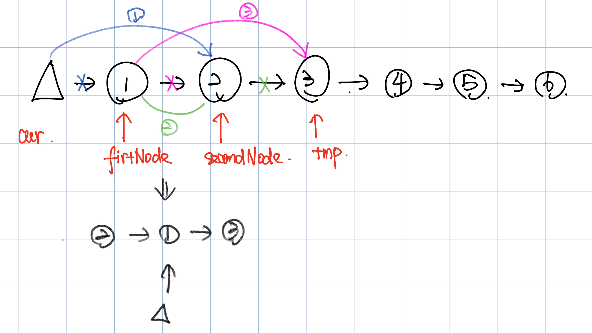
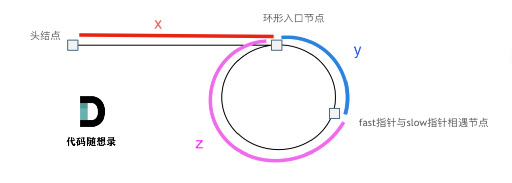
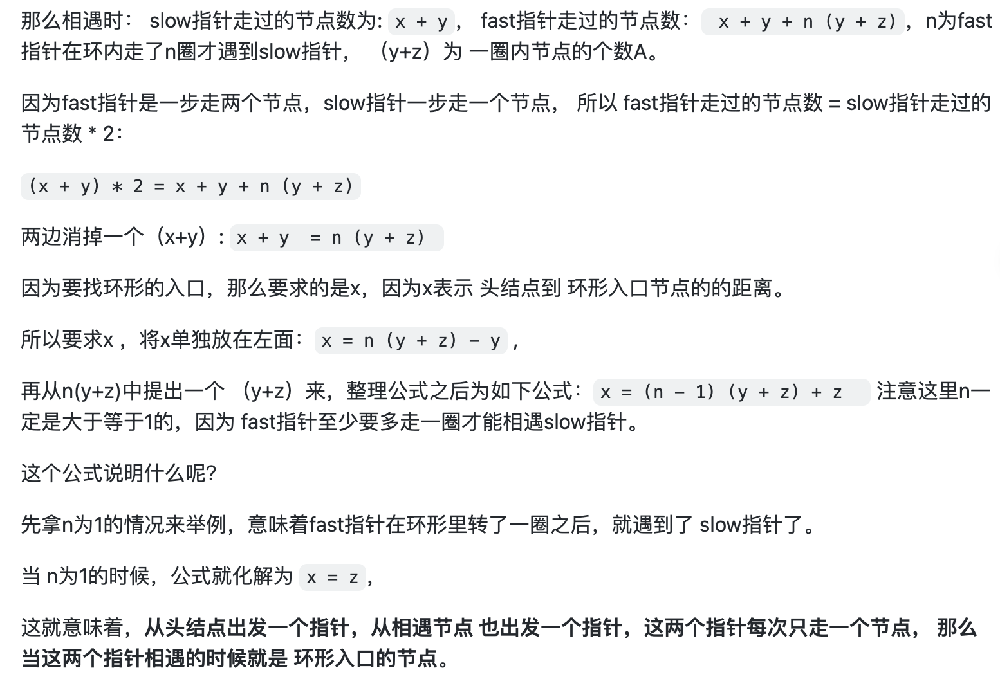

# 24. Swap Nodes in Paris
* **一刷:40:50(❌)**
* [24. Swap Nodes in Paris](https://leetcode.com/problems/swap-nodes-in-pairs/)

## 思路
* 需要通过`虚拟头节点dummyNode` 来找到前一个的状态
* 这里 **!!paramount** 就是这个`cur`,他补全了整个`swap`逻辑，并且能够自动的记录上一个状态e.g. dummy, 1, 3

```java
/**
 * Definition for singly-linked list.
 * public class ListNode {
 *     int val;
 *     ListNode next;
 *     ListNode() {}
 *     ListNode(int val) { this.val = val; }
 *     ListNode(int val, ListNode next) { this.val = val; this.next = next; }
 * }
 */
class Solution {
    public ListNode swapPairs(ListNode head) {
        ListNode dummy = new ListNode (-1);
        dummy.next = head;
        ListNode cur = dummy;
        ListNode tmp;
        ListNode firstNode ;
        ListNode secondNode;
        while(cur.next!= null && cur.next.next != null){
            tmp = cur.next.next.next;
            firstNode = cur.next;
            secondNode = cur.next.next;
            cur.next = secondNode;
            secondNode.next = firstNode;
            firstNode.next = tmp;
            cur = firstNode;
        }
        return dummy.next;
    }
}
```
***
# 19. Remove Nth Node From End of List
* **一刷:23:19(✅)**
* [19. Remove Nth Node From End of List](https://leetcode.com/problems/remove-nth-node-from-end-of-list/)

## My Code 
```java
/**
 * Definition for singly-linked list.
 * public class ListNode {
 *     int val;
 *     ListNode next;
 *     ListNode() {}
 *     ListNode(int val) { this.val = val; }
 *     ListNode(int val, ListNode next) { this.val = val; this.next = next; }
 * }
 */
class Solution {
    public ListNode removeNthFromEnd(ListNode head, int n) {
        int size = 0;
        ListNode pointer = new ListNode (-1,head);
        ListNode dummy = new ListNode(-1,head);
        while(pointer.next != null){
            size ++;  
            pointer = pointer.next; 
        }
        int stop = size - n;
        ListNode cur = new ListNode (-1);
        cur = dummy;
        for(int i = 0; i < stop; i++){
            cur = cur.next;
        }
        cur.next = cur.next.next;
        return dummy.next;
    }
}
```
***
# 142. Linked List Cycle II
* **一刷:30:50(❌)**
* [142. Linked List Cycle II](https://github.com/youngyangyang04/leetcode-master/blob/master/problems/0142.%E7%8E%AF%E5%BD%A2%E9%93%BE%E8%A1%A8II.md)

## 思路


```java
/**
 * Definition for singly-linked list.
 * class ListNode {
 *     int val;
 *     ListNode next;
 *     ListNode(int x) {
 *         val = x;
 *         next = null;
 *     }
 * }
 */
public class Solution {
    public ListNode detectCycle(ListNode head) {
        ListNode fast = new ListNode (-1, head);
        ListNode slow = new ListNode (-2, head);
        fast = head;
        slow = head;
        int meetPoint = 0;
        while(fast != null && fast.next != null){
            slow = slow.next;
            fast = fast.next.next;
            if( slow == fast){
                ListNode index1 = fast;
                ListNode index2 = head;
                while(index1 != index2){
                    index1 = index1.next;
                    index2 = index2.next;
                }
                return index1;
            }
        }
        return null;
    }
}
```