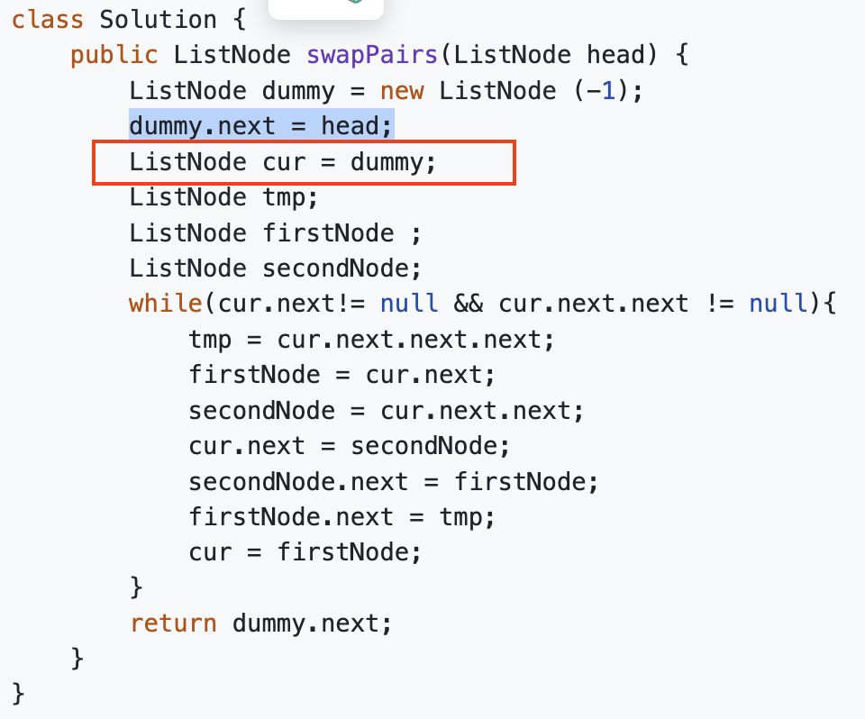

# 24. Swap Nodes in Pairs
* **一刷:40:22(✅)**
* [24. Swap Nodes in Pairs](https://leetcode.com/problems/swap-nodes-in-pairs/)

## ❗️❗️❗️ 链表dummy head问题
### Q：为什么dummyhead能够保证一直在更新后的head？我的while循环也没有对head进行操作呀
* 关键点在于他将 dummy赋值给了进行操作的cur节点`ListNode cur = dummy;`。这样就保证了cur之后的操作是对dummy指向的list进行的！！！！


***
# 234. Palindrome Linked List
* **一刷:10:22(✅)**
* [234. Palindrome Linked List](https://leetcode.com/problems/palindrome-linked-list/)

## Code
* 思路：将list放到array来实现回文判断
```java
class Solution {
    public boolean isPalindrome(ListNode head) {
        int len = 0;
        ListNode cur = head;
        while (cur != null) {
            len++;
            cur = cur.next;
        }
        cur = head;
        int[] res = new int[len];
        // put elements into arrays
        for (int i = 0; i < res.length; i++){
            res[i] = cur.val;
            cur = cur.next;
        }
        for (int i = 0, j = len - 1; i < j; i++, j--){
            if (res[i] != res[j]){
                return false;
            }
        }
        return true;
    }
}
```
