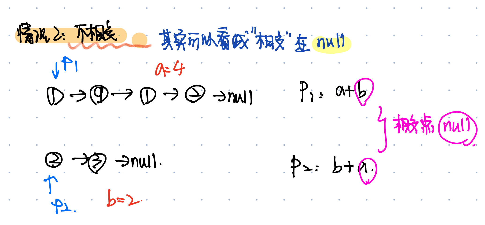

# 143. Reorder List
* **一刷:25:22(✅)**
* [143. Reorder List](https://leetcode.com/problems/reorder-list/)

## My Code
* 注意：需要在最后将ListNode 指向null
``` java
class Solution {
    public void reorderList(ListNode head) {
        Deque<ListNode> dq = new LinkedList<>();
        ListNode move = head;
        // put list into dq
        while (move != null) {
            dq.add(move);
            move = move.next;
        }
        // construct a new resList
        ListNode res = head;
        while (!dq.isEmpty()) {
            ListNode front = dq.poll();
            res.next = front;
            res = res.next;
            if (dq.isEmpty()) {
                break;
            } else {
                ListNode end = dq.pollLast();
                res.next = end;
                res = res.next;
            }
        }
        res.next = null;
        return;
    }
}
```
***
# 141. Linked List Cycle
* **一刷:5:12(✅)**
* [141. Linked List Cycle](https://leetcode.com/problems/linked-list-cycle/)
## My Code 
```java
public class Solution {
    public boolean hasCycle(ListNode head) {
        if(head == null) {return false;}
        ListNode fast = head.next;
        ListNode slow = head;
        while(fast!= null && fast.next != null){
            if(fast == slow){
                return true;
            }
            fast = fast.next.next;
            slow = slow.next;
        }
        return false;
    }
}
```
***
# 160. Intersection of Two Linked Lists
* **一刷:12:22(✅)**
* [160. Intersection of Two Linked Lists](https://leetcode.com/problems/intersection-of-two-linked-lists/)

## 思路
* 链表问题涉及到"环/相交“多半都和数学问题有关，要找到总的不变量，写写方程


```java
public class Solution {
    public ListNode getIntersectionNode(ListNode headA, ListNode headB) {
        ListNode p1 = headA;
        ListNode p2 = headB;
        while(p1!=p2){
            if(p1 == null){
                p1 = headB;
            }
            else {
                p1 = p1.next;
            }
            if(p2 == null){
                p2 = headA;
            }
            else {
                p2 = p2.next;
            }
        }
        return p1;
    }
}
```

