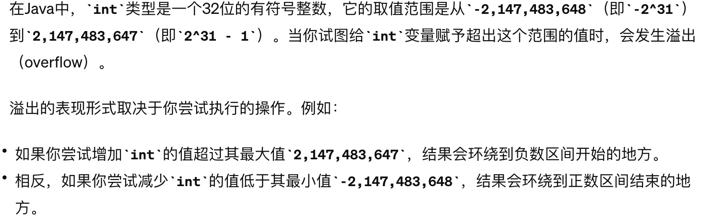

# 454. 4Sum II
* **一刷:15:32(✅)**
* [454. 4Sum II](https://leetcode.com/problems/4sum-ii/description/)

## My Code
```java
class Solution {
    public int fourSumCount(int[] nums1, int[] nums2, int[] nums3, int[] nums4) {
        HashMap <Integer,Integer> map12 = new HashMap<>();
        for(int i = 0; i < nums1.length; i ++){
            for (int j = 0; j < nums2.length; j ++){
                int tmp = nums1[i] + nums2[j];
                if(map12.containsKey(tmp)){
                    int num = map12.get(tmp);
                    num ++;
                    map12.put(tmp,num);
                }
                else {
                    map12.put(tmp,1);
                }
            }
        }
        int res = 0;
        for(int i = 0; i < nums3.length; i ++){
            for (int j = 0; j < nums4.length; j ++){
                int tmp = -(nums3[i] + nums4[j]);
                if(map12.containsKey(tmp)){
                    res = res + map12.get(tmp);
                }
            }
        }
        return res;
    }
}
```
***
# 383. Ransom Note
* **一刷:7:23(✅)**
* [383. Ransom Note](https://leetcode.com/problems/ransom-note/)

## My Code
```java
class Solution {
    public boolean canConstruct(String ransomNote, String magazine) {
        int lenR = ransomNote.length();
        int lenM = magazine.length();
        if(lenM < lenR) return false;
        int [] set = new int[26];
        for (int i = 0; i < lenM; i ++){
            char a = magazine.charAt(i);
            set[a - 'a'] ++;
        }
        for(int j = 0; j < lenR; j ++){
            char i = ransomNote.charAt(j);
            if(set[i - 'a'] == 0){
                return false;
            }
            else {
                set[i - 'a'] --;
            }
        }
        return true;
    }
}
```
***
# 15. 3Sum
* **一刷:40:32(❌)**
* [15. 3Sum](https://leetcode.com/problems/3sum/)
## 分析

### 思路
* 通过`双指针`，控制i为最外收束的，left通过i的值来确定==>`left = i + 1`
* **去重**: 去重逻辑不光需要考虑i的去重，`left和right也需要`(自己考虑到！) 


## My Code
```java
class Solution {
    public List<List<Integer>> threeSum(int[] nums) {
        Arrays.sort(nums);
        List<List<Integer>> res = new LinkedList<>();
        for(int i = 0; i <= nums.length - 2; i ++){
            if(i > 0 && nums[i - 1] == nums[i]) continue;
            int left = i + 1;
            int right = nums.length - 1;
            while(left < right){
                int tmpRes = nums[i] + nums[left] + nums[right];
                if(tmpRes < 0) left ++;
                else if(tmpRes > 0) right --;
                else {
                    List<Integer> r = new LinkedList<>();
                    r.add(nums[i]);
                    r.add(nums[left]);
                    r.add(nums[right]);
                    res.add(r);
                    while (right > left && nums[right] == nums[right - 1]) right--;
                    while (right > left && nums[left] == nums[left + 1]) left++;  
                    right--; 
                    left++;
                }
            }
        }
        return res;
    }
}
```
***
# 18. 4Sum
* **一刷:27:32(✅)**
* [18. 4Sum](https://leetcode.com/problems/4sum/)

## 知识点
### 1. int 溢出 通过 转换成 long型来比较大小。 int 溢出 2*10^9(2,147,483,647) 就要考虑溢出情况

## My Code
```java
class Solution {
    public List<List<Integer>> fourSum(int[] nums, int target) {
        Arrays.sort(nums);
        List<List<Integer>> res = new LinkedList<>();
        if(nums.length < 4)return res;
        for(int i = 0; i <= nums.length - 4; i ++){
            if(i > 0 && nums[i - 1] == nums[i]) continue;
            for (int j = i + 1; j <= nums.length - 3; j ++){
                if(j > i + 1 && nums[j - 1] == nums[j]) continue;
                int left = j + 1;
                int right = nums.length - 1;
                while(left < right){
                    long t = (long)nums[i] + nums[j] + nums[left] + nums[right];
                    if(t < target) left ++;
                    else if (t > target ) right --;
                    else  {
                        List<Integer> r = new LinkedList<>();
                        r.add(nums[i]);
                        r.add(nums[j]);
                        r.add(nums[left]);
                        r.add(nums[right]);
                        res.add(r);
                        while(left < right && nums[left] == nums[left + 1]) left ++;
                        while(left < right && nums[right] == nums[right - 1]) right --;
                        left ++;
                        right --;
                    }
                }
            }
        }
        return res;
    }
}
```