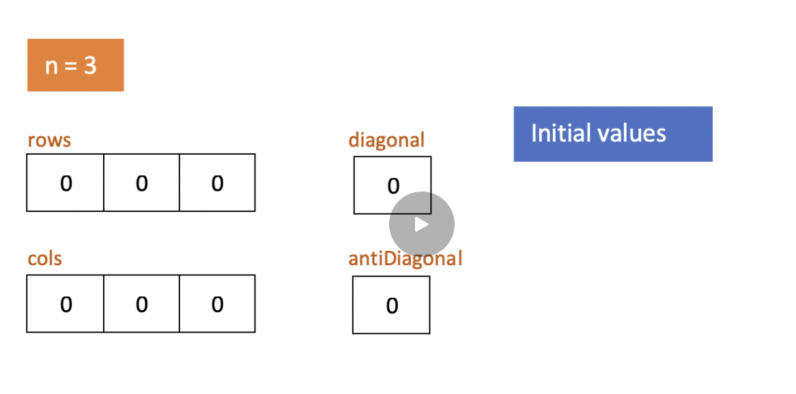

# 205. Isomorphic Strings 
* **一刷:15:02(✅)**
* [205. Isomorphic Strings ](https://leetcode.com/problems/isomorphic-strings/)

## My Code
* 用Array表示ASCII码(128个): `boolean [] arr = new boolean [128]`
  * 然后直接用char引用: `arr[t.charAt(i)] = true;`
```java
class Solution {
    public boolean isIsomorphic(String s, String t) {
        Map<Character,Character> map = new HashMap<>();
        boolean [] arr = new boolean [128];
        for(int i = 0 ; i < s.length(); i ++){
            if( map.containsKey(s.charAt(i)) && map.get(s.charAt(i)) != t.charAt(i)){
                return false;
            }
            if(!map.containsKey(s.charAt(i))){
                if(arr[t.charAt(i)]){
                    return false;
                }
                map.put(s.charAt(i), t.charAt(i));
                arr[t.charAt(i)] = true;
            }
        }
        return true;
    }
}
```
***
# 146. LRU Cache (好题🌟)
* **一刷:40:02(❌)**
* [146. LRU Cache](https://leetcode.com/problems/lru-cache/)

## 分析
* 本题好在不是简单的实现一个function，而是需要设计整个`DList`，以及对应的方法(`removeNode(DList node)` 和 `addNodeToHead(DList node)`)
* 本题通过DList来管理Node的顺序，通过`Map<Integer,DList>`来管理Node Key的唯一性
* DList的定义
  * 单独的class
  * 包含了key和value（到时候可以直接取）
  * DList prev 和 DList next
  * 具体的实现是在LRUCache的构造函数中
## Code
```java

class DList {
    int key;
    int value;
    DList prev;
    DList next;
}

class LRUCache {
    private Map<Integer, DList> cache = new HashMap<>();
    private int capacity;
    private DList head, tail;
    private int size = 0;

    public LRUCache(int capacity) {
        this.capacity = capacity;
        head = new DList();
        tail = new DList();
        head.next = tail;
        tail.prev = head;
    }

    public int get(int key) {
        if (cache.containsKey(key)) {
            DList res = cache.get(key);
            removeNode(res);
            addNodeToHead(res);
            return res.value;
        } else {
            return -1;
        }
    }

    public void put(int key, int value) {
        if (cache.containsKey(key)) {
            DList res = cache.get(key);
            res.value = value;
            removeNode(res);
            addNodeToHead(res);

        } else {
            if (size < capacity) {
                DList node = new DList();
                node.key = key;
                node.value = value;
                cache.put(key, node);
                addNodeToHead(node);
                size++;
            } else {
                DList node = new DList();
                int tmp = tail.prev.key;
                removeNode(tail.prev);
                cache.remove(tmp);
                node.key = key;
                node.value = value;
                cache.put(key, node);
                addNodeToHead(node);
            }
        }

    }

    private void addNodeToHead(DList node) {
        DList pre = head;
        DList nex = head.next;
        pre.next = node;
        nex.prev = node;
        node.prev = pre;
        node.next = nex;
    }

    private void removeNode(DList node) {
        DList pre = node.prev;
        DList nex = node.next;
        pre.next = nex;
        nex.prev = pre;
    }
}
```
***
# 128. Longest Consecutive Sequence
* **一刷:15:02(✅)**
* [128. Longest Consecutive Sequence](https://leetcode.com/problems/longest-consecutive-sequence/)
## 时间复杂度分析


## My Code
```java
class Solution {
    public int longestConsecutive(int[] nums) {
        if(nums.length == 0){return 0;}
        Set<Integer> set = new HashSet<>();
        for(int i : nums){
            set.add(i);
        }
        int res = 1;
        for (int i = 0; i < nums.length; i++) {
            if(!set.contains(nums[i] - 1)){
                int start = 1;
                int cur = nums[i];
                while(set.contains(cur + 1)){
                    start ++;
                    cur = cur + 1;
                }
                res = Math.max(res,start);
            }
        }
        return res;
    }
}
```
***
# 73. Set Matrix Zeroes
* **一刷:17:02(✅)**
* [73. Set Matrix Zeroes](https://leetcode.com/problems/set-matrix-zeroes/)
## 优化思路
* 因为变成0这个操作是在the whole row & col上操作，所以可以想象成俄罗斯方块，将第一次遍历中所有的0都上浮到first cow & col
* 需要额外记录 first cow & col中是否包含0

## Code
```java
class Solution {
    public void setZeroes(int[][] matrix) {
        boolean firstRow = false;
        boolean firstCol = false;
        for(int i = 0; i < matrix.length; i ++){
            if(matrix[i][0] == 0) {
                firstCol = true;
                break;
            }
        }
        for(int i = 0; i < matrix[0].length; i ++){
            if(matrix[0][i] == 0) {
                firstRow = true;
                break;
            }
        }
        for(int i = 1; i < matrix.length; i ++){
            for(int j = 1; j < matrix[0].length; j ++){
                if(matrix[i][j] == 0){
                    matrix[i][0] = 0;
                    matrix[0][j] = 0;
                }
            }
        }
        for(int i = 1; i < matrix.length; i ++){
            for(int j = 1; j < matrix[0].length; j ++){
                if(matrix[i][0] == 0 || matrix[0][j] == 0){
                    matrix[i][j] = 0;
                }
            }
        }
        if(firstRow){
            for(int i = 0; i < matrix[0].length; i ++){
                matrix[0][i] = 0;
            }
        }
        if(firstCol){
            for(int i = 0; i < matrix.length; i ++){
                matrix[i][0] = 0;
            }
        }
    }
}
```
***
# 380. Insert Delete GetRandom O(1)
* **一刷:17:02(✅)**
* [380. Insert Delete GetRandom O(1)](https://leetcode.com/problems/insert-delete-getrandom-o1/)
## 知识点
* List是可以在链条内更新的: `list.set(int index, E element)`

## Code
```java
class RandomizedSet {
    List<Integer> list = new LinkedList<>();
    Map<Integer,Integer> map = new HashMap<>();
    public RandomizedSet() {
        
    }
    
    public boolean insert(int val) {
        if(map.containsKey(val)){
            return false;
        }else {
            map.put(val,list.size());
            list.add(val);
            return true;
        }
    }
    
    public boolean remove(int val) {
        if(map.containsKey(val)){
            int index = map.get(val);
            int lastElement = list.getLast();
            list.set(index,lastElement);
            map.put(lastElement, index);
            list.removeLast();
            map.remove(val);
            return true;
        }else {
            return false;
        }
    }
    
    public int getRandom() {
        Random random = new Random();
        int ran = random.nextInt(list.size());
        return list.get(ran);
    }
}
```
***
# 49. Group Anagrams
* **一刷:32:02(✅)**
* [49. Group Anagrams](https://leetcode.com/problems/group-anagrams/)
## 知识点 & 技巧
* map里面的values可以直接通过`map.values()`获取到全部，然后通过`new ArrayList<>(map.values())`直接转换成一个`List<List<String>>`类型的结果。相当于`new ArrayList<>`用来指定一个容器的类型，然后map.values()获取到了不同key对应下所有的values(这里是List<String>)类型,然后放进去
* 技巧：🌟字符串匹配问题！！！
  * 可以通过26个字母创建一个int arr，然后将遍历到的char通过`[i - 'a']`统计到对应的位置
  * 直接通过 `String key = new String(arr) // charArr to String`来生成一个key(因为只关心字符出现个数，不care出现的先后顺序)
## Code
```java
class Solution {
    public List<List<String>> groupAnagrams(String[] strs) {
        Map<String, List<String>> map = new HashMap<>();
        
        for(String str : strs) {
            char[] charCount = new char[26];
            for(char c : str.toCharArray()) {
                charCount[c - 'a']++;
            }
            String key = new String(charCount); 

            if(!map.containsKey(key)) {
                map.put(key, new LinkedList<>());
            }
            map.get(key).add(str);
        }
        
        return new ArrayList<>(map.values());
    }
}
```
***
# 350. Intersection of Two Arrays
* **一刷:15:02(✅)**
* [350. Intersection of Two Arrays](https://leetcode.com/problems/intersection-of-two-arrays-ii/)

## 技巧
* 优化：当两个数组差距很大，可以通过小数组作为主数组进行操作
```java
public int[] intersect(int[] nums1, int[] nums2) {
        if (nums1.length > nums2.length) {
            return intersect(nums2, nums1);
        }
}
```
* 直接在数组上进行拼接迭代工作，而不需要使用List浪费space
  * 当找到内容，直接在主数组（小的那个）上面更新，最后返回:`Arrays.copyOfRange(nums1,0,k)`就可以

## Code 
```java
class Solution {
    public int[] intersect(int[] nums1, int[] nums2) {
        if (nums1.length > nums2.length) {
            return intersect(nums2, nums1);
        }
        Arrays.sort(nums1);
        Arrays.sort(nums2);
        int k = 0;
        int index1 = 0;
        int index2 = 0;
        while (index1 < nums1.length) {
            if (nums1[index1] == nums2[index2]) {
                nums1[k] = nums1[index1];
                index1++;
                index2++;
                k++;
            } else if (nums1[index1] > nums2[index2]) {
                index2++;
            } else {
                index1++;
            }
            if (index2 >= nums2.length)
                break;
        }

        return Arrays.copyOfRange(nums1, 0, k);
    }
}
```
***
# 348. Design Tic-Tac-Toe
* **一刷:60:02(✅)**
* [348. Design Tic-Tac-Toe](https://leetcode.com/problems/design-tic-tac-toe/)
## 优化 (很妙🌟)
* 不用将每个内容都存入Map中，而是分别通过 `row,col数组` + `diag, disDiag标志`四个量来衡量是否获胜
* 因为只有两个选手，可以从`player1 -->1 , player2 --> -1`且ensure了每次下棋♟️都不会走repetitive的位置，那么可以通过记录当前row或者col或者diag或者disDiag的总数来判断是否获胜


## Code
```java
class TicTacToe {
    int [] rows;
    int [] cols;
    int diag;
    int disDiag;
    public TicTacToe(int n) {
        rows = new int [n];
        cols = new int [n];
        diag = 0;
        disDiag = 0;
    }
    
    public int move(int row, int col, int player) {
        int currentPlayer = player == 1 ? 1 : -1;
        rows[row] += currentPlayer;
        cols[col] += currentPlayer;
        if(row == col){
            diag += currentPlayer;
        }
        int n = rows.length;
        if (col + row == n - 1){
            disDiag += currentPlayer;
        }
        if(Math.abs(rows[row]) == n ||
        Math.abs(cols[col]) == n||
        Math.abs(diag) == n||
        Math.abs(disDiag) == n){
            return currentPlayer == 1 ? 1 : 2;
        }
        return 0;
    }
}
```
