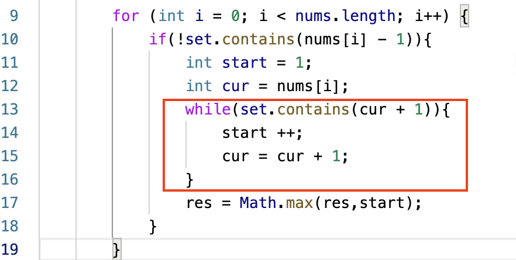
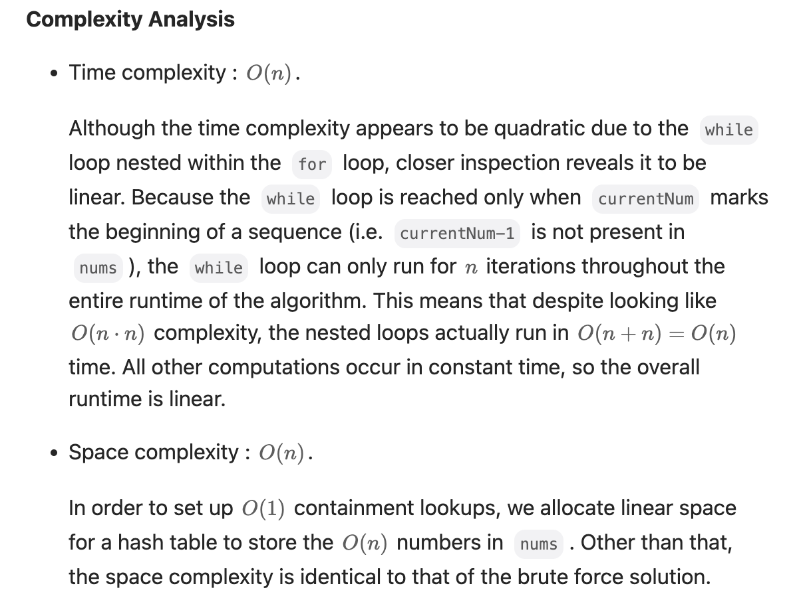

# 205. Isomorphic Strings 
* **一刷:15:02(✅)**
* [205. Isomorphic Strings ](https://leetcode.com/problems/isomorphic-strings/)

## My Code
* 用Array表示ASCII码(128个): `boolean [] arr = new boolean [128]`
  * 然后直接用char引用: `arr[t.charAt(i)] = true;`
```java
class Solution {
    public boolean isIsomorphic(String s, String t) {
        Map<Character,Character> map = new HashMap<>();
        boolean [] arr = new boolean [128];
        for(int i = 0 ; i < s.length(); i ++){
            if( map.containsKey(s.charAt(i)) && map.get(s.charAt(i)) != t.charAt(i)){
                return false;
            }
            if(!map.containsKey(s.charAt(i))){
                if(arr[t.charAt(i)]){
                    return false;
                }
                map.put(s.charAt(i), t.charAt(i));
                arr[t.charAt(i)] = true;
            }
        }
        return true;
    }
}
```
***
# 146. LRU Cache (好题🌟)
* **一刷:40:02(❌)**
* [146. LRU Cache](https://leetcode.com/problems/lru-cache/)

## 分析
* 本题好在不是简单的实现一个function，而是需要设计整个`DList`，以及对应的方法(`removeNode(DList node)` 和 `addNodeToHead(DList node)`)
* 本题通过DList来管理Node的顺序，通过`Map<Integer,DList>`来管理Node Key的唯一性
* DList的定义
  * 单独的class
  * 包含了key和value（到时候可以直接取）
  * DList prev 和 DList next
  * 具体的实现是在LRUCache的构造函数中
## Code
```java

class DList {
    int key;
    int value;
    DList prev;
    DList next;
}

class LRUCache {
    private Map<Integer, DList> cache = new HashMap<>();
    private int capacity;
    private DList head, tail;
    private int size = 0;

    public LRUCache(int capacity) {
        this.capacity = capacity;
        head = new DList();
        tail = new DList();
        head.next = tail;
        tail.prev = head;
    }

    public int get(int key) {
        if (cache.containsKey(key)) {
            DList res = cache.get(key);
            removeNode(res);
            addNodeToHead(res);
            return res.value;
        } else {
            return -1;
        }
    }

    public void put(int key, int value) {
        if (cache.containsKey(key)) {
            DList res = cache.get(key);
            res.value = value;
            removeNode(res);
            addNodeToHead(res);

        } else {
            if (size < capacity) {
                DList node = new DList();
                node.key = key;
                node.value = value;
                cache.put(key, node);
                addNodeToHead(node);
                size++;
            } else {
                DList node = new DList();
                int tmp = tail.prev.key;
                removeNode(tail.prev);
                cache.remove(tmp);
                node.key = key;
                node.value = value;
                cache.put(key, node);
                addNodeToHead(node);
            }
        }

    }

    private void addNodeToHead(DList node) {
        DList pre = head;
        DList nex = head.next;
        pre.next = node;
        nex.prev = node;
        node.prev = pre;
        node.next = nex;
    }

    private void removeNode(DList node) {
        DList pre = node.prev;
        DList nex = node.next;
        pre.next = nex;
        nex.prev = pre;
    }
}
```
***
# 128. Longest Consecutive Sequence
* **一刷:15:02(✅)**
* [128. Longest Consecutive Sequence](https://leetcode.com/problems/longest-consecutive-sequence/)
## 时间复杂度分析



## My Code
```java
class Solution {
    public int longestConsecutive(int[] nums) {
        if(nums.length == 0){return 0;}
        Set<Integer> set = new HashSet<>();
        for(int i : nums){
            set.add(i);
        }
        int res = 1;
        for (int i = 0; i < nums.length; i++) {
            if(!set.contains(nums[i] - 1)){
                int start = 1;
                int cur = nums[i];
                while(set.contains(cur + 1)){
                    start ++;
                    cur = cur + 1;
                }
                res = Math.max(res,start);
            }
        }
        return res;
    }
}
```