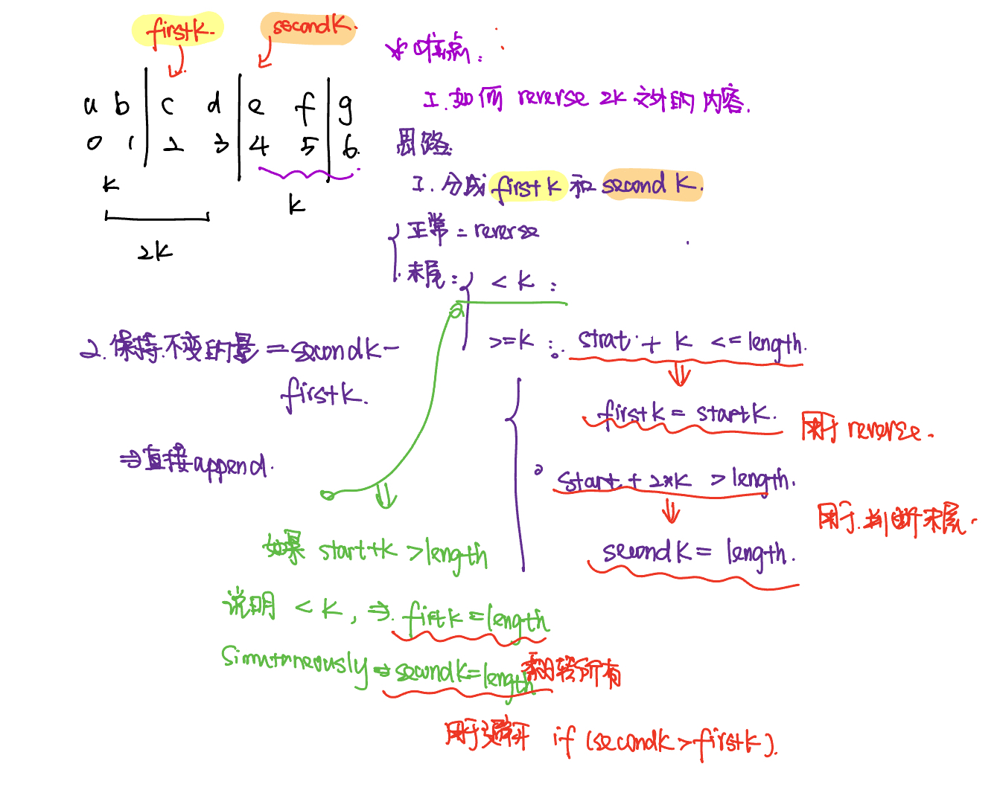

# 337. House Robber III
* **一刷：2:03（✅）**
* [344. Reverse String](https://leetcode.com/problems/reverse-string/)
## Keypoint
* char 一个tmp时，要有空格. `e.g. char tmp = ' '`;
## My Code
```java
class Solution {
    public void reverseString(char[] s) {
        int left = 0;
        int right = s.length - 1;
        while(left < right){
            char tmp = s[right];
            s[right] = s[left];
            s[left] = tmp;
            left ++;
            right --;
        }
    }
}
```
***
# 541. Reverse String II
* **一刷：45:03（❌）**
* [541. Reverse String II](https://leetcode.com/problems/reverse-string-ii/)

## 分析


## My Code
```java
class Solution {
    public String reverseStr(String s, int k) {
        StringBuilder sb = new StringBuilder();
        int length = s.length();
        int start = 0;
        while(start < length){
            int firstK = (start + k > length) ? length : start + k;
            int secondK = (start + 2 * k > length) ? length: start + 2* k;
            StringBuilder tmp = new StringBuilder();
            tmp.append(s.substring(start,firstK));
            tmp.reverse();
            sb.append(tmp);
            if(secondK > firstK){
                sb.append(s.substring(firstK,secondK));
            }
            start = start + 2 * k;
        }
        String res = String.valueOf(sb);
        return res;
    }
}
```
***
# 151. Reverse Words in a String
* **一刷：75:03（✅）**
* [151. Reverse Words in a String](https://leetcode.com/problems/reverse-words-in-a-string/description/)

## My Code
* 分部写函数
```java
class Solution {
    public String reverseWords(String s) {
       char [] c = s.toCharArray();
       char [] c2 = removeSpace(c); 
       int len = c2.length;
       //reverse words
       for(int i = 0; i < len ; ){
           int start = i;
           int end = i;
           while(end < len && c2[end] != ' ' ){
               end ++;
           }
           end = end - 1;
           reverse(c2, start, end);
           i = end + 2;
       }
       //reverse sentence
       reverse(c2,0,len - 1);
       String res = new String(c2);
       return res;
    }
    private char [] removeSpace(char [] c){
        int front = 0;
        int end = c.length - 1;
        //record front and end index
        while(c[front] == ' '){
            front ++;
        }
        while(c[end] == ' '){
            end --;
        }
        int slow = front;
        for(int fast = front; fast <= end; fast ++){
            if(fast > 0 && c[fast] == ' ' && c[fast - 1] == ' '){
                continue;
            }
            else{
                c[slow] = c[fast];
                slow ++;
            }
        }
        char [] res = new char[slow - front];
        int index = 0;
        for(int i = front; i < slow; i ++){
            res[index] = c[i];
            index ++;
        }
        return res;
    }
    private void reverse (char [] c, int start , int end){
        int i = start;
        int j = end;
        while(i < j){
            char tmp = c[j];
            c[j] = c[i];
            c[i] = tmp;
            i ++;
            j --;
        }
    }
}
```