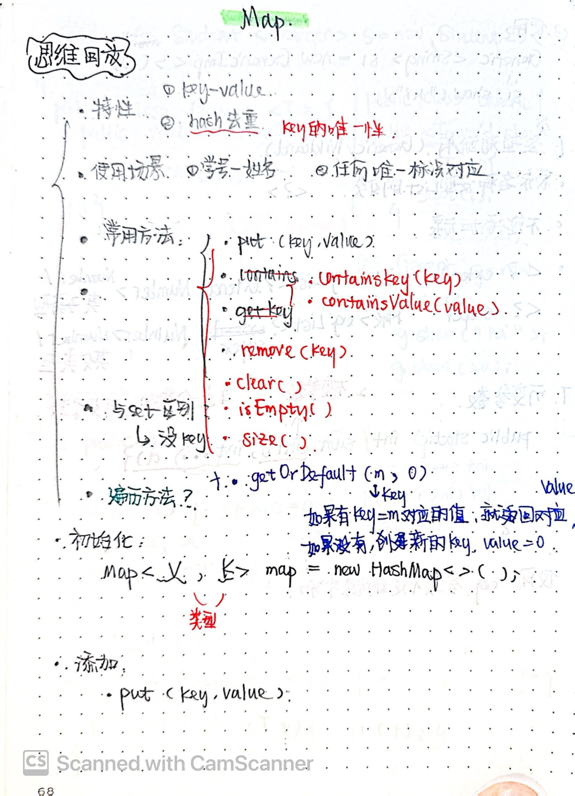
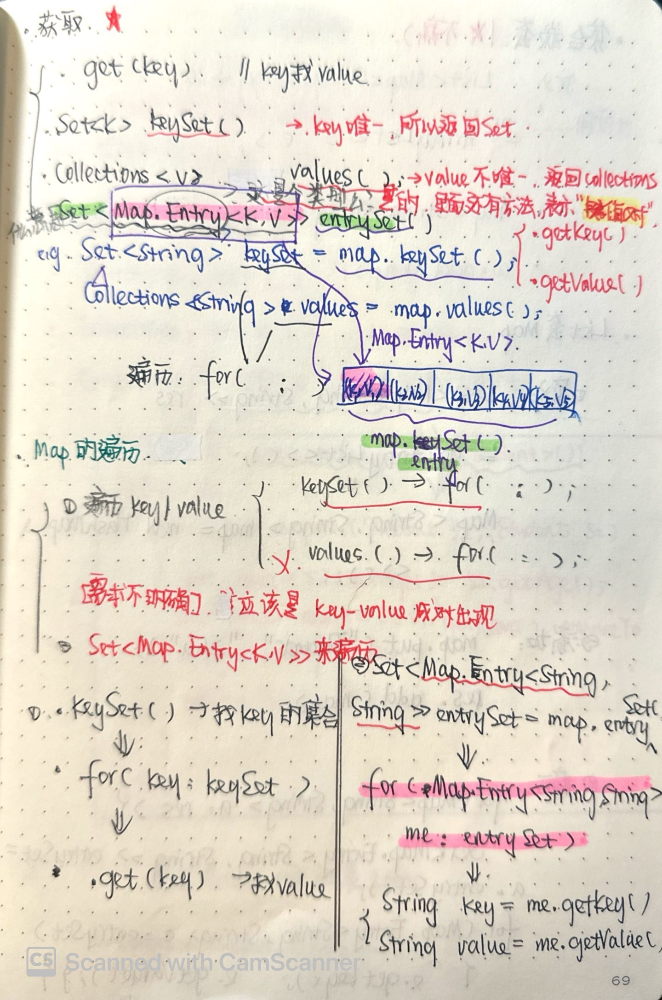

# 239. Sliding Window Maximum
* **一刷:34：04(❌)**
* **二刷:07:04(✅)**
* [239. Sliding Window Maximum](https://leetcode.com/problems/sliding-window-maximum/)

## 思路
* 使用的`单调栈`的思想。想要找到`k`区间内的最大，那么找到当前范围内递减的就可以，他的开头就是当前的最大值
* 在`deque`中存放`index`！！这点很巧妙，因为可以通过deque的值来判断是否在k内，又可以通过`nums[deque.peek()]`来获取到具体的值
* 单调递减栈的两个条件
  * 当i的值比deque中peek()记录的index要大时，就说明该poll了
  * 当 当前nums[i]的具体值比末尾的值要大时，说明不是单调递减了，`nums[dq.peekLast()] < nums[i]` 也应该 poll了

## Code
```java
class Solution {
    public int[] maxSlidingWindow(int[] nums, int k) {
        //dq to record the index of arr
        Deque<Integer> dq = new LinkedList<>();
        //res arr
        int [] arr = new int [nums.length - k + 1];
        int index = 0;
        for(int i = 0 ; i < nums.length; i ++){
            while(!dq.isEmpty() && i - k + 1 > dq.peek()){
                dq.poll();
            }
            while(!dq.isEmpty() && nums[dq.peekLast()] < nums[i]){
                dq.pollLast();
            }
            dq.offer(i);
            if(i >= k - 1){
                arr[index ++] = nums[dq.peek()];
            }
        }
        return arr;
    }
}
```
***
# 347. Top K Frequent Elements
* **一刷:34：04(❌)**

## ❗️相关知识点
### Java优先级队列: PriorityQueue
1. 优先队列`PriorityQueue`是Queue接口的实现，可以对其中元素进行`排序`
2. 常用方法
* `peek()//返回队首元素`
* `poll()//返回队首元素，队首元素出队列`
* `add()//添加元素`
3. 初始化:`Queue<Integer> q = new PriorityQueue<>();`
4. 自定义比较器
* 升序排列：`PriorityQueue<int []> pq = new PriorityQueue<>((pair1,pair2) -> pair2[1] - pair1[1]);`
* 降序排列：`PriorityQueue<int []> pq = new PriorityQueue<>((pair1,pair2) -> pair1[1] - pair2[1]);`

### Java Map集合
1. map的常用方法



## My Code
```java
class Solution {
    public int[] topKFrequent(int[] nums, int k) {
        Map<Integer,Integer> map = new HashMap<>();
        for (int i : nums){
            map.put(i,map.getOrDefault(i,0) + 1);
        }
        PriorityQueue<int []> pq = new PriorityQueue<>((pair1,pair2) -> pair2[1] - pair1[1]);
        for(Map.Entry<Integer,Integer> me : map.entrySet()){
            pq.add(new int []{me.getKey(),me.getValue()});
        }
        int [] res = new int [k];
        for(int i =0; i<k;i ++){
            res[i] = pq.poll()[0];
        }
        return res;
    }
}
```