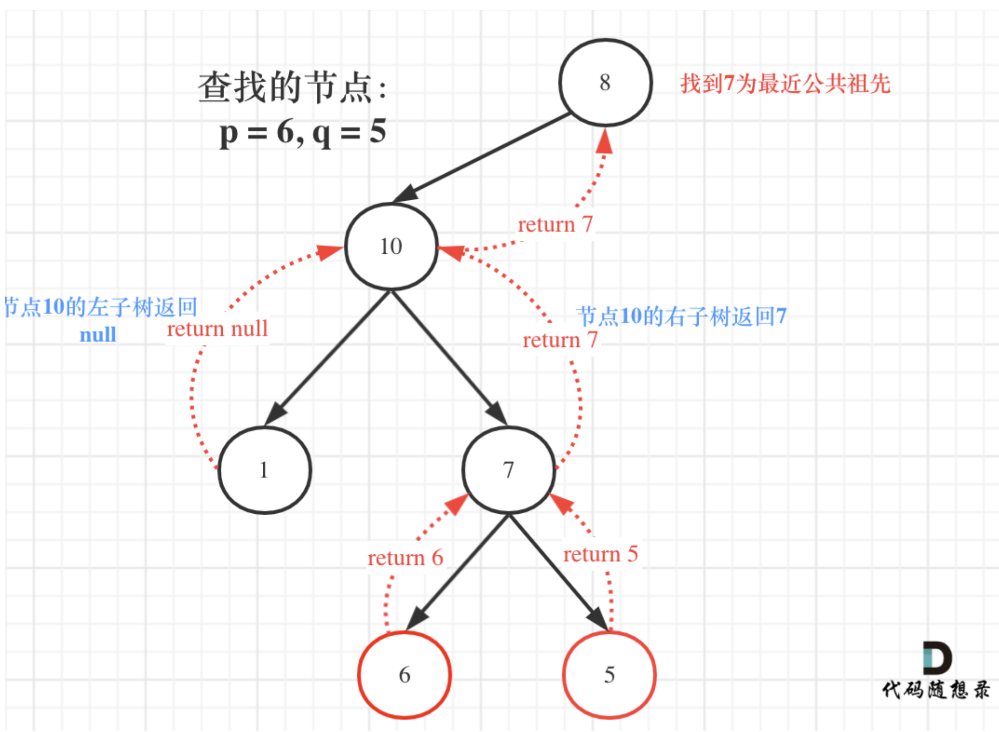

# 530. Minimum Absolute Difference in BST
* **一刷:19:46(❌)**
* [530. Minimum Absolute Difference in BST](https://leetcode.com/problems/minimum-absolute-difference-in-bst/)

## Tree问题：递归遍历记录pre和cur两个指针
* 技巧:在class之中定义`全局变量`。
  * 通过全局变量，不用put指针到递归函数中
  * 可以直接返回`res`值

## Code
```java
class Solution {
    TreeNode pre;
    int res = Integer.MAX_VALUE;
    public int getMinimumDifference(TreeNode root) {
        if(root == null)return 0;
        traversal(root);
        return res;
    }
    private void traversal(TreeNode root){
        if(root == null) return ;
        traversal(root.left);
        if(pre!=null){
            res = Math.min(res, root.val - pre.val);
        }
        pre = root;
        traversal(root.right);
    }
}
```
***
# 501. Find Mode in Binary Search Tree
* **一刷:19:46(❌)**
* [501. Find Mode in Binary Search Tree](https://leetcode.com/problems/find-mode-in-binary-search-tree/description/)

## Code
### IDEA
* 通过List来记录最大的值（们）。如果count的值超过了maxCount，那么就需要更新 ==> `resList.clear()`
* 因为是BST，所以 1.如果pre是null，说明前一个肯定是没有的，count为1（当前的）；2. 如果不相等，重新开始

```java
class Solution {
    List<Integer> resList;
    int maxCount ;
    int count ;
    TreeNode pre;
    public int[] findMode(TreeNode root) {
        resList = new ArrayList<>();
        maxCount = 0;
        count = 0;
        findMode1(root);
        int [] res = new int [resList.size()];
        int j = 0;
        for(int i:resList){
            res[j] = i;
            j ++;
        }
        return res;
    }
    private void findMode1(TreeNode root){
        if(root == null) return;
        findMode1(root.left);
        if(pre == null || pre.val != root.val){
            count = 1;
        }else{
            count ++;
        }
        if(count > maxCount){
            resList.clear();
            resList.add(root.val);
            maxCount = count;
        }
        else if(count == maxCount){
            resList.add(root.val);
        }
        
        pre = root;
        findMode1(root.right);
    }
}
```
***
# 236. Lowest Common Ancestor of a Binary Tree
* **一刷:19:46(❌)**
* [236. Lowest Common Ancestor of a Binary Tree](https://leetcode.com/problems/lowest-common-ancestor-of-a-binary-tree/description/)

## My Code

```java
class Solution {
    public TreeNode lowestCommonAncestor(TreeNode root, TreeNode p, TreeNode q) {
        if(root == null || root == p || root == q) return root;

        TreeNode left = lowestCommonAncestor(root.left,p,q);
        TreeNode right = lowestCommonAncestor(root.right, p , q);

        if(left == null && right == null){
            return null;
        }else if(left != null && right == null){
            return left;
        }else if(left == null && right != null){
            return right;
        }else {
            return root;
        }
    }
}
```