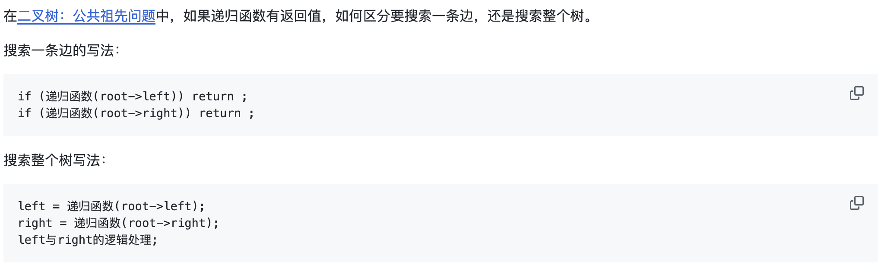
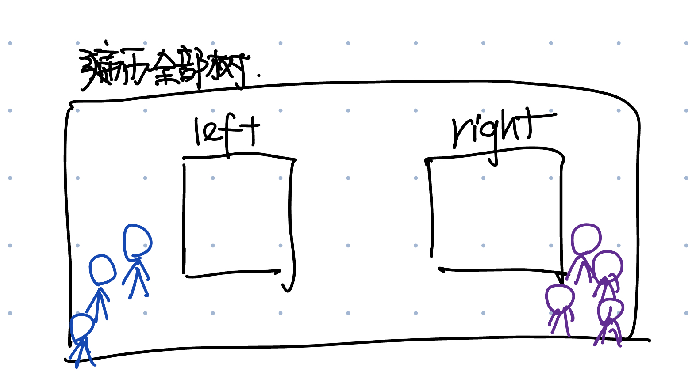

# 235. Lowest Common Ancestor of a Binary Search Tree
* **一刷:15:46(❌)**
* [235. Lowest Common Ancestor of a Binary Search Tree](https://leetcode.com/problems/lowest-common-ancestor-of-a-binary-search-tree/)

## Questions
### Q1.如何阻止继续遍历？
二叉树的递归遍历可以分成`单边遍历`和`整棵树遍历`

题目中，当不在范围内， 直接抛给return `return lowestCommonAncestor(root.left, p, q);`
## Q2. 二叉树递归问题
二叉树的递归将`return 本身的函数`想象成`抛/接`，将 `return 具体的值`想象成`接/抛`
* 刚开始的时候，根据条件iterate，把`return lowestCommonAncestor(root.left, p, q);`想象成将工作布置给下属
* 当最后某一个下属完成了任务，就要讲内容层层返还给最后的领导。`return root`
* 某些时候需要将内容分配给所有的team(left，right)，找到最终结果。那么就需要一个left，right的小盒子来放结果0

## Code
### 思路
* 利用BST的特性。左子树<右子树 ==> p和q就是一个范围 [p,q].
* 从上到下遍历，当第一次在区间[p,q]之内的时候，就是最小的距离
  * if root小于q，说明一定是在右子树，return 右子树
  * if root大于p，说明一定在左子树，reutrn 左子树
  * 如果在中间，直接返回
```java
class Solution {
    public TreeNode lowestCommonAncestor(TreeNode root, TreeNode p, TreeNode q) {
        if(root.val > p.val && root.val > q.val) return lowestCommonAncestor(root.left, p, q);
        if(root.val < p.val && root.val < q.val) return lowestCommonAncestor(root.right, p, q);
        return root;
    }
}
```