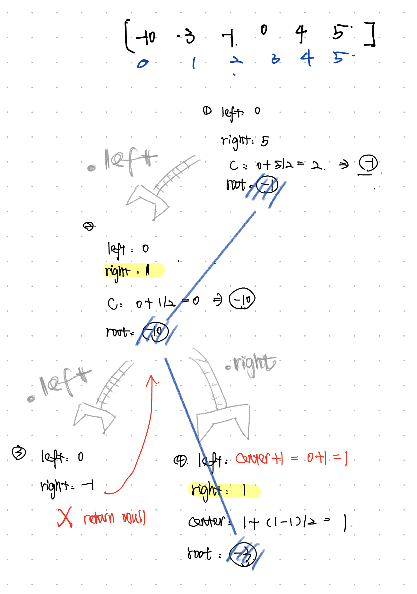

# 669. Trim a Binary Search Tree
* **一刷:40:15(❌)**
* [669. Trim a Binary Search Tree](https://leetcode.com/problems/trim-a-binary-search-tree/description/)
## Questions
### Q1:如何继续遍历深入循环？
* 做题时难点
  * 知道需要继续深入遍历，但是不知道如何接住继续深入返回的Tree
  * **接住逻辑** 是通过最后普通操作的`root.left = trimBST(root.left,low,high);` 完成的！ 

* 接住逻辑

```java 
class Solution {
    public TreeNode trimBST(TreeNode root, int low, int high) {
        if(root == null) return root;
        if(root.val < low) {
            TreeNode tmpRight = root.right;
            while(tmpRight != null && tmpRight.val < low ){
                tmpRight = tmpRight.right;
            }
             while(tmpRight != null && tmpRight.val > high ){
                tmpRight = tmpRight.left;
            }
            root = tmpRight;
            return root;
        }
        else if(root.val > high) {
            TreeNode tmpLeft = root.left;
            while(tmpLeft != null && tmpLeft.val > high){
                tmpLeft = tmpLeft.left;
            }
            while(tmpLeft != null && tmpLeft.val < low){
                tmpLeft = tmpLeft.right;
            }
            root = tmpLeft;
            return root;
        }
        else {
            root.left = trimBST(root.left,low,high);
            root.right = trimBST(root.right,low,high);
        }
        return root;
    }
}
```

## Code

```java
class Solution {
    public TreeNode trimBST(TreeNode root, int low, int high) {
        if(root == null) return null;
        if(root.val < low){
            TreeNode right = trimBST(root.right,low,high);
            return right;         
        }
        if(root.val > high){
            TreeNode left = trimBST(root.left,low,high);
            return left;         
        }
        if(root.val <= high && root.val >= low){
            root.left = trimBST(root.left,low,high);
            root.right = trimBST(root.right,low,high);
        }
        return root;
    }
}
```
***
# 108.Convert Sorted Array to Binary Search Tree
* **一刷:40:15(❌)**
* [108.Convert Sorted Array to Binary Search Tree](https://leetcode.com/problems/convert-sorted-array-to-binary-search-tree/description/)

## 错误点🙅
### “Range范围” 投入Recursion没有太理解
* 需要注意left和right也是需要实时更改的
* 并且因为是递归所以`大的框架`就是root的left和right，每次的大框架其实都是定的，都是在内部进行移动

## Code
```java
class Solution {
    public TreeNode sortedArrayToBST(int[] nums) {
        TreeNode res = numsToBST(nums,0,nums.length - 1);
        return res;
    }
    public TreeNode numsToBST(int [] nums, int left, int right){
        if(left > right ) return null;
        int center = left + ((right - left) / 2);
        TreeNode root = new TreeNode(nums[center]);
        root.left = numsToBST(nums,left,center - 1);
        root.right = numsToBST(nums,center + 1, right);
        return root;
    }
}
```
***
# 538. Convert BST to Greater Tree 
* **一刷:6:53(✅)**
* [538. Convert BST to Greater Tree ](https://leetcode.com/problems/convert-bst-to-greater-tree/description/)
## My Code
```java
class Solution {
    int sum = 0;
    public TreeNode convertBST(TreeNode root) {
        traversal (root);
        return root;
    }
    private void traversal(TreeNode root){
        if(root == null) return;
        traversal(root.right);
        root.val = root.val + sum;
        sum = root.val;
        traversal(root.left);
        return ;
    }
}
```