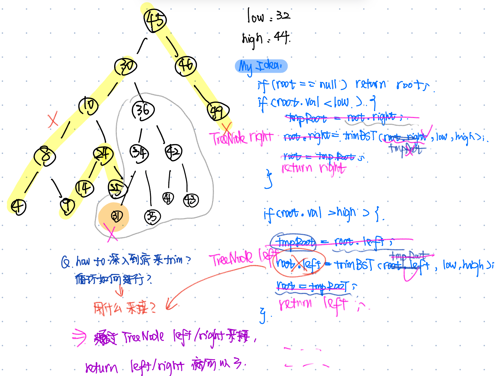
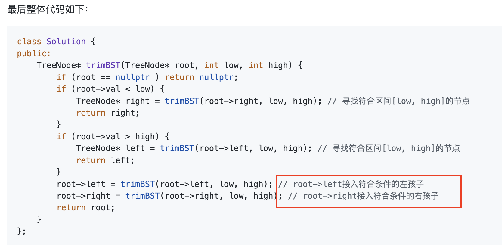

# 669. Trim a Binary Search Tree
* **一刷:40:15(❌)**
* [669. Trim a Binary Search Tree](https://leetcode.com/problems/trim-a-binary-search-tree/description/)
## Questions
### Q1:如何继续遍历深入循环？
* 做题时难点
  * 知道需要继续深入遍历，但是不知道如何接住继续深入返回的Tree
  * **接住逻辑** 是通过最后普通操作的`root.left = trimBST(root.left,low,high);` 完成的！ 

* 接住逻辑

```java 
class Solution {
    public TreeNode trimBST(TreeNode root, int low, int high) {
        if(root == null) return root;
        if(root.val < low) {
            TreeNode tmpRight = root.right;
            while(tmpRight != null && tmpRight.val < low ){
                tmpRight = tmpRight.right;
            }
             while(tmpRight != null && tmpRight.val > high ){
                tmpRight = tmpRight.left;
            }
            root = tmpRight;
            return root;
        }
        else if(root.val > high) {
            TreeNode tmpLeft = root.left;
            while(tmpLeft != null && tmpLeft.val > high){
                tmpLeft = tmpLeft.left;
            }
            while(tmpLeft != null && tmpLeft.val < low){
                tmpLeft = tmpLeft.right;
            }
            root = tmpLeft;
            return root;
        }
        else {
            root.left = trimBST(root.left,low,high);
            root.right = trimBST(root.right,low,high);
        }
        return root;
    }
}
```

## Code

```java
class Solution {
    public TreeNode trimBST(TreeNode root, int low, int high) {
        if(root == null) return null;
        if(root.val < low){
            TreeNode right = trimBST(root.right,low,high);
            return right;         
        }
        if(root.val > high){
            TreeNode left = trimBST(root.left,low,high);
            return left;         
        }
        if(root.val <= high && root.val >= low){
            root.left = trimBST(root.left,low,high);
            root.right = trimBST(root.right,low,high);
        }
        return root;
    }
}
```