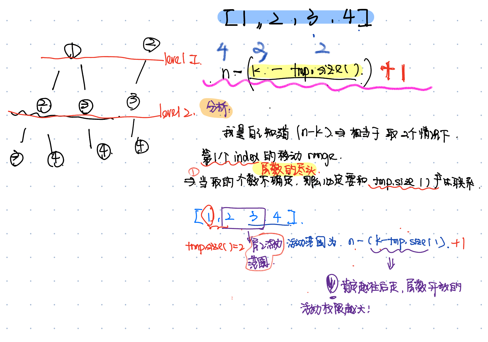

# 77. Combinations
* **一刷:50:15(❌)**
* [77. Combinations](https://leetcode.com/problems/combinations/)
## 错误代码
```java
class Solution {
    int level = 1;
    public List<List<Integer>> combine(int n, int k) {
        int [] arr = new int [n];
        for (int i = 0 ; i < n; i ++){
            arr[i] = i + 1;
        }
        List<Integer> tmp = new LinkedList<>();
        List<List<Integer>> res = new LinkedList<>();
        int start = 0;
        int end = n - k;
        int maxLevel = n - k;
        backTracking(start,end,arr,res,tmp,maxLevel);
        return res;
    }
    private void backTracking(int start, int end , int [] arr, List<List<Integer>> res, List<Integer> tmp, int maxLevel){
        if(level > maxLevel){
            res.add(tmp);
            tmp.removeLast();
            level = level - 1;
            return;
        }
        for (int i = start; i < end; i ++){
            tmp.add(arr[i]);
            level = level + 1;
            start = start + 1;
            end = arr.length;
            backTracking(start,end,arr,res,tmp,maxLevel);
        }
    }
}
```

## 思路 + 知识点
### 回溯中的赋值操作:res.add(new ArrayList<>(tmp));
* **为什么不是 `res.add(tmp);` 而是创建了新的List？**
  * `res.add(new ArrayList<>(tmp));`确保了你在添加tmp到结果集res时，每次都保存了tmp的一个快照，而不是tmp本身的引用，这对于确保算法正确性和结果的独立性是非常重要的。
  * 因为深拷贝: 当添加tmp到res时，你需要确保res中的每个列表都是独立的。如果你直接添加tmp（即res.add(tmp);），你实际上只是添加了对tmp对象的引用。这意味着，如果之后tmp被修改，那么res中之前添加的那个tmp引用所指向的对象也会随之改变。通过创建tmp的一个新实例`new ArrayList<>(tmp)`，你实际上是对tmp进行了深拷贝，这样res中的列表就能独立于tmp变化。
### 如何找到层序遍历每一层的终止条件？


## Code
* startIndex 确保的组合而不是排序
* 问题: 对于index的移动不清楚
```java
class Solution {
    List <Integer> tmp = new LinkedList<>();
    List<List<Integer>> res = new LinkedList<>();
    public List<List<Integer>> combine(int n, int k) {
        int startIndex = 1;
        backTracking(n,k,startIndex);
        return res;
    }
    private void backTracking(int n, int k, int startIndex){
        if(tmp.size() == k){
            res.add(new ArrayList<>(tmp));
            return;
        }
        for(int i = startIndex; i <= n - (k - tmp.size()) + 1; i ++ ){
            tmp.add(i);
            backTracking(n,k,i + 1);
            tmp.removeLast();
        }
    }
}
```