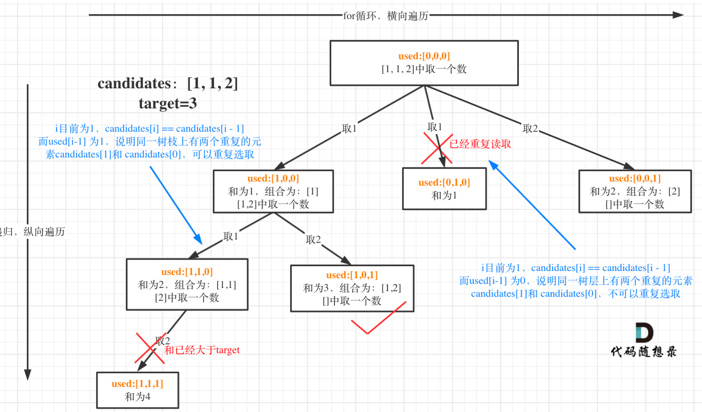

# 39. Combination Sum
* **一刷:20:22(✅)**
* [39. Combination Sum](https://leetcode.com/problems/combination-sum/)

## My Code
```java
class Solution {
    List<List<Integer>> res = new LinkedList<>();
    List<Integer> tmp = new LinkedList<>();
    public List<List<Integer>> combinationSum(int[] candidates, int target) {
        backTracking(candidates,target,0);
        return res;
    }
    private void backTracking(int [] candidates, int target, int startIndex){
        if(target == 0){
            res.add(new LinkedList<>(tmp));
            return;
        }
        if (target < 0){
            return;
        }
        for(int i = startIndex ; i < candidates.length; i ++){
            tmp.add(candidates[i]);
            target = target - candidates[i];
            backTracking(candidates,target, i);
            tmp.removeLast();
            target = target + candidates[i];
        }
    }
}
```
***
# 40. Combination Sum II
* **一刷:30:22(❌)**
* [40. Combination Sum II](https://leetcode.com/problems/combination-sum-ii/description/)

## 问题
### Q1. 如何记录每层的使用？？
* 分析
  * 知道需要记录每层和每枝树的使用情况，但不知道具体如何记录每层？
* 解答
  * 通过一个`boolean used`数组，每次取用之后设置为true
  * 既然无法区分每层，那么就来判断`每枝`！==> `！used[i - 1] && candidates[i] == candidates[i - 1]`表明了当前枝叶重复采用了，那么就是可以的！！ 如果`used[i - 1] == false`说明了不是在**枝叶，而是在层！**

## Code
```java
class Solution {
    List<List<Integer>> res = new LinkedList<>();
    List<Integer> tmp = new LinkedList<>();
    boolean[] used;
    public List<List<Integer>> combinationSum2(int[] candidates, int target) {
        Arrays.sort(candidates);
        used = new boolean[candidates.length];
        Arrays.fill(used, false);
        backTracking(candidates, target, 0);
        return res;
    }

    private void backTracking(int[] candidates, int target, int startIndex) {
        if (target == 0) {
            res.add(new LinkedList<>(tmp));
            return;
        }
        if (target < 0) {
            return;
        }
        for (int i = startIndex; i < candidates.length; i++) {
            if (candidates[i] > target) {
                break;
            }
            if (i > 0 && candidates[i] == candidates[i - 1] && !used[i - 1]) {
                continue;
            }
            tmp.add(candidates[i]);
            used[i] = true;
            target = target - candidates[i];
            backTracking(candidates, target, i + 1);
            tmp.removeLast();
            target = target + candidates[i];
            used[i] = false;
        }
    }
}
```
***
# 131. Palindrome Partitioning
* **一刷:40:22(❌)**
* [131. Palindrome Partitioning](https://leetcode.com/problems/palindrome-partitioning/description/)

## 问题
### 如何确定终止条件？ 也就是什么时候说明成功取到了一个完整parlindrome?
* 这里的i其实很巧妙，他**既当了startIndex又当了endIndex**
```java
    for(int i = startIndex; i < s.length(); i ++){
        String part = s.substring(startIndex,i + 1);
        if(parlindromeJudge(part)){
            tmp.add(part);
        }else{
            continue; //如果不符合他会跳过带入backtracking，继续往下移动endIndex;
        }
        backTracking(s, i + 1); //此时的i已经不是startIndex了，而是上一个endIndex的末尾
        tmp.removeLast();
    }
```
* 通过👆代码，所以当`startIndex>=s.length()`时，可以看作找到了一组parlindrome
* 反过来说，如果startIndex没有移动到末尾，也就是` i > s.length() but startIndex < s.length()`说明没有找到parlindrome
## Code
```java
class Solution {
    List<List<String>> res = new LinkedList<>();
    List<String> tmp = new LinkedList<>();
    public List<List<String>> partition(String s) {
        backTracking(s,0);
        return res;
    }
    private void backTracking(String s,int startIndex){
        if(startIndex >= s.length()){
            res.add(new LinkedList<>(tmp));
            return;
        }
        for(int i = startIndex; i < s.length(); i ++){
            String part = s.substring(startIndex,i + 1);
            if(parlindromeJudge(part)){
                tmp.add(part);
            }else{
                continue;
            }
            backTracking(s, i + 1);
            tmp.removeLast();
        }
    }
    private boolean parlindromeJudge(String s) {
        int left = 0;
        int right = s.length() - 1;
        while (left <= right) {
            if (s.charAt(left) != s.charAt(right)) {
                return false;
            }
            left++;
            right--;
        }
        return true;
    }
}
```

