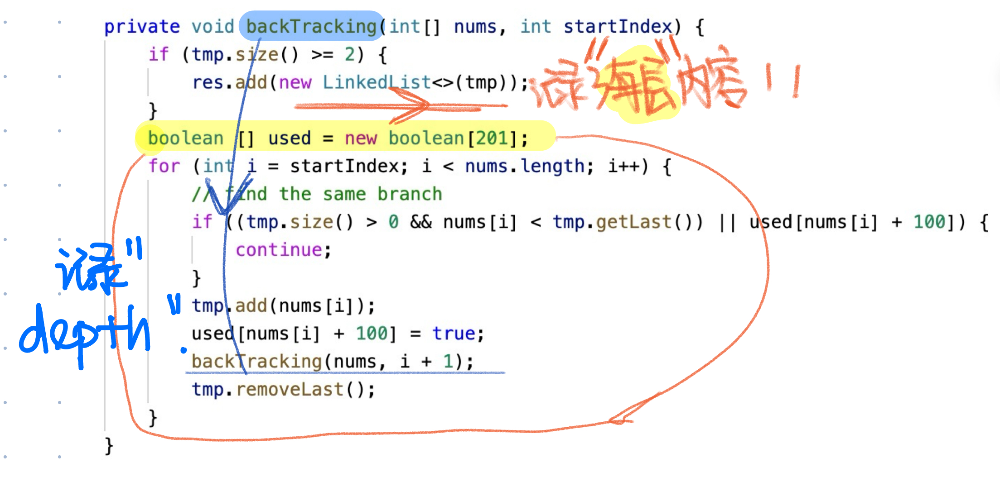

# 491. Non-decreasiong Subsequences
* **一刷:50:22(❌)**
* [491. Non-decreasiong Subsequences](https://leetcode.com/problems/non-decreasing-subsequences/description/)

## 问题
### 为什么回溯没有返回值？
* 对于**求所有节点** 问题，可以没有return，因为startIndex在for循环中已经有了限制条件，也不会超出
### 如何找到used数组
* 对本题：
  * 对本题来说，因为subsequences可不是紧密相连 `e.g. [4,6,7,6]` 那么就不能使用`used[i - 1]`来判断
* **通过在for循环外面每次创建一个新的数组used，来记录本层的内容！！！**


## Code
class Solution {
    List<List<Integer>> res = new LinkedList<>();
    List<Integer> tmp = new LinkedList<>();
    public List<List<Integer>> findSubsequences(int[] nums) {
        backTracking(nums, 0);
        return res;
    }

    private void backTracking(int[] nums, int startIndex) {
        if (tmp.size() >= 2) {
            res.add(new LinkedList<>(tmp));
        }
        boolean [] used = new boolean[201];
        for (int i = startIndex; i < nums.length; i++) {
            // find the same branch
            if ((tmp.size() > 0 && nums[i] < tmp.getLast()) || used[nums[i] + 100]) {
                continue;
            }
            tmp.add(nums[i]);
            used[nums[i] + 100] = true;
            backTracking(nums, i + 1);
            tmp.removeLast();         
        }
    }
}
***
# 46. Permutations
* **一刷:9:22(✅)**
* [46. Permutations](https://leetcode.com/problems/permutations/)

## My Code
* 感悟：
  * 注意理解for作为每层，然后backtracking作为深度
```java
class Solution {
    List<List<Integer>> res = new LinkedList<>();
    List<Integer> tmp = new LinkedList<>();
    boolean [] used ;
    public List<List<Integer>> permute(int[] nums) {
        used = new boolean [nums.length];
        Arrays.fill(used, false);
        backTracking(nums);
        return res;
    }
    private void backTracking(int [] nums){
        if(tmp.size() == nums.length){
            res.add(new LinkedList<>(tmp));
            return;
        }
        for (int i = 0; i < nums.length; i ++){
            if(used[i] == true){
                continue;
            }
            used[i] = true;
            tmp.add(nums[i]);
            backTracking(nums);
            tmp.removeLast();
            used[i] = false;
        }
    }
}
```
***

# 47. Permutations II
* **一刷:22:22(✅)**
* [47. Permutations II](https://leetcode.com/problems/permutations-ii/)

## My Code
```java
class Solution {
    List<List<Integer>> res = new LinkedList<>();
    List<Integer> tmp = new LinkedList<>();
    boolean [] pathUsed ;
    public List<List<Integer>> permuteUnique(int[] nums) {
        pathUsed = new boolean[nums.length];
        backTracking(nums);
        Arrays.sort(nums);
        return res;
    }
    private void backTracking(int [] nums){
        if(tmp.size() == nums.length){
            res.add(new LinkedList<>(tmp));
            return;
        }
        boolean [] used = new boolean [21];
        for (int i = 0; i < nums.length; i ++){
            if(used[nums[i] + 10] == true){
                continue;
            }
            if(pathUsed[i] == true){
                continue;
            }
            tmp.add(nums[i]);
            pathUsed[i] = true;
            used[nums[i] + 10] = true;
            backTracking(nums);
            tmp.removeLast();
            pathUsed[i] = false;
        }
    }
}
```
