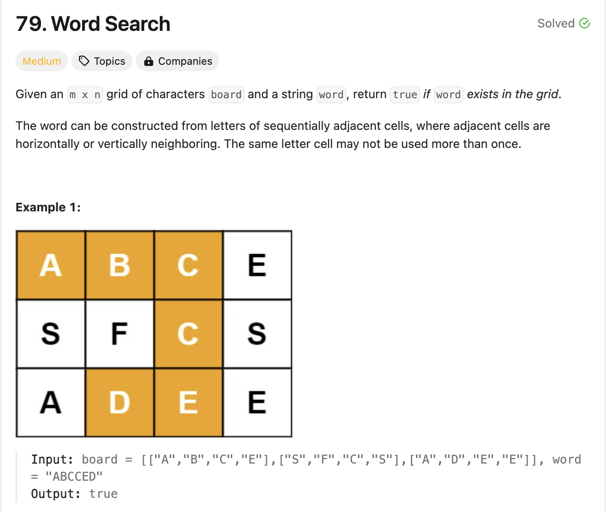

# 79. Word Search
* **一刷:30:22(❌)**
* [491. Non-decreasiong Subsequences](https://leetcode.com/problems/word-search/)
* 
## 问题
### Q1. 回退的时候需要设置哪些值？为何used[nextRow][nextCol] = false; 不可以？
* 回退需要将used[nextRow][nextCol]设置回false. 
* 因为我当前的点还没有设置回去！！used[row][col]（就是传入进来最开始的中间那个点！
```java
class Solution {
    int[][] move = { { 0, 1 }, { 0, -1 }, { -1, 0 }, { 1, 0 } };
    boolean[][] used;

    public boolean exist(char[][] board, String word) {
        used = new boolean[board.length][board[0].length];
        char[] alpha = word.toCharArray();
        for (int i = 0; i < board.length; i++) {
            for (int j = 0; j < board[0].length; j++) {
                if (!used[i][j] && alpha[0] == board[i][j]) {
                    if (dfs(i, j, alpha, 0, board))
                        return true;
                }
            }
        }
        return false;
    }
    public boolean dfs(int row, int col, char[] alpha, int index, char[][] board) {
        index++;
        used[row][col] = true;
        if (index >= alpha.length)
            return true;
        for (int times = 0; times < 4; times++) {
            int nextRow = row + move[times][0];
            int nextCol = col + move[times][1];
            if (nextRow < 0 || nextCol < 0 || nextCol >= board[0].length || nextRow >= board.length) {
                continue;
            }
            if (!used[nextRow][nextCol] && alpha[index] == board[nextRow][nextCol]) {
                if (dfs(nextRow, nextCol, alpha, index, board)) {
                    return true;
                }
                used[nextRow][nextCol] = false;
            }
        }
        used[row][col] = false;
        return false;
    }
}
```