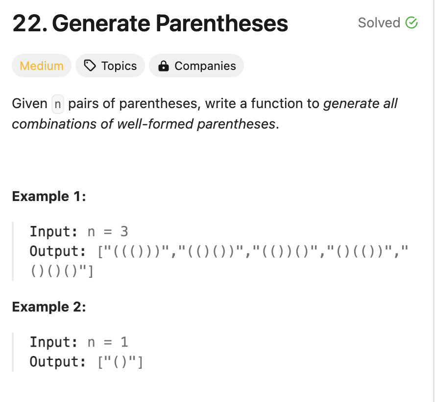

# 79. Word Search
* **一刷:30:22(❌)**
* [491. Non-decreasiong Subsequences](https://leetcode.com/problems/word-search/)
* 
## 问题
### Q1. 回退的时候需要设置哪些值？为何used[nextRow][nextCol] = false; 不可以？
* 回退需要将used[nextRow][nextCol]设置回false. 
* 因为我当前的点还没有设置回去！！used[row][col]（就是传入进来最开始的中间那个点！
```java
class Solution {
    int[][] move = { { 0, 1 }, { 0, -1 }, { -1, 0 }, { 1, 0 } };
    boolean[][] used;

    public boolean exist(char[][] board, String word) {
        used = new boolean[board.length][board[0].length];
        char[] alpha = word.toCharArray();
        for (int i = 0; i < board.length; i++) {
            for (int j = 0; j < board[0].length; j++) {
                if (!used[i][j] && alpha[0] == board[i][j]) {
                    if (dfs(i, j, alpha, 0, board))
                        return true;
                }
            }
        }
        return false;
    }
    public boolean dfs(int row, int col, char[] alpha, int index, char[][] board) {
        index++;
        used[row][col] = true;
        if (index >= alpha.length)
            return true;
        for (int times = 0; times < 4; times++) {
            int nextRow = row + move[times][0];
            int nextCol = col + move[times][1];
            if (nextRow < 0 || nextCol < 0 || nextCol >= board[0].length || nextRow >= board.length) {
                continue;
            }
            if (!used[nextRow][nextCol] && alpha[index] == board[nextRow][nextCol]) {
                if (dfs(nextRow, nextCol, alpha, index, board)) {
                    return true;
                }
                used[nextRow][nextCol] = false;
            }
        }
        used[row][col] = false;
        return false;
    }
}
```
***
# 22. Generate Parentheses
* **一刷:35:22(❌)**
* [22. Generate Parentheses](https://leetcode.com/problems/generate-parentheses/)


## Questions
### Q1.如何确定 ( 和 ) 是对应包含在里面的？
* 通过设置一个openN 和 closeN
* `)`的判断条件是:`if(closeN < openN)`
* index是不用backtracking移动的，因为recursion就是会自动完成这个过程了！
  * 也就是说不用手动:`index - 1`
* 也不需要重复for循环，只要if找到了慢慢往下走就可(不是非要for的，backtracking可不是因为有这个for才实现的，本质是recursion)
```java
class Solution {
    List<String> res = new LinkedList<>();
    char[] tmp;
    int openN = 0;
    int closeN = 0;

    public List<String> generateParenthesis(int n) {
        Deque<Character> stack = new LinkedList<>();
        tmp = new char[n * 2];
        tmp[0] = '(';
        openN = 1;
        backTracking(1, tmp, n);
        return res;
    }
    public void backTracking(int index, char[] tmp, int n) {
        if (index == tmp.length) {
            res.add(new String(tmp));
            return;
        }
        if (openN < n) {
            tmp[index] = '(';
            openN++;
            backTracking(index + 1, tmp, n);
            openN--;
        }
        if (closeN < openN) {
            tmp[index] = ')';
            closeN++;
            backTracking(index + 1, tmp, n);
            closeN--;
        }
    }
}
```
