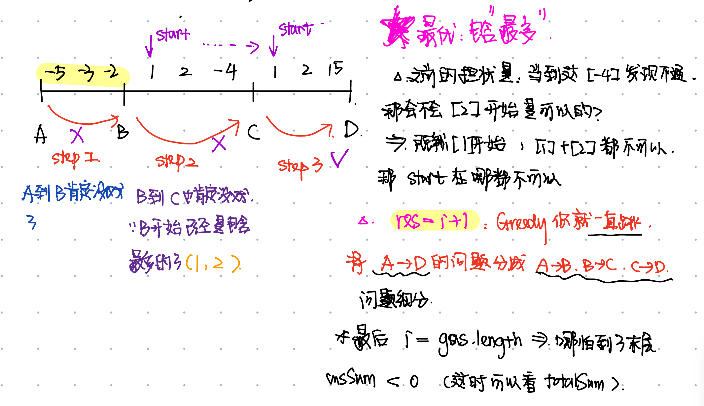

# 1005. Maximize Sum Of Array After K Negations
* **一刷:26：09(✅)**
* [1005. Maximize Sum Of Array After K Negations](https://leetcode.com/problems/maximize-sum-of-array-after-k-negations/description/)

## My Code
* 思路：
  * 排序，然后分情况讨论
    * <0, 如果还没到底,计算minus;不然就是每次改变符号变正
    * >0, 需要留意是不是绝对值最小值, 且minus推一步的时候，k-i就好
```java
class Solution {
    public int largestSumAfterKNegations(int[] nums, int k) {
        Arrays.sort(nums);
        for(int i = 0; i < k; i ++){
            if(nums[i] == 0 ){
               break;
            }
            if(nums[i] < 0){
                if(i  >= nums.length - 1){
                    int minus_2 = ((k - i)%2) == 1?-1:1;
                    nums[i] = nums[i] * minus_2;
                    break;
                }
                nums[i] = -nums[i];
                continue;
            }
            if(nums[i] > 0){
                if(i > 0){
                    if(Math.abs(nums[i]) > Math.abs(nums[i - 1])){
                        int minus_1 = ((k - i)%2) == 1?-1:1;
                        nums[i - 1] = nums[i - 1] * minus_1;
                        break;
                    }
                }
                int minus = ((k - i)%2) == 1?-1:1;
                nums[i] = nums[i] * minus;
                break;
            }
        }
        int res = 0 ;
        for(int i : nums){
            res = res + i;
        }
        return res;
    }
}
```
***
# 134. Gas Station
* **一刷:40：09(❌)**
* [134. Gas Station](https://leetcode.com/problems/gas-station/)

## 问题
### 如何通过rest[]数组来找到起始位置？如何利用Greedy的局部最优到全局最优？
* 通过两个sum，totalSum和curSum
  * 如果totalSum < 0,也就是整个rest的和加起来都小于0,那么直接返回-1
  * **curSum**是本题的关键！！
    * 如果curSum为0，那么可以肯定的是不可能在这之中产生起点，`起点`自动变成了`i+1`,并且将`curSum归0`
  

## Code
* **技巧:** 数组模拟circular的问题`res = (i + 1)%leftTank.length;` 
```java
class Solution {
    public int canCompleteCircuit(int[] gas, int[] cost) {
        int res = 0;
        int leftTank [] = new int [gas.length];
        for (int i = 0; i < gas.length; i ++){
            leftTank[i] = gas[i] - cost[i];
        }
        int totalSum = 0;
        int curSum = 0;
        for(int i = 0; i < leftTank.length; i ++){
            totalSum += leftTank[i];
            curSum += leftTank[i];
            if(curSum < 0){
                res = (i + 1)%leftTank.length;
                curSum = 0;
            }
        }
        if(totalSum < 0) return -1;
        return res;
    }
}
```
