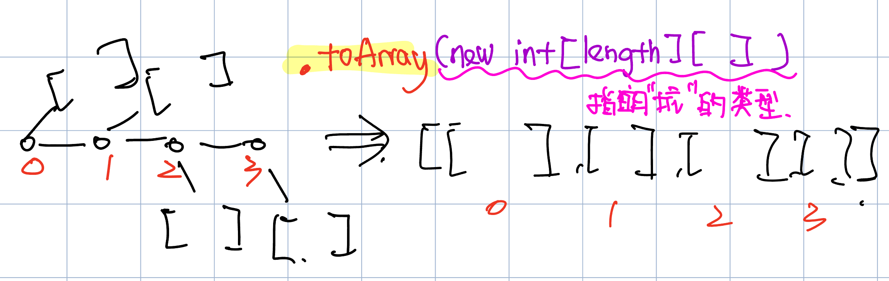

# 860. Lemonade Change
* **一刷:13:23(✅)**
* [860. Lemonade Change](https://leetcode.com/problems/lemonade-change/description/)

## My Code
```java
class Solution {
    public boolean lemonadeChange(int[] bills) {
        int fiveCharge = 0;
        int tenCharge = 0;
        for (int i = 0; i < bills.length; i++) {
            int cur = bills[i];
            if (cur == 5) {
                fiveCharge++;
            } else if (cur == 10) {
                if (fiveCharge <= 0)
                    return false;
                tenCharge++;
                fiveCharge--;
            } else {
                if (tenCharge > 0 && fiveCharge > 0) {
                    tenCharge--;
                    fiveCharge--;
                } else if (fiveCharge >= 3) {
                    fiveCharge = fiveCharge - 3;
                } else {
                    return false;
                }
            }
        }
        return true;
    }
}
```
***
# 406. Queue Reconstruction by Height
* **一刷:45:23(❌)**
* [406. Queue Reconstruction by Height](https://leetcode.com/problems/queue-reconstruction-by-height/)

## 操作技巧
* 数组的比较器构造:(实现了二维数组**两个维度**的比较 ==> 1. 身高的降序 2.如果身高相同，k的升序！！)
```java
Arrays.sort(arr, (arr1,arr2)->{
    //height相同的情况
    if(arr1[0] == arr2[0]){
        return arr1[1] - arr2[1];
    }
    //降序排列
    return arr2[0] - arr1[0];
})
```
* 通过list来操作插入的操作，最后通过**toArray():list ==> array**
  * 一维数组: 直接`resList.toArray();`
  * 二维数组: `resList.toArray(new int[peope.length][])`. 
    * 因为toArray这个方法没办法确认这个二维数组是什么类型的，所以默认情况是`Object[]`类型
    * 需要手动的创建一个`new int[大小==resList大小][]`的容器来让toArray知道目标的正确类型
    * 

## 思路
* 通过`降序身高`首先确定身高
* 在通过`k`,将k插入指定的位置，因为此时k决定了一切

```java
class Solution {
    public int[][] reconstructQueue(int[][] people) {
       Arrays.sort(people,(a,b) -> {
        //如果身高相同
        if(a[0] == b[0]){
            return a[1] - b[1];
        }
        return b[0] - a[0];
       });
    LinkedList<int []> resList = new LinkedList<>();
    for(int i = 0; i < people.length; i ++){
        int location = people[i][1];
        resList.add(location,people[i]);
    }
    return resList.toArray(new int [people.length][]);
    }
}
```