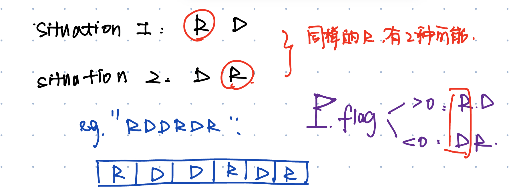
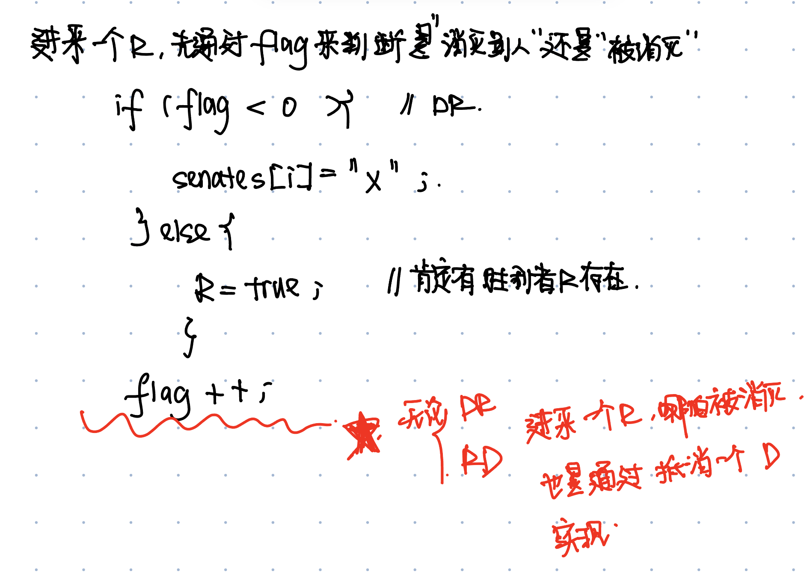

# 649. Dota2 Senate
* **一刷:37:49(❌)**
* [649. Dota2 Senate](https://leetcode.com/problems/dota2-senate/)

## 思路
* while循环 ==> 当双方R/D有一方被完全消灭了，游戏结束



```java
class Solution {
    public String predictPartyVictory(String senate) {
        char[] senates = senate.toCharArray();
        boolean R = true;
        boolean D = true;
        int flag = 0;
        while (R && D) {
            R = false;
            D = false;
            for (int i = 0; i < senates.length; i++) {
                if (senates[i] == 'R') {
                    if (flag < 0) {
                        senates[i] = '0';
                    } else {
                        R = true;
                    }
                    flag++;
                }
                if (senates[i] == 'D') {
                    if (flag > 0) {
                        senates[i] = '0';
                    } else {
                        D = true;
                    }
                    flag--;
                }
            }
        }
        return R == true ? "Radiant" : "Dire";
    }
}
```
***
# 1221. Split a String in Balanced Strings
* **一刷:4:47(✅)**
* [1221. Split a String in Balanced Strings](https://leetcode.com/problems/split-a-string-in-balanced-strings/)

## My Code
```java
class Solution {
    public int balancedStringSplit(String s) {
        int res = 0;
        int R = 0;
        int L = 0;
        char [] charArr = s.toCharArray();
        for(int i = 0 ; i < charArr.length; i ++){
            if(charArr[i] == 'R'){
                R ++;
            }
            if(charArr[i] == 'L'){
                L ++;
            }
            if(R == L){
                R = 0;
                L = 0;
                res ++;
            }
        }
        return res;
    }
}
```