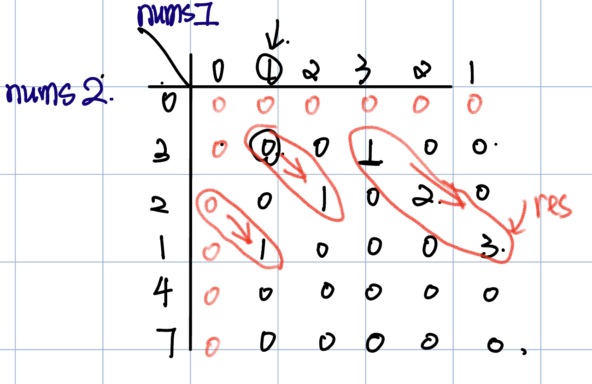

# 300. Longest Increasing Subsequence
* **一刷:30:50(❌)**
* [300. Longest Increasing Subsequence](https://leetcode.com/problems/longest-increasing-subsequence/description/)

## 问题
* 完全没有理解`子序列`问题的解题思路

## 思路
* 通过`两层for循环`
  * dp[] 代表了`以nums[i]结尾`当前位置最大的子序列个数，那么这个个数就不可能只看当前的位置 ==> 通过内部的一个for, 其中`j<= i -1` 来找到引入 nums[i]之后，最大子序列可能的个数
* dp[i]是`不动的！`，因为就是要找到最大的子序列个数
* 通过res来记录所有位置最大的个数 ==> ！！！特别注意的是，dp[len - 1]可不是最大值，因为如果将最大的全部累计到最后一个，他就没意义了。 他表示的是以nums[i]结尾，增序列的最大个数,他有一个`if(nums[i] > nums[j])`条件


```java
class Solution {
    public int lengthOfLIS(int[] nums) {
        int len = nums.length;
        int [] dp = new int [len];
        Arrays.fill(dp, 1);
        int res = 1;
        for (int i = 1; i < len ; i ++){
            for (int j = 0; j <= i - 1; j++){
                if(nums[i] > nums[j]){
                    dp[i] = Math.max(dp[i], dp[j] + 1);
                }
                res = Math.max(res, dp[i]);
            }
        }
        return res;
    }
}
```
## 子序列问题:Arrays.fill(dp,1)来填充dp的初始值
***
# 674. Longest Continuous Increasing Subsequence
* **一刷:4:54(✅)** 
* [674. Longest Continuous Increasing Subsequence](https://leetcode.com/problems/longest-continuous-increasing-subsequence/)

## My Code
```java
class Solution {
    public int findLengthOfLCIS(int[] nums) {
        int len = nums.length;
        int [] dp = new int [len];
        Arrays.fill(dp,1);
        int res = 1;
        for (int i = 1; i < len; i ++){
            if(nums[i] > nums[i - 1]){
                dp[i] = dp[i - 1] + 1;
                res = Math.max(dp[i], res);
            }        
        }
        return res;
    }
}
```
***
# 718. Maximum Length of Repeated Subarray
* **一刷:15:50(❌)**
* [718. Maximum Length of Repeated Subarray](https://leetcode.com/problems/maximum-length-of-repeated-subarray/description/)

## 问题
### Q1. 如何对比数组子序列？
### Q2. 如果遍历nums1, 未必nums2全部来一遍?

## 思路
* `二维数组`可以记录两个arrays的所有比较情况
* dp[i][j]的状态只能由dp[i - 1][j - 1]推导出来. 也就是说，因为是连续的子序列，那么当 `nums1[i] == nums2[j]` 我们才有找他们前面一个值的必要。其实二维数组已经帮我们找到了`不同的开头和结尾，对应的最大连续子序列个数了`

```java
class Solution {
    public int findLength(int[] nums1, int[] nums2) {
        int [][] dp = new int [nums1.length + 1][nums2.length + 1];
        int res = 0;
        for (int i = 1; i <= nums1.length; i ++){
            for (int j = 1; j <= nums2.length; j++){
                if(nums1[i - 1] == nums2[j - 1]){
                    dp[i][j] = dp[i - 1][j - 1] + 1;
                }
                res = Math.max(res, dp[i][j]);
            }
        }
        return res;
    }
}
```