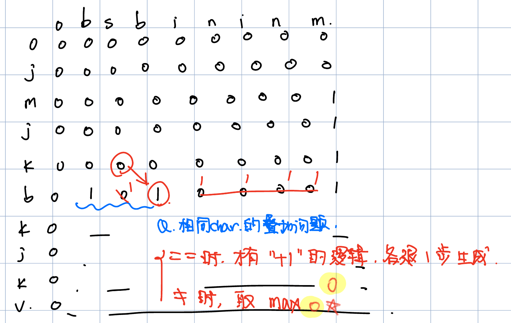

# 1143. Longest Common Subsequence
* **一刷:40:50(❌)**
* [1143. Longest Common Subsequence](https://leetcode.com/problems/longest-common-subsequence/description/)

## 问题
### 遇到相同的char，如何叠加个数？ e.g. "bsbininm" 和"jmjkbkjkv" 中的 b


## Code
* 通过dp堆叠，保持最新位置为max
```java
class Solution {
    public int longestCommonSubsequence(String text1, String text2) {
        int len1 = text1.length();
        int len2 = text2.length();
        int [][] dp = new int [len1 + 1][len2 + 1];
        for (int i = 1; i <= len1; i ++){
            for (int j = 1;j <= len2; j ++){
                if(text1.charAt(i - 1) == text2.charAt(j - 1)){
                    dp[i][j] = dp[i - 1][j - 1] + 1;
                }
                else {
                    dp[i][j] = Math.max(dp[i - 1][j] , dp[i][j - 1]);
                }
            }
        }
        return dp[len1][len2];
    }
}
```