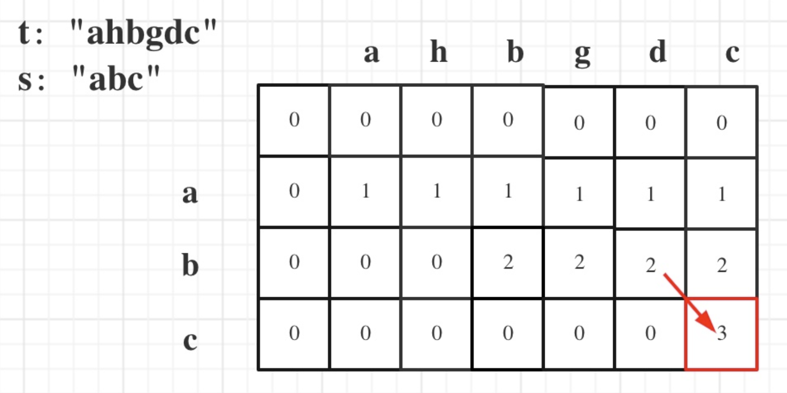
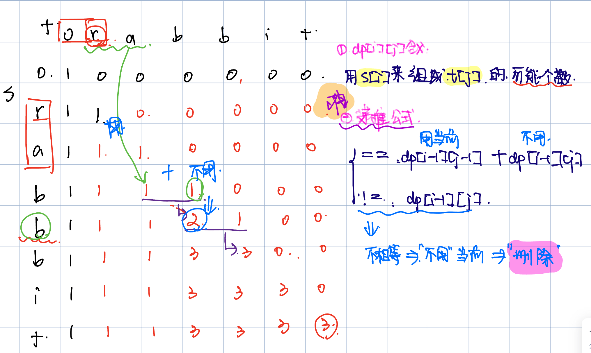

# 392. Is Subsequence
* **一刷:40:50(✅)**
* [392. Is Subsequence](https://leetcode.com/problems/is-subsequence/)

## My Code
* 通过`双指针`解决
```java
class Solution {
    public boolean isSubsequence(String s, String t) {
        int lenS = s.length();
        int lenT = t.length();
        int start = -1;
        for (int i = 0; i < lenS; i ++){
            boolean tmp = false;
            for (int j = start + 1; j < lenT; j ++){
                if(s.charAt(i) == t.charAt(j)){
                    tmp = true;
                    start = j;
                    break;
                }
            }
            if (!tmp) {
                return false;
            }
        }
        return true;
    }
}
```

## dp，编辑距离问题

```java
class Solution {
    public boolean isSubsequence(String s, String t) {
        int length1 = s.length(); int length2 = t.length();
        int[][] dp = new int[length1+1][length2+1];
        for(int i = 1; i <= length1; i++){
            for(int j = 1; j <= length2; j++){
                if(s.charAt(i-1) == t.charAt(j-1)){
                    dp[i][j] = dp[i-1][j-1] + 1;
                }else{
                    dp[i][j] = dp[i][j-1];
                }
            }
        }
        if(dp[length1][length2] == length1){
            return true;
        }else{
            return false;
        }
    }
}
```
# 115. Distinct Subsequences
* **一刷:30:50(❌)**
* [115. Distinct Subsequences](https://leetcode.com/problems/distinct-subsequences/)


## Code
```java
class Solution {
    public int numDistinct(String s, String t) {
        int [][] dp = new int [s.length() + 1][t.length() + 1];
        for (int i = 0; i <= s.length(); i ++){
            dp[i][0] = 1;
        }
        for (int i = 1; i <= s.length(); i ++){
            for (int j = 1; j <= t.length(); j ++){
                if(s.charAt(i - 1) == t.charAt(j - 1)){
                    dp[i][j]=dp[i - 1][j - 1] + dp[i - 1][j];
                }
                else{
                    dp[i][j] = dp[i - 1][j];
                }
            }
        }
        return dp[s.length()][t.length()];
    }
}
```