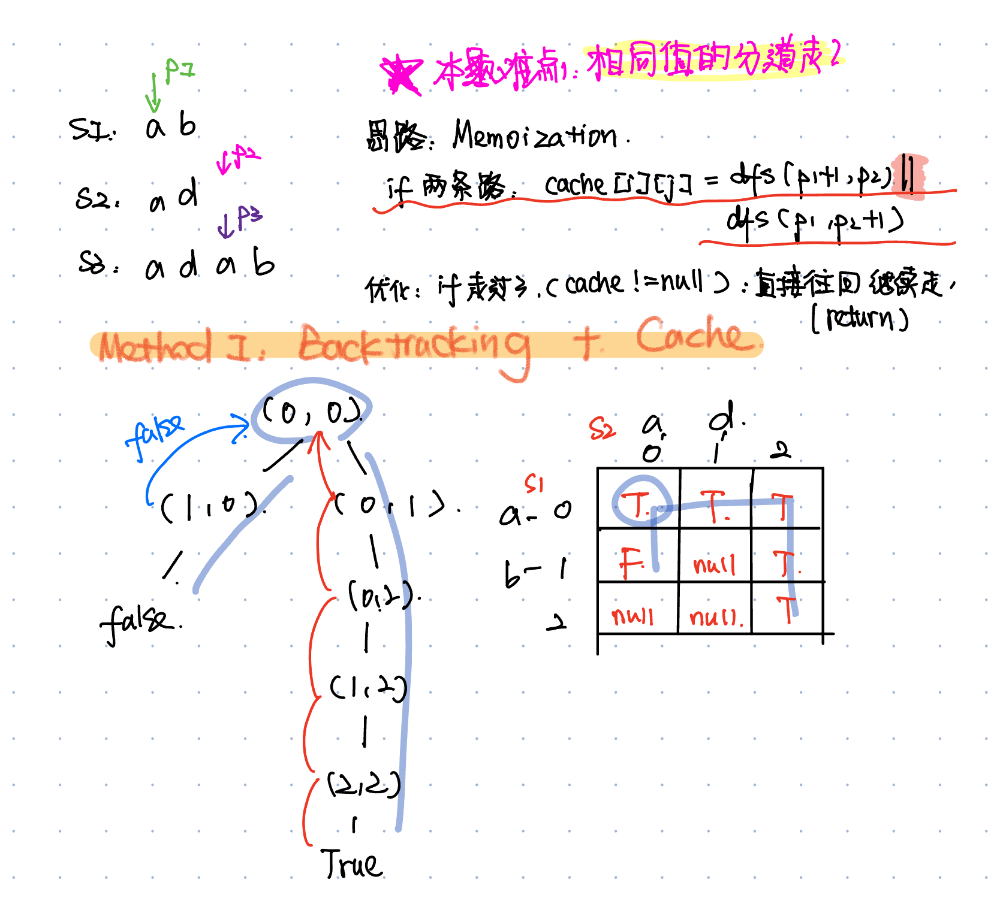

# 120. Triangle
* **一刷:39:49(✅)**
* [120. Triangle](https://leetcode.com/problems/triangle/?envType=study-plan-v2&envId=top-interview-150)

## 问题
### Q1. 如何使用Dp来实现？这个需要全部情况都依次尝试才可以呀。比如有个值很小，如果回退得很深，那么我的dp数组表示的是什么？
* 通过二维数组记录所有内容

## My Code
```java
class Solution {
    public int minimumTotal(List<List<Integer>> triangle) {
        //dp: the mini of dp[i - 1][j] & dp[i - 1][j - 1];
        int n = triangle.size();
        int [][] dp = new int [n][n];
        int level = 0;
        for(int i = 0; i <= level; i ++){
            if(i >= n) break;
            for (int j = 0; j <= level; j ++){
                int cur = triangle.get(i).get(j);
                if(i - 1 < 0) {
                    dp[i][j] = cur;
                    level ++;
                    break;
                }
                if(j - 1 < 0){
                    dp[i][j] = cur + dp[i - 1][j]; 
                    continue;
                }
                if( j >= triangle.get(i).size() - 1){
                    dp[i][j] = cur + dp[i - 1][j - 1];
                    level ++;
                    break;
                }
                dp[i][j] = cur + Math.min(dp[i - 1][j - 1], dp[i - 1][j]);
                level ++;
            }

        }
        int res = Integer.MAX_VALUE;
        for(int i = 0 ; i < n ; i ++){
            res = Math.min(res, dp[n - 1][i]);
        }
        return res;
    }
}
```
***
# 64. Minimum Path Sum
* **一刷:10:23(✅)**
* [120. Triangle](https://leetcode.com/problems/minimum-path-sum/?envType=study-plan-v2&envId=top-interview-150)

## My Code
```java
class Solution {
    public int minPathSum(int[][] grid) {
        int row = grid.length;
        int col = grid[0].length;
        int [][] dp = new int [row][col];

        dp[0][0] = grid[0][0];
        //initiate top-row
        for(int i = 1; i < col; i ++){
            dp[0][i] = grid[0][i] + dp[0][i - 1];
        }
        //initiate left-col
        for(int i = 1; i < row; i ++){
            dp[i][0] = grid[i][0] + dp[i - 1][0];
        }

        for(int i = 1; i < row; i ++){
            for (int j = 1; j < col; j ++){
                dp[i][j] = grid[i][j] + Math.min(dp[i - 1][j], dp[i][j - 1]);
            }
        }
        return dp[row - 1][col - 1];
    }
}
```
***
# 5. Longest Palindromic Substring
* **一刷:30:00(❌)**
* [5. Longest Palindromic Substring](https://leetcode.com/problems/longest-palindromic-substring/?envType=study-plan-v2&envId=top-interview-150)
## 总结

### 整体做题思路
* 根据5部曲，一步一步分析，然后遇到复杂的情况把情况列举出来，分情况讨论
* 通过dp递归公式e.g. dp[i + 1][j - 1] 来确定遍历的顺序(这也是遍历顺序在step4的原因)
### Tips
* ！！ 对于**上三角（右上）** 问题: j = i 来作为起点
## Code
```java
class Solution {
    public String longestPalindrome(String s) {
        char[] charArr = s.toCharArray();
        boolean[][] dp = new boolean[charArr.length][charArr.length];
        int maxLen = 0;
        int start = 0;
        for (int i = 0; i < s.length(); i++) {
            dp[i][i] = true;
        }
        for (int i = charArr.length - 1; i >= 0; i--) {
            for (int j = i; j < charArr.length; j++) {
                if (charArr[i] == charArr[j]) {
                    if (j - i <= 1) {
                        dp[i][j] = true;
                    } else if (dp[i + 1][j - 1]) {
                        dp[i][j] = true;
                    }
                }
                if (dp[i][j] && j - i + 1 > maxLen) {
                    maxLen = j - i + 1;
                    start = i;
                }
            }
        }
        return s.substring(start, maxLen + start);
    }
}
```
# 221. Maximal Square
* **一刷:30:00(✅)**
* [221. Maximal Square](https://leetcode.com/problems/maximal-square/?envType=study-plan-v2&envId=top-interview-150)

## My Code
```java
class Solution {
    public int maximalSquare(char[][] matrix) {
        int max = 0;
        int [][] dp = new int [matrix.length][matrix[0].length];
        for(int i = 0 ; i < matrix.length; i ++){
            dp[i][0] =  matrix[i][0] - '0';
            if(dp[i][0] == 1) max = 1;
        }
        for(int i = 0 ; i < matrix[0].length; i ++){
            dp[0][i] = matrix[0][i] - '0';
            if(dp[0][i] == 1) max = 1;
        }
        for(int i = 1; i < matrix.length; i ++){
            for(int j = 1; j < matrix[0].length; j ++){
                if(matrix[i][j] == '1'){
                    if(matrix[i - 1][j] == '1' && matrix[i - 1][j - 1] == '1' && matrix[i][j - 1] == '1'){
                            int tmp = Math.min(Math.min(dp[i - 1][j - 1],dp[i][j - 1]), dp[i - 1][j]);
                            double tmp1  = Math.sqrt(tmp);
                            tmp1 = (tmp1 + 1) * (tmp1 + 1);
                            dp[i][j] = (int)tmp1;
                    }
                    else{
                        dp[i][j] = 1;
                    }
                    if(dp[i][j] > max){
                        max = dp[i][j];
                    }
                }
            }
        }
        return max;
    }
}
```
# 97. Interleaving String
* **一刷:8:00(❌)**
* [97. Interleaving String](https://leetcode.com/problems/interleaving-string/?envType=study-plan-v2&envId=top-interview-150)
* 解析 [Youtube](https://www.youtube.com/watch?v=3Rw3p9LrgvE)
* 解析2 [Youtube2](https://www.youtube.com/watch?v=sfP64T6SmaY)

## 分析
### 记忆化搜索(Memoization)
* Defination：Use a **cache array** to record the results of depth-first search **(DFS)**. It is a form of **dynamic programming.**

### Boolean 进行初始化，default value是 null！
* 在Java中**初始化一个Boolean[][] cache数组，数组中的每个元素的默认值是null**。这是因为Boolean是Java的一个包装类，不是基本数据类型。包装类的数组在初始化时，它们的元素会被设置为null，而不是基本数据类型布尔值的false。
* 这个特性在使用时可以非常有用，因为你可以区分哪些元素已经被设置为true或false，以及哪些元素还没有被设置（即仍然为null）。这可以帮助你在实现记忆化递归时判断某个子问题是否已经被解决。如果一个数组元素是null，表示该子问题还未被计算过；如果不是null，你可以直接使用存储的值，避免重复计算

### 本体思路


```java
class Solution {
    Boolean [][] cache;
    char [] s1Chr;
    char [] s2Chr;
    char [] s3Chr;
    char UNKNOWN = '0';
    public boolean isInterleave(String s1, String s2, String s3) {
        s1Chr = s1.toCharArray();
        s2Chr = s2.toCharArray();
        s3Chr = s3.toCharArray();
        if(s1Chr.length + s2Chr.length != s3Chr.length) return false;
        cache = new Boolean[s1Chr.length + 1][s2Chr.length + 1];
        return dfs(0,0);
    }
    public boolean dfs(int p1, int p2){
        int p3 = p1 + p2;
        if(p1 == s1Chr.length && p2 == s2Chr.length) return true;
        if(cache[p1][p2] != null) return cache[p1][p2];
        char c1 = p1 == s1Chr.length ? UNKNOWN : s1Chr[p1];
        char c2 = p2 == s2Chr.length ? UNKNOWN : s2Chr[p2];
        if(c1 == s3Chr[p3] && c2 == s3Chr[p3]){
            cache[p1][p2] = dfs(p1 + 1, p2) || dfs(p1, p2 + 1);
        }else if(c1 == s3Chr[p3]){
            cache[p1][p2] = dfs(p1 + 1, p2);
        }else if(c2 == s3Chr[p3]){
            cache[p1][p2] = dfs(p1, p2 + 1);
        }else {
            cache[p1][p2] = false;
        }
        return cache[p1][p2];
    }
}
```