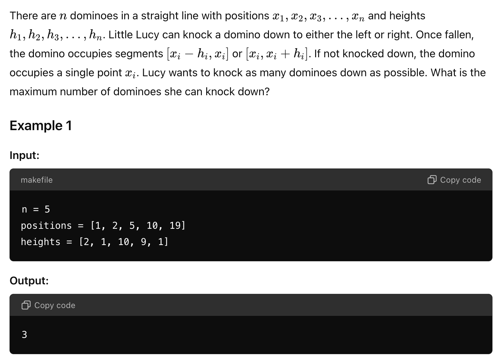
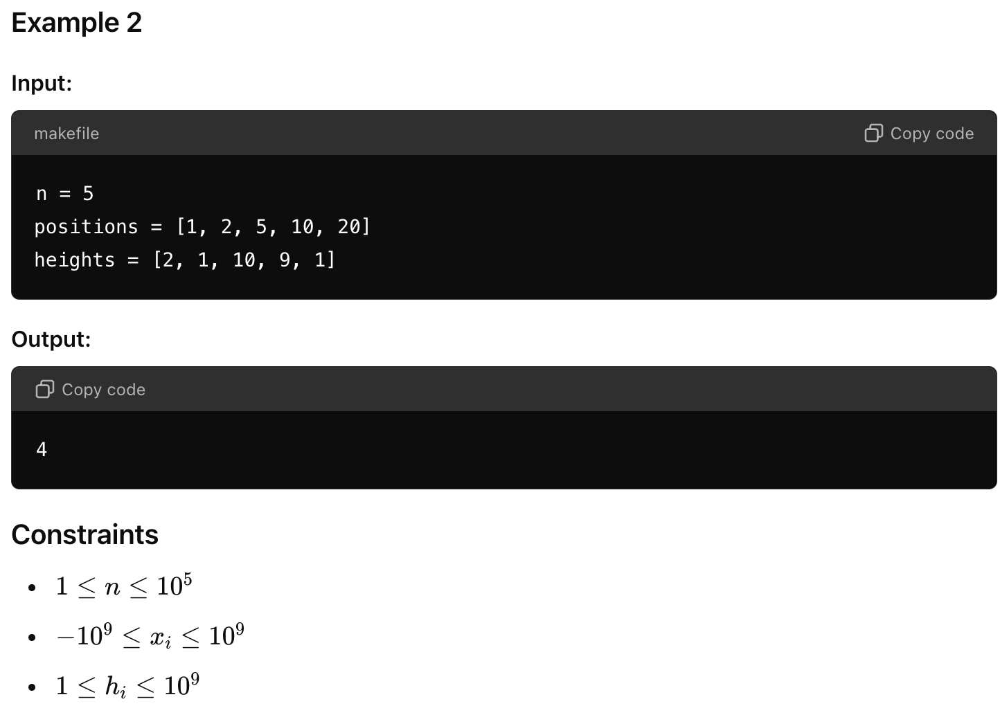

# 问题



## Code_1
```java
package org.example;

class FallingDominoes {

    public int knock(int[] heights, int[] positions) {
        int size = heights.length;

        if (size <= 2) {
            return size;
        }

        int result = 0;

        // 当前倒向左边、站立和倒向右边的最大数量
        int currFellLeft = 1;
        int currStayedUp = 0;
        int currFellRight = 0;

        for (int i = 1; i < size - 1; ++i) {
            int prevFellLeft = currFellLeft;
            int prevStayedUp = currStayedUp;
            int prevFellRight = currFellRight;

            // i-th 多米诺骨牌可以倒向左边
            if (positions[i] - heights[i] > positions[i - 1]) {
                // i-th 多米诺骨牌可以倒向左边并且 i-1 倒向右边
                if (positions[i] - heights[i] > positions[i - 1] + heights[i - 1]) {
                    currFellLeft = 1 + max(prevFellLeft, prevStayedUp, prevFellRight);
                } else {
                    currFellLeft = 1 + max(prevFellLeft, prevStayedUp);
                }
            }

            // i-th 多米诺骨牌保持站立
            currStayedUp = max(prevFellLeft, prevStayedUp, prevFellRight);

            // i-th 多米诺骨牌可以倒向右边
            if (positions[i] + heights[i] < positions[i + 1]) {
                currFellRight = 1 + max(prevFellLeft, prevStayedUp, prevFellRight);
            }
        }

        return 1 + max(currFellLeft, currStayedUp, currFellRight);
    }

    private int max(int i, int j, int k) {
        return Math.max(i, Math.max(j, k));
    }

    private int max(int i, int j) {
        return Math.max(i, j);
    }

    public static void main(String[] args) {
        FallingDominoes solver = new FallingDominoes();
        int[] positions1 = {1, 2, 5, 10, 19};
        int[] heights1 = {2, 1, 10, 9, 1};
        System.out.println(solver.knock(heights1, positions1)); // 输出: 3

        int[] positions2 = {1, 2, 5, 10, 20};
        int[] heights2 = {2, 1, 10, 9, 1};
        System.out.println(solver.knock(heights2, positions2)); // 输出: 4
    }
}

```

## Code 2
```java
package org.example;

import java.util.*;

class FallingDominoes {
    public static int knock(long n, long[] positions, long[] heights) {
        if (n == 0) return 0;

        // dp[3][n]: 0 for left, 1 for stand, 2 for right
        int[][] dp = new int[3][(int) n];
        dp[0][0] = 1;
        dp[1][0] = 0;
        dp[2][0] = 0;

        if ((n > 1 && positions[0] + heights[0] < positions[1]) || n == 1) dp[2][0] = 1;

        for (int i = 1; i < n; i++) {
            // i-th domino can fall on left
            if (positions[i] - heights[i] > positions[i - 1]) {
                if (positions[i - 1] + heights[i - 1] < positions[i] - heights[i]) {
                    dp[0][i] = 1 + Math.max(Math.max(dp[0][i - 1], dp[1][i - 1]), dp[2][i - 1]);
                } else {
                    dp[0][i] = 1 + Math.max(dp[0][i - 1], dp[1][i - 1]);
                }
            }

            // i-th domino don't fall
            dp[1][i] = Math.max(Math.max(dp[0][i - 1], dp[1][i - 1]), dp[2][i - 1]);

            // i-th domino can fall on right
            if (i == n - 1 || positions[i] + heights[i] < positions[i + 1]) {
                dp[2][i] = 1 + Math.max(Math.max(dp[0][i - 1], dp[1][i - 1]), dp[2][i - 1]);
            }
        }

        return Math.max(Math.max(dp[0][(int) n - 1], dp[1][(int) n - 1]), dp[2][(int) n - 1]);
    }

    public static void main(String[] args) {
        int n = 5;
        long[] positions1 = {1, 2, 5, 10, 19};
        long[] heights1 = {2, 1, 10, 9, 1};
        System.out.println(knock(n, positions1, heights1)); // 输出: 3

        long[] positions2 = {1, 2, 5, 10, 20};
        long[] heights2 = {2, 1, 10, 9, 1};
        System.out.println(knock(n, positions2, heights2)); // 输出: 4
    }
}
```