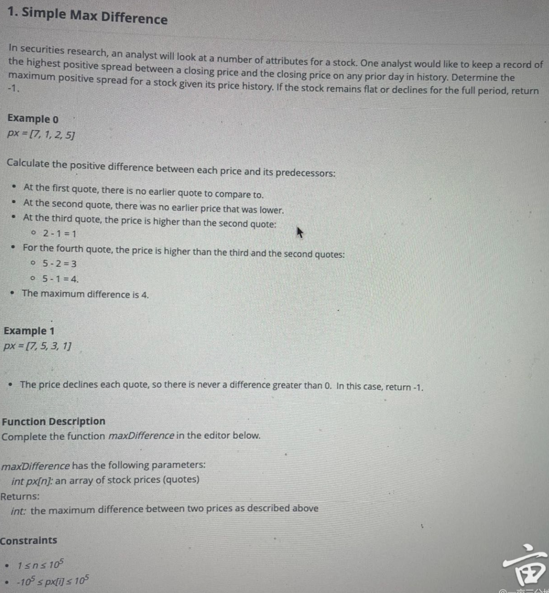

# 问题


# Code
```java
public class SimpleMaxDifference {

    public static int maxDifference(int[] px) {
        if (px.length < 2) {
            return -1;
        }
        
        int minPrice = px[0];
        int maxDifference = -1;

        for (int i = 1; i < px.length; i++) {
            if (px[i] > minPrice) {
                maxDifference = Math.max(maxDifference, px[i] - minPrice);
            } else {
                minPrice = px[i];
            }
        }

        return maxDifference;
    }

    public static void main(String[] args) {
        int[] px1 = {7, 1, 2, 5};
        System.out.println(maxDifference(px1)); // 输出: 4

        int[] px2 = {7, 5, 3, 1};
        System.out.println(maxDifference(px2)); // 输出: -1
    }
}
```