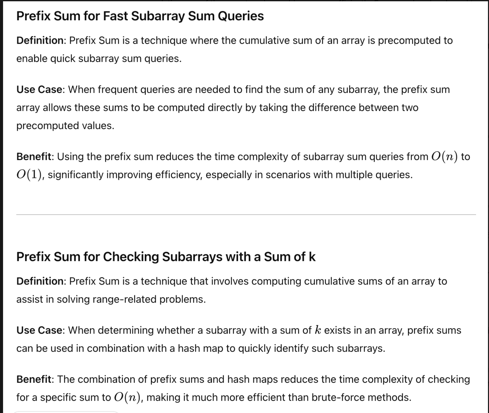

# Google 代码规范
* 1. 缩进是2 spaces
* 2. 注释空一行
* 3. 每个方法前简要描述功能
* 4. if/else/while语句都是前后有空格

# 959. Regions Cut By Slashed
* **一刷:30:22(❌)**
* [959. Regions Cut By Slashed](https://leetcode.com/problems/regions-cut-by-slashes/?envType=company&envId=google&favoriteSlug=google-thirty-days&difficulty=MEDIUM)

## 思路
* 将一个cell看作是四个vertices的方格，通过Disjoint Union Set data structure，找到connected edges
* 初始值boundry都连在一起
* TC: O(N^2 * a(n^2)), where a is inverse Ackermann function
* SC: O(N^2)
## Code
```java
class Solution {
  /**
   * Solution class to solve the problem of counting regions by slashes.
   * The algorithm uses the Disjoint Set Union (DSU) data structure to count
   * the number of regions formed by slashes in the grid.
   */
  public int regionsBySlashes(String[] grid) {
    // Initialize DSU data structure
    int gridSize = grid.length;
    int pointsPerSide = gridSize + 1;
    int totalPoints = pointsPerSide * pointsPerSide;
    int[] parentArray = new int[totalPoints];
    Arrays.fill(parentArray, -1);

    // Connect boundary points
    for (int i = 0; i < pointsPerSide; i++) {
      for (int j = 0; j < pointsPerSide; j++) {
        if (i == 0 || j == 0 || i == pointsPerSide - 1 || j == pointsPerSide - 1) {
          int coord = i * pointsPerSide + j;
          parentArray[coord] = 0;
        }
      }
    }

    // Set top-left point to -1
    parentArray[0] = -1;
    int regionCount = 1;

    // Process each cell in the grid
    for (int i = 0; i < gridSize; i++) {
      for (int j = 0; j < gridSize; j++) {
        if (grid[i].charAt(j) == '/') {
          int topRight = i * pointsPerSide + (j + 1);
          int downLeft = (i + 1) * pointsPerSide + j;
          regionCount += union(parentArray, topRight, downLeft);
        } else if (grid[i].charAt(j) == '\\') {
          int topLeft = i * pointsPerSide + j;
          int downRight = (i + 1) * pointsPerSide + (j + 1);
          regionCount += union(parentArray, topLeft, downRight);
        }
      }
    }

    return regionCount;
  }

  /**
   * Finds the root of the set containing the given node.
   *
   * @param parentArray the DSU array representing the sets
   * @param node the node to find
   * @return the root of the set containing the node
   */
  private int find(int[] parentArray, int node) {
    if (parentArray[node] == -1) {
      return node;
    }

    // Path Compression, reduce time complexity to amortized time complexity O(a(n))
    parentArray[node] = find(parentArray, parentArray[node]);
    return parentArray[node];
  }

  /**
   * Unions two sets containing the given nodes and returns 1 if a new region
   * is formed, 0 otherwise.
   *
   * @param parentArray the DSU array representing the sets
   * @param node1 the first node
   * @param node2 the second node
   * @return 1 if a new region is formed, 0 otherwise
   */
  private int union(int[] parentArray, int node1, int node2) {
    int parent1 = find(parentArray, node1);
    int parent2 = find(parentArray, node2);

    // Nodes are already in the same set, new region formed
    if (parent1 == parent2) {
      return 1;
    }

    // Union the sets
    parentArray[parent2] = parent1;
    return 0;
  }
}
```
***

# Prefix Sum
## 介绍 + 使用场景


## 2955. Number of Same-End Substrings 介绍
* 【technique/data structure的实现方法】**The basic idea is** to precompute the cumulative sums of an array, which enables quick subarray sum queries. 
* 【为什么采用这个方法-这个方法的常用使用场景】**I chose this technique because** it is particularly useful when frequent queries are required to find the sum of any subarray. 
* 【结合本题进行分析/为什么本题适合这个方法？】**For instance, in this case,** we need to frequently query the total number of appearances of lowercase English letters in a substring, the prefix sum array allows us to compute these sums directly by taking the difference between two precomputed values. 
* 【使用这个方法的好处/time complexity的对比】 **This approach effectively reduces the time complexity of** subarray sum queries from linear time to constant time, significantly improving efficiency.

# 2955. Number of Same-End Substrings 
* **一刷:30:22(❌)**
* [2955. Number of Same-End Substrings ](https://leetcode.com/problems/number-of-same-end-substrings/?envType=company&envId=google&favoriteSlug=google-thirty-days&difficulty=MEDIUM)

## Prefix Sum
### 二维数组的prefix sum介绍
* We implement the prefix sum method using a 2D array to store the **cumulative counts** for each of the 26 lowercase English letters from 'a' to 'z'. Each row in the array represents a letter and **tracks its prefix sums** in the string s. This allows us to efficiently calculate the number of times any letter appears in a given substring **by quickly referencing the precomputed values.**

## Code
```java
class Solution {
  /**
   * Counts the number of substrings with the same starting and ending character within given queries.
   *
   * @param s the input string
   * @param queries an array of queries, where each query is an array with two integers [left, right]
   * @return an array where each element corresponds to the count of substrings for each query
   */
  public int[] sameEndSubstringCount(String s, int[][] queries) {
    int stringLength = s.length();
    int numberOfQueries = queries.length;

    // Initialize the 2D prefix sum array
    int[][] prefixSum = new int[26][stringLength + 1];
    initPrefixSumArray(prefixSum, s);

    // Calculate the number of same end substrings for each query
    int[] result = new int[numberOfQueries];
    for (int i = 0; i < numberOfQueries; i++) {
      int left = queries[i][0];
      int right = queries[i][1];
      result[i] = calculateSameEndSubstrings(prefixSum, left, right);
    }
    return result;
  }

  /**
   * Initializes the 2D prefix sum array that tracks character frequencies.
   *
   * @param prefixSum the 2D prefix sum array
   * @param s the input string
   */
  private void initPrefixSumArray(int[][] prefixSum, String s) {
    int stringLength = s.length();
    for (int j = 1; j < stringLength + 1; j++) {
      for (int i = 0; i < 26; i++) {
        prefixSum[i][j] = prefixSum[i][j - 1];
      }
      prefixSum[s.charAt(j - 1) - 'a'][j]++;
    }
  }

  /**
   * Calculates the number of substrings with the same starting and ending character within a given range.
   *
   * @param prefixSum the 2D prefix sum array
   * @param left the left boundary of the substring
   * @param right the right boundary of the substring
   * @return the number of substrings with the same starting and ending character
   */
  private int calculateSameEndSubstrings(int[][] prefixSum, int left, int right) {
    int count = right - left + 1;
    for (int i = 0; i < 26; i++) {
      int letterAppearances = prefixSum[i][right + 1] - prefixSum[i][left];
      count += (letterAppearances * (letterAppearances - 1) / 2);
    }
    return count;
  }
}
```
***
# 3026. Maximum Good Subarray Sum
* **一刷:30:22(❌)**
* [3026. Maximum Good Subarray Sum](https://leetcode.com/problems/maximum-good-subarray-sum/?envType=company&envId=google&favoriteSlug=google-thirty-days&difficulty=MEDIUM)

## 思路
### Prefix Sum + HashMap
* 通过prefix sum来数组的前缀和
* 通过map来记录最优的max值
  * 本题比较绕的点在于 arr里面的数据是能够repeated的，这样的话map就不能一开始就traverse一遍，然后初始化
  * 而是应该在最后
  ```java
    if(!prefixMap.containsKey(nums[i]) || prefixSumArray[i] < prefixSumArray[prefixMap.get(nums[i])]) {
            prefixMap.put(nums[i] , i);
        }
  ```
  * 逻辑就是如果前缀map还未包含nums[i] 或者 当前前缀sum array 小于了第一次出现prefixMap.get(nums[i])的值（因为我们是求的startIndex，是被减数，越小越好）==>更新
## Code 
```java
class Solution {
  public long maximumSubarraySum(int[] nums, int k) {
    int numsLen = nums.length;
    HashMap<Integer, Integer> prefixMap = new HashMap<>();
    Long max = Long.MIN_VALUE;

    //initialize prefix sum array
    long [] prefixSumArray = new long [numsLen];
    prefixSumArray[0] = nums[0];
    for(int i = 1; i < numsLen; i++) {
        prefixSumArray[i] = prefixSumArray[i - 1] + nums[i];
    }

    for(int i = 0; i < numsLen; i++) {
        if(prefixMap.containsKey(nums[i] - k)) {
            int startIndex = prefixMap.get(nums[i] - k);
            long sum = prefixSumArray[i] - (startIndex > 0 ? prefixSumArray[startIndex - 1] : 0);
            max = Math.max(sum, max);
        }
        if(prefixMap.containsKey(nums[i] + k)) {
            int startIndex = prefixMap.get(nums[i] + k);
            long sum = prefixSumArray[i] - (startIndex > 0 ? prefixSumArray[startIndex - 1] : 0);
            max = Math.max(sum, max);
        }
        if(!prefixMap.containsKey(nums[i]) || prefixSumArray[i] < prefixSumArray[prefixMap.get(nums[i])]) {
            prefixMap.put(nums[i] , i);
        }
    }

    return max == Long.MIN_VALUE ? 0 : max;
  }
}
```
***
# 2981. Find Longest Special Substring That Occuers Thrice I
* **一刷:30:22(❌)**
* [2981. Find Longest Special Substring That Occuers Thrice I](https://leetcode.com/problems/find-longest-special-substring-that-occurs-thrice-i/?envType=company&envId=google&favoriteSlug=google-thirty-days&difficulty=MEDIUM)

## 思路
* 通过一个2D array来记录每一个lowercase English Letter的个数，row - 26， col - s.length() + 1(因为最多就s.length())
* 然后使用sliding window来控制最长的window，windowLen = j - i + 1;
* 然后traverse windowLen 从 k=1 到 k=windowLen, 代表了不同size的k，对应的count
  * 这一步很关键是因为出现 nnnnnynnnn的情况，如果只考虑了一个window无法记录，通过二维数组的方式，能够进行全局的一个record

## Code
```java
class Solution {
    public int maximumLength(String s) {
        int [][] subStringsCount = new int [26][s.length() + 1];
        int n = s.length();
        int max = 0;
        //
        for(int i = 0; i < n; i++){
            char c = s.charAt(i);
            int j = i;
            while(j < n - 1 && s.charAt(j + 1) == c) {
                j++;
            }
            int windowLen = j - i + 1;
            for(int k = 1; k <= windowLen; k++){
                int count = windowLen - k + 1;
                subStringsCount[c - 'a'][k] += count;
                if(subStringsCount[c - 'a'][k] >=3 ){
                    max = Math.max(max, k);
                }
            }
            i = j; //slide the window
        }
        return max == 0 ? -1 : max;
    }
}
```
***
# 7. Reverse Integer
* **一刷:30:22(❌)**
* [7. Reverse Integer](https://leetcode.com/problems/reverse-integer/?envType=company&envId=google&favoriteSlug=google-thirty-days&difficulty=MEDIUM)

## Trick：Integer的overflow(越界)
* Integer的overflow问题可以通过 `Integer.MAX_VALUE / 10` 来比较前半部分和 比较最后一位的值 `(+ -> 7 || - -> -8)`

## Code
```java
 class Solution {
    public int reverse(int x) {
        int rev = 0;
        while(x != 0) {
            int pop = x % 10;
            x = x / 10;
            
            if(rev > Integer.MAX_VALUE / 10 || (rev == Integer.MAX_VALUE / 10 && pop > 7)) {
                return 0;
            }
            if(rev < Integer.MIN_VALUE / 10 || (rev == Integer.MAX_VALUE / 10 && pop < -8)) {
                return 0;
            }
            rev = rev * 10 + pop;
        }
        return rev;
    }
}
```
***
# 1937. Maximum Number of Points with Cost
* **一刷:30:22(❌)**
* [1937. Maximum Number of Points with Cost](https://leetcode.com/problems/maximum-number-of-points-with-cost/?envType=company&envId=google&favoriteSlug=google-thirty-days&difficulty=MEDIUM)

## 思路: 双重DP
* 本题的难点在于如何balance max value 和 与col距离之间的关系
* 通过`double dp`，分别从 : left --> right 和 right --> left 来计算最大值
* 然后每一行就和它prevRow left --> right 的最大值 以及 right --> left最大值进行比较就可以了
## 技巧：双DP(左到右 & 右到左)
* 当发现可以使用record的值就考虑dp
* 如果感觉dp与其他因素有规律的牵挂（比如本地就和col有一进一退的关联 ）
* 可以考虑 添加一个临时的dp数组，**从左到右 从右到左** 分别遍历
* 特别是和index的增减有关，两头分别遍历很有用！

## Code
```java
class Solution {
    public long maxPoints(int[][] points) {
        long[][] dp = new long[points.length][points[0].length];
        long[] prevRow = new long[points[0].length];
        for (int j = 0; j < points[0].length; j++) {
            prevRow[j] = points[0][j];
        }
        for (int i = 1; i < points.length; i++) {
            long[] curRow = new long[points[0].length];
            long[] leftMax = new long[points[0].length];
            long[] rightMax = new long[points[0].length];
            // leftMax initialization
            leftMax[0] = prevRow[0];
            for (int j = 1; j < prevRow.length; j++) {
                leftMax[j] = Math.max(prevRow[j], leftMax[j - 1] - 1);
            }
            rightMax[prevRow.length - 1] = prevRow[prevRow.length - 1];
            for (int j = rightMax.length - 2; j >= 0; j--) {
                rightMax[j] = Math.max(prevRow[j], rightMax[j + 1] - 1);
            }
            for (int j = 0; j < points[0].length; j++) {
                curRow[j] = points[i][j] + Math.max(leftMax[j], rightMax[j]);
            }
            prevRow = curRow;
        }
        long max = 0;
        for (int i = 0; i < prevRow.length; i++) {
            max = Math.max(max, prevRow[i]);
        }
        return max;
    }
}
```
***
# 394. Decode String
* **一刷:30:22(❌)**
* [394. Decode String](https://leetcode.com/problems/decode-string/?envType=company&envId=google&favoriteSlug=google-thirty-days&difficulty=MEDIUM)

## 思路: 双Stack
* 通过res来记录遍历到的结果
* 然后通过两个stack
  * 一个用来装之前StringBuilder res的值（因为nested [[]] 而被迫重新开
  * 一个用来记录循环的次数
* 有四种情况
  * 当为digit: `Character.isDigit(c)` 就记录k的值
  * 为`[` : 就push当前的res和k进入stack，并且重新res = new StringBuilder(); k = 0; 这样就能保证res一定是最里面那层的值
  * 为`]` : pop stringbuilder stack里面的值，它相当于是目前那个值的前序内容，所以在它 tmp.append(res) 循环添加 当前的res
  * 最后更新 res = tmp，相当于最里面那个值解决了，然后一步一步往外扩展

## Code
```java
class Solution {
    public String decodeString(String s) {
        StringBuilder res = new StringBuilder();
        Stack<Integer> countStack = new Stack<>();
        Stack<StringBuilder> strTmpStack = new Stack<>();
        int times = 0;
        for(int i = 0; i < s.length(); i++) {
            char c = s.charAt(i);
            if(Character.isDigit(c)) {
                times = times * 10 + c - '0';
            } else if(c == '[') {
                countStack.push(times);
                strTmpStack.push(res);
                res = new StringBuilder();
                times = 0;
            } else if (c == ']') {
                StringBuilder storedRes = strTmpStack.pop();
                int t = countStack.pop();
                for(int j = 0; j < t; j++) {
                    storedRes.append(res);
                }
                res = storedRes;
            } else {
                res.append(c);
            }
        } 
        return res.toString();
    }
}
```
# 592. Fraction Addition and Subtraction
* **一刷:30:22(❌)**
* [592. Fraction Addition and Subtraction](https://leetcode.com/problems/fraction-addition-and-subtraction/?envType=company&envId=google&favoriteSlug=google-thirty-days&difficulty=MEDIUM)
## Euclidean Algorithm for finding Greatest Common Divisor
```java
private int GCD(int a, int b) {
  if(b == 0) {
    return a;
  }
  return GCD (b, a%b);
}
```

## Code
```java
class Solution {
    public String fractionAddition(String expression) {
        int expressLen = expression.length();
        if (expressLen <= 4) {
            return expression;
        }
        // push first fration
        int start = 0;
        int end = start;
        while (expression.charAt(end) != '/') {
            end++;
        }
        int num = Integer.parseInt(expression.substring(start, end));
        start = end + 1;
        end = start;
        // System.out.println(expression.charAt(end));
        while (expression.charAt(end) != '+' && expression.charAt(end) != '-') {
            end++;
        }
        int deno = Integer.parseInt(expression.substring(start, end));
        start = end;
        int tmpNum = 0;
        int tmpDeno = 0;
        for (int i = start; i < expressLen; i++) {
            char c = expression.charAt(i);
            if (c == '/') {
                tmpNum = Integer.parseInt(expression.substring(start, i));
                start = i + 1;
            } else if (i == expressLen - 1 || expression.charAt(i + 1) == '+' || expression.charAt(i + 1) == '-') {
                tmpDeno = Integer.parseInt(expression.substring(start, i + 1));
                int commonD = tmpDeno;
                if (deno != tmpDeno) {
                    commonD = deno * tmpDeno;
                    tmpNum = tmpNum * deno;
                    num = num * tmpDeno;
                }
                int commonN = tmpNum + num;
                num = commonN;
                deno = commonD;
                start = i + 1;
                if (start >= expressLen) {
                    break;
                }
            }
        }
        int resN = num;
        int resD = deno;

        if (resN == 0) {
            resD = 1;
        } else {
            int divide = gcd(Math.abs(num), Math.abs(deno));
            resN = resN / divide;
            resD = resD / divide;
        }
        StringBuilder sb = new StringBuilder();
        sb.append(String.valueOf(resN));
        sb.append("/");
        sb.append(String.valueOf(resD));
        return sb.toString();
    }

    //Euclidean Algorithm to find the Greatest Common Divisor(GCD)
    private int gcd(int a, int b) {
        if (b == 0) {
            return a; // If b is 0, then a is the GCD
        }
        return gcd(b, a % b); // Recursively call gcd with b and a % b
    }
}
```