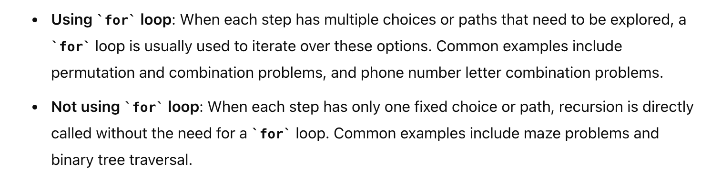

# Backtracking使用for和不使用for的情况

***
# 39. Combination Sum
* **一刷:30:22(❌)**
* [39. Combination Sum](https://leetcode.com/problems/combination-sum/description/)

## 思路1: Backtracking
* 在target<0的时候直接返回
### 时间复杂度分析
* The execution of the backtracking is **unfolded** as a DFS traversal in a n-ary tree. The total number of steps during the backtracking would be **the number of nodes in the tree**
* loose upper bound on the number of nodes
  * First of all, the **fan-out** of each node would be bounded to N, i.e. the total number of candidates.
  * The maximal depth of the tree, would be **T/M (target/min(candidates))** 
  * The maximal number of nodes in N-ary tree of **N/M** height would be **O(N^(target/min(candidates)) * target)** // **O of N to the power of T divided by M**
## N-ry 节点个数


## Code
```java
class Solution {
    List<List<Integer>> res;
    int target;

    public List<List<Integer>> combinationSum(int[] candidates, int target) {
        this.target = target;
        res = new LinkedList<>();
        List<Integer> list = new LinkedList<>();
        backtracking(candidates, 0, list);
        return res;
    }

    private void backtracking(int[] candidates, int index, List<Integer> list) {
        if (target == 0) {
            res.add(new LinkedList<>(list));
            return;
        }
        if (target < 0) {
            return;
        }
        for (int i = index; i < candidates.length; i++) {
            target -= candidates[i];
            list.add(candidates[i]);
            backtracking(candidates, i, list);
            target += list.removeLast();
        }
    }
}
```

# 90. Subsets II
* **一刷:30:22(❌)**
* [90. Subsets II](https://leetcode.com/problems/subsets-ii/)

## 思路1:Backtracking
* backtracking是dfs，used数组是比较的前一层的结果
* 所以当前一个使用过了used[i - 1]是可以跳过的，因为不在同一层；如果前一层没有使用过又相同，说明可能是开的新的分支


## Code
```java
class Solution {
    boolean[] used;
    List<List<Integer>> res;

    public List<List<Integer>> subsetsWithDup(int[] nums) {
        used = new boolean[nums.length];
        res = new LinkedList<>();
        Arrays.sort(nums);
        List<Integer> list = new LinkedList<>();
        backtracking(nums, list, 0);
        return res;
    }

    private void backtracking(int[] nums, List<Integer> list, int index) {
        if (index <= nums.length) {
            res.add(new LinkedList<>(list));
        }
        for (int i = index; i < nums.length; i++) {
            if (i > 0 && nums[i - 1] == nums[i] && !used[i - 1]) {
                continue;
            }
            used[i] = true;
            list.add(nums[i]);
            backtracking(nums, list, i + 1);
            used[i] = false;
            list.removeLast();
        }
    }
}
```
***
# 51. N-Queens
* **一刷:30:22(❌)**
* [51. N-Queens](https://leetcode.com/problems/n-queens/)
## 技巧
### 1. Diag问题考虑 row + col ==> positive Diagnol || row - col ==> negative
* Diag问题通常可以通过row和col的加减结果来代表不变量
### 2. O(N!)的时间复杂度: The factorial of a number N
### 3. char[] to String: new String(c);
## 思路: Backtracking
* 通过Set分别给col，posDiag，negDiag设置，记录走过的位置
* 然后backtracking
## Code
```java
class Solution {
    List<List<String>> res;
    public List<List<String>> solveNQueens(int n) {
        res = new LinkedList<>();
        Set<Integer> col = new HashSet<>();
        Set<Integer> posDiag = new HashSet<>();
        Set<Integer> negDiag = new HashSet<>();
        char[][] boards = new char [n][n];
        for(char [] b : boards){
            Arrays.fill(b, '.');
        }
        backtracking(n, 0, col, posDiag, negDiag, boards);
        return res;
    }
    private void backtracking(int n, int r, Set<Integer> col, Set<Integer> posDiag, Set<Integer> negDiag, char[][] boards){
        if(n == r){
            List<String> copy = new LinkedList<>();
            for(char[] eachRow: boards){
                copy.add(new String(eachRow));
            }
            res.add(copy);
            return;
        }
        for(int c = 0; c < n; c++){
            if(col.contains(c) || posDiag.contains(r + c) || negDiag.contains(r - c) ){
                continue;
            }
            col.add(c);
            posDiag.add(c + r);
            negDiag.add(r - c);
            boards[r][c] = 'Q';
            backtracking(n, r + 1, col, posDiag, negDiag, boards);
            col.remove(c);
            posDiag.remove(c + r);
            negDiag.remove(r - c);
            boards[r][c] = '.';
        } 
    }
}
```