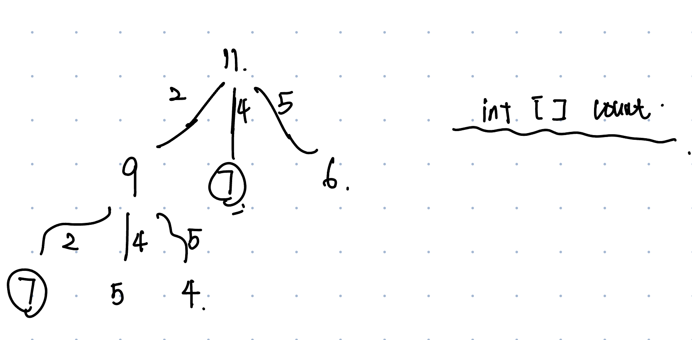

# 70. Climbing Stairs
* **一刷:6：45(✅)**
* [70. Climbing Stairs](https://leetcode.com/problems/climbing-stairs/description/)

## My Code
```java
class Solution {
    public int climbStairs(int n) {
        if (n == 1) return 1;
        if (n == 2 ) return 2;
        int [] dp = new int [n + 1];
        dp[1] = 1;
        dp[2] = 2;
        for(int i = 3; i <= n; i ++){
            dp[i] = dp[i - 1] + dp[i - 2];
        }
        return dp[n];
    }
}
```
***
# 322. Coin Change
* **一刷:36：45(❌)**
* [322. Coin Change](https://leetcode.com/problems/coin-change/)

## 思路1: DP
* 通过一维DP，将amount拆分成一个一个依次累加。每个dp[i]代表的就是当前amount下最小的个数，然后最终的也一定是最小的
* 两个for循环，一个iterate amount，一个iterate coins
* 时间复杂度: O(S * n);
* 空间复杂度: O(S);
### Code  
```java
class Solution {
    public int coinChange(int[] coins, int amount) {
        int [] dp = new int [amount + 1];
        int max = amount + 1;
        Arrays.fill(dp, max);
        dp[0] = 0;
        for(int i = 1; i <= amount; i ++){
            for(int j = 0; j < coins.length; j ++){
                if(coins[j]<=i){
                    dp[i] = Math.min(dp[i], dp[i - coins[j]] + 1);
                }
            }
        }
        return dp[amount] == max ? -1 : dp[amount];
    }
}
```
***
## 思路2: DFS + Memorization
* 通过DFS来遍历每一种情况，然后使用一个统一的Memorization array来记录所有重复过的结果

### Code
```java
class Solution {
    public int coinChange(int[] coins, int amount) {
        if(amount < 1) return 0;
        return coinChange(new int [amount], amount, coins);
    }
    private int coinChange(int [] count, int remain, int [] coins){
        if(remain < 0) return -1;
        if(remain == 0) return 0;
        if(count[remain - 1] != 0 ) return count[remain - 1];
        int min = Integer.MAX_VALUE;
        for(int i = 0 ; i < coins.length; i ++){
            int res = coinChange(count,remain - coins[i],coins);
            if(res >= 0 && res < min){
                min = 1 + res;
            }
        }
        count[remain - 1] = (min == Integer.MAX_VALUE) ? -1 : min;
        return count[remain - 1];
    }

}
```
***
# 300. Longest Increasing Subsequence
* **一刷:20：45(✅)**
* [300. Longest Increasing Subsequence](https://leetcode.com/problems/longest-increasing-subsequence/)
## 思路1: DP
* dp数组记录当前nums[i]能够取到的最长increasing subsequence. 
* 两个for循环，里面的for循环通过倒序来找比当前nums[j]小的值能够取到的最大值。然后通过一个res来记录总的值
### Code
* 时间复杂度: O(N^2)
* 空间复杂度: O(N)
```java
class Solution {
    public int lengthOfLIS(int[] nums) {
        int [] dp = new int [nums.length];
        Arrays.fill(dp,1);
        int res = 1;
        for(int i = 1; i < nums.length; i ++){
            int max = 1;
            for(int j = i - 1; j >= 0; j --){
                if(nums[i] > nums[j]){
                    max = Math.max(max, dp[j] + 1);
                }
            }
            dp[i] = max;
            res = Math.max(res, dp[i]);
        }
        return res;
    }
}
```
## 思路2: Binary Search + 维系一个最长increasing subsequence
* 每次到一个新的点，通过二分法找到它所在的位置，然后替换成更小的值。然后最后list的长度就是最大的递增序列
* 这里其实包含了贪心，因为只有每次你加入的值越小，你的子序列potential的长度才会越长
* list.set(index, target);
* binary search应该找的是第一个target > 前面一个值的位置，所以是start
### Code
```java
class Solution {
    public int lengthOfLIS(int[] nums) {
        List<Integer> list = new ArrayList<>();
        list.add(nums[0]);
        for(int i = 1; i < nums.length; i ++){
            if(nums[i] < list.get(list.size() - 1)){
                binarySearch(list,nums[i]);
            }
            else if(nums[i] > list.get(list.size() - 1)){
                list.add(nums[i]);
            }
        }
        return list.size();
    }
    private void binarySearch(List<Integer> list, int target ){
        int start = 0;
        int end = list.size() - 1;
        int mid = start + ((end - start)/2) ; 
        while(start < end){
            mid = start + ((end - start)/2);
            if(list.get(mid) >= target){
                end = mid;
            }else if(list.get(mid) <= target){
                start = mid + 1;
            }
        }
        list.set(start,target);
    }
}
```
# 1143. Longest Common Subsequence
* **二刷:12:50(✅)**
* [1143. Longest Common Subsequence](https://leetcode.com/problems/longest-common-subsequence/description/)

## 思路1: 二维DP
* 二维dp记录了如果相同的话，当前的最大值。如果不同就是分别各退一步的max

### Code
```java
class Solution {
    public int longestCommonSubsequence(String text1, String text2) {
        char [] char1 = text1.toCharArray();
        char [] char2 = text2.toCharArray();
        int [][] dp = new int [text1.length() + 1][text2.length() + 1];
        for(int i = 1; i <= char1.length; i ++){
            for(int j = 1; j <= char2.length; j ++){
                if(char1[i - 1] == char2[j - 1]){
                    dp[i][j] = dp[i - 1][j - 1] + 1;
                }else {
                    dp[i][j] = Math.max(dp[i - 1][j], dp[i][j - 1]);
                }
            }
        }
        return dp[char1.length][char2.length];
    }
}
```
# 139. Word Break
* **二刷:20:50(❌)**
* [139. Word Break](https://leetcode.com/problems/word-break/)
## 思路1: BFS
### 思路

### Code
```java
class Solution {
    public boolean wordBreak(String s, List<String> wordDict) {
        Set<String> wordD = new HashSet<>(wordDict);
        Set<Integer> seen = new HashSet<>();
        Queue<Integer> que = new LinkedList<>();
        que.offer(0);
        seen.add(0);
        while(!que.isEmpty()){
            int start = que.poll();
            if(start == s.length()) return true;
            for(int end = start + 1; end <= s.length(); end ++){
                if(!seen.contains(end) && wordD.contains(s.substring(start,end))){
                    que.offer(end);
                    seen.add(end);
                }
            }
        }
        return false;
    }
}
```
## 思路2: 一维DP
* DP数组表示的是当前字符串以及之前的内容能否凑成string在worddict中
* 类似背包问题，就是看在wordDict中能够取出值把背包放满
* tricky的点在于dp数组的index和substring的start值是有一个错位. 因为要判断当前值到底能不能true应该找的当前j的“前一个”，但dp初始化是s.length() + 1. 所以自动就退了一格
* e.g. "catsandog"中 d的index是6，在dp中是7。dog的判断，j是6,那么应该找的n对应于dp的值，刚好也是6，n的dp是false，所以是false

### Code
```java
class Solution {
    public boolean wordBreak(String s, List<String> wordDict) {
        Set<String> words = new HashSet<>(wordDict);
        boolean [] dp = new boolean [s.length() + 1];
        dp[0] = true;
        for(int i = 1; i <= s.length(); i ++){
            for(int j = 0; j < i; j ++){
                if(dp[j] && words.contains(s.substring(j,i))){
                    dp[i] = true;
                }
            }
        }
        return dp[s.length()];
    }
}
```