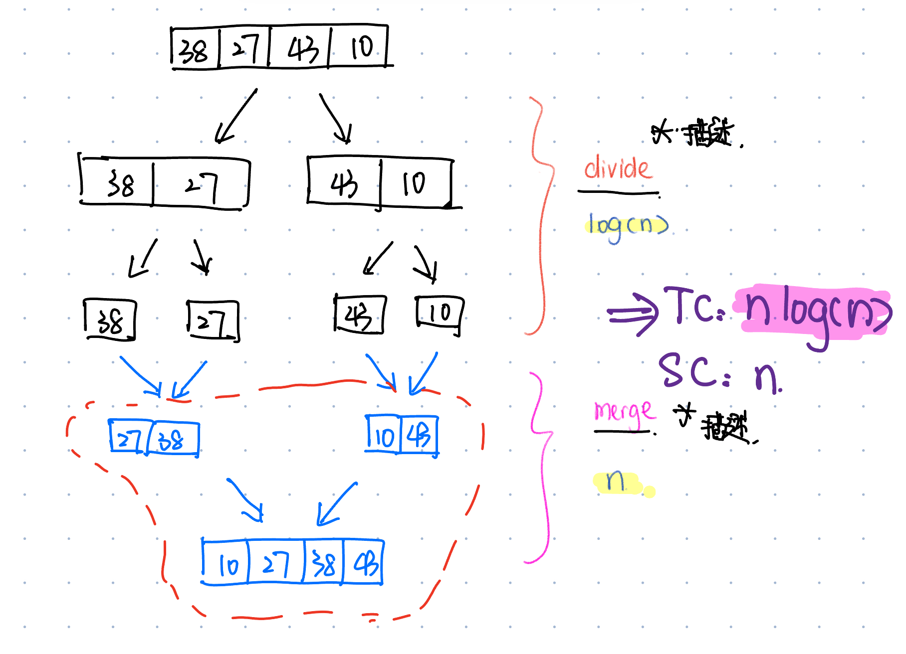

# Basic (Bubble)

***
# Merge Sort
## 相关文章
* [Merge Sort快速入门](https://www.geeksforgeeks.org/merge-sort/)
* [Merge Sort详细分析_1](https://medium.com/basecs/making-sense-of-merge-sort-part-1-49649a143478)
* [Merge Sort详细分析_2](https://medium.com/basecs/making-sense-of-merge-sort-part-2-be8706453209)
## Defination
### 描述
* Merger Sort（总） + 实现steps（3）（分） + merge的过程（细分）
### 细节
* **Merge Sort** is a sorting algorithm <u>that follows</u> the **Divide and ** Conquer. <u>It works by</u> **recursively divide** the input arrays into smaller subarrays and sorting them then **merge** these sorted subarrays <u>to obtain</u> the sorted array.
* In simple terms, we can say the process of merge sort is to divide the array into two halves, sort each half, and then merge the sorted halves back together. This process is repeated until the entire array is sorted.

## Steps
* The whole process can break down into 3 steps --> **Divide**,**Conquer** and **Merge**
  * First, **Divide** the list/array **recursively** into <u>two halves</u> until it can no more be divided.
  * Second, Each subarray is sorted individually using the merge sort algorithm
  * Last, the sorted subarrays are merged back together in sorted order.
* 具体的merge sort过程描述
  * Specifically, in the merge process of merge sort, two adjacent subarrys are compared and merged. A temporary array is created with a lengh equal to the combined size of both subarrays. Then, elements from both subarrays are compared one by one, and the smaller element is placed into the temporary array in sorted order.


## 时间/空间复杂度分析
### TC O(nlogn)
* **Divide** step: Merge Sort **recursively** splits the input array into two halves. This process continues until the array is broken down into individual elements. The depth of this recursion (how many times we can split) is **log₂(n)**,
* **Merge step**: At each level of recursion, the merging process is performed on n elements. Merging two sorted halves takes linear time, O(n), because every element must be compared and copied.
### SC O(n)
* **Array - O(n)**: Additional space is required for the temporary array used during merging.
* **LinkedList - O(log n)**: The space complexity of merge sort for a LinkedList is **O(logN)** due to the **recursive call stack**.

## Use Case
* `Collections.sort()`

### Advantages
* **Stability**: Merge Sort is a **stable** sorting algorithm, meaning it preserves the relative order of equal elements. This is especially important for **non-primitive** types where multiple attributes are involved. Stability ensures that when sorting by one attribute, the ralative order of elements with equal values in that attribute remains unchanged, which is useful for **multi-level** sorting based on additional attributes.
* Preferred for **LinkedList** sorting
  * **LinkedList has poor random access efficiency**: Unlike arrays, LinkedList cannot perform O(1) random access, as it must traverse the list to find a specific node. Sorting algorithms like Quick Sort or Heap Sort rely heavily on random access to compare and swap elements, making them less efficient for LinkedList. Merge Sort, on the other hand, does not rely on random access. Instead, it recursively divides and merges sorted sublists, which is better suited for the sequential access nature of LinkedList.
  * **No additional space required:** Merge Sort can directly modify LinkedList pointers during the merge operation, avoiding the need for frequent memory allocation and deallocation, as is required for array-based sorting. By adjusting the pointers to merge two sorted linked lists into one, Merge Sort minimizes space overhead for LinkedList sorting.
### Disadvantages
* Not **in place**: It requires **additional memory** to store the sorted data.

## Code
```java
    public static int [] mergeSort(int [] arr) {
        // Base case: when arr can not be further divided
        if(arr.length <= 1) {
            return arr;
        }
        //Divide into havles
        int mid = arr.length / 2;
        int [] left = Arrays.copyOfRange(arr, 0 , mid);
        int [] right = Arrays.copyOfRange(arr,mid, arr.length);

        return merge(mergeSort(left), mergeSort(right));
    }
    private static int [] merge(int [] left, int [] right) {
        int [] temp = new int [left.length + right.length];
        int leftIndex = 0;
        int rightIndex = 0;
        int tempIndex = 0;
        while(leftIndex < left.length && rightIndex < right.length) {
            if(left[leftIndex] < right[rightIndex]) {
                temp[tempIndex] = left[leftIndex];
                leftIndex++;
            } else {
                temp[tempIndex] = right[rightIndex];
                rightIndex++;
            }
            tempIndex++;
        }
        if (leftIndex != left.length) {
            while(leftIndex < left.length) {
                temp[tempIndex] = left[leftIndex];
                tempIndex++;
                leftIndex++;
            }
        } else {
            while(rightIndex < right.length) {
                temp[tempIndex] = right[rightIndex];
                tempIndex++;
                rightIndex++;
            }
        }
        return temp;
    }
```
***
# Quick Sort
## 相关文章
* [Quick Sort快速入门](https://www.geeksforgeeks.org/quick-sort-algorithm/)
* [Quick Sort详细分析_1](https://medium.com/basecs/pivoting-to-understand-quicksort-part-1-75178dfb9313)
* [Quick Sort详细分析_2](https://medium.com/basecs/pivoting-to-understand-quicksort-part-2-30161aefe1d3)

## Defination
### 描述
* **Quick Sort** is a sorting algorithm that follows **Divide and Conquer** approach. Essentially, it picks an element as a **pivot** and **patitions** the given array around that pivot by **placing** the pivot in its correct position in the sorted array.
### 细节
Essentially, there are 3 steps in the algorithm
* First, we choose a **pivot**. Here we can choose a random element as the pivot to reduce the possibility of the worst-case scenario. If we pick the first or last element, the worst-case scenario occurs when the given array is already sorted, and the time complexity will degrade to O(n^2).
* Second, partition the array around pivot. To be specific, we keep track of **index of smaller elements** and keep **swapping**. After partition, it is ensured that all elements **to the left of the pivot** are smaller than those **to the right**. The left and right may not be sorted individually.
* And then, **recursively** call for the two partitioned left and right subarrays **until only one element is left**.

## 时间/空间复杂度分析
### TC O(nlogn)
* **Average Case**: Quicksort’s average-case performance is usually very good in practice, making it one of the fastest sorting Algorithm.
* **Worst Case: O(N ^ 2)** : The worst-case Scenario for Quicksort occur when the pivot at each step consistently results in highly unbalanced partitions. When the array is already sorted and the pivot is always chosen as the smallest or largest element.
### SC O(logN) //Consider recursive stack space || O(1) //don't consider
* (In-place)

## Use Case
* `Arrays.sort()` //Primitive

### Advantages
* It has **a low overhead**, as it only requires a small amount of memory to function.
* It is **Cache Friendly** as we work on the same array to sort and do not copy data to any auxiliary array.
* Fastest general purpose algorithm for large data when stability is not required.
### Disadvantages
* It has a worst-case time complexity of O(N^2), which occurs when the pivot is chosen poorly.
* This is the fact that quicksort is an **unstable algorithm**, meaning that it won’t be guaranteed to preserve the order of elements as it reorders; two elements that are exactly the same in the unsorted array could show up in a reversed order in the sorted one.

## Code
```java
   public static void random (int [] arr, int low, int high) {
        Random ranNum = new Random();
        int randPivot = ranNum.nextInt(high - low + 1) + low;
        int tmp = arr[high];
        arr[high] = arr[randPivot];
        arr[randPivot] = tmp;
    }
    public static int partition (int [] arr, int low, int high) {
        random(arr,low,high);
        int pivot = arr[high];
        int pointer = low;
        for (int i = low; i < high; i++) {
            if (arr[i] <= pivot) {
                int tmp = arr[i];
                arr[i] = arr[pointer];
                arr[pointer] = tmp;
                pointer++;
            }
        }
        arr[high] = arr[pointer];
        arr[pointer] = pivot;
        return pointer;
    }
    public static void quickSort (int [] arr, int low, int high) {
        if (low < high) {
            int partitionIndex = partition(arr, low, high);
            quickSort(arr, low, partitionIndex - 1);
            quickSort(arr, partitionIndex + 1, high);
        }
    }
```

# Merger Sort & Quick Sort Choosing
* **Stability ?**
  * Merge Sort: Stability is important, we do care about maintaining the order of our items.  
    * Merge Sort preserves the relative order of records with equal keys, making it a stable algorithm. 
  * Quick Sort: Stability is not important
    *  Quick Sort is generally unstable because elements with equal values may change their relative order as they are swapped during partitioning. 
* **External Memory ?**
  * Merge Sort: Additional space is required for the temporary array used during merging.
  * Quick Sort: No need to use any external memory.
* **Performance ?**
  * Quick Sort generally performs better in practice due to **in-place sorting** and better **cache locality**. Merge Sort is more consistent with O(n log n) time but requires more memory and is slower in practical use due to the merging process overhead.